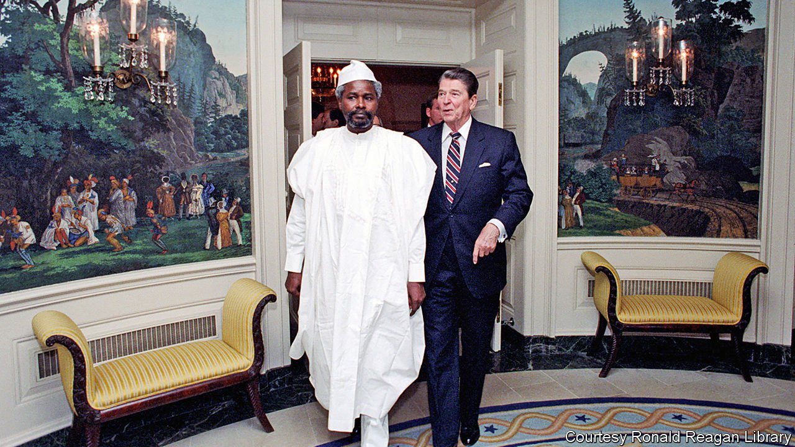

###### Death of a dictator

# Chad’s former strongman, Hissène Habré, dies of covid-19 

##### He tortured and massacred thousands, but belatedly faced justice 

 

> Aug 28th 2021 

HIS SWIMMING-POOL-turned-prison was known as La Piscine. There, Hissène Habré’s torturers would bind victims’ feet and hands and force them to swallow large volumes of water. Then they would hoist them up and drop them, sending water shooting out of their mouths and noses. They had other methods, too, such as stuffing the exhaust pipe of a running vehicle into a prisoner’s mouth. Across the road from La Piscine were offices used by the American government, which backed Mr Habré’s brutal regime.

The despot who ruled Chad from 1982 to 1990 died on August 24th after contracting covid-19. He was 79, and serving a life sentence in Senegal for crimes against humanity.


The son of a shepherd, Mr Habré showed early promise. He won a scholarship to study in France, where he earned a university degree. But on returning to Chad he joined a rebel group. In 1974 he and his men took three Europeans hostage, then killed a French officer sent to negotiate their release. Later that decade, under a power-sharing deal, he was given the posts of prime minister and vice-president. When the deal broke down, Mr Habré fled to Sudan. Several hundred skeletons were found near the house he left behind in Chad.

He made a comeback in 1982, seizing power with the support of America, which saw him as a bulwark against communism and, in particular, Libya. America helped train Mr Habré’s secret police and sent him copious arms. President Ronald Reagan even invited him to the White House (pictured). France also helped out, sending troops. Meanwhile, Chadian soldiers massacred civilians. In all Mr Habré is thought to have ordered the killing of some 40,000 people.

Rebels led by Idriss Déby overthrew Mr Habré in 1990. For years the exiled leader lived a quiet, luxurious life in a coastal suburb of Dakar, the capital of Senegal. His victims, though, were rounding up evidence. “From the depths of that madness, I swore to fight for justice if I ever got out alive,” said Souleymane Guengueng, a former detainee.

Finally, in 2015, Mr Habré was called before a special court in Senegal where 90 witnesses testified against him. Ten months later the judge found him guilty of crimes such as summary execution, torture and rape. A soft ululation from the widows of victims rang out in the courtroom, then cheering and weeping. It was a rare instance of a court in one country successfully prosecuting the former leader of another for crimes against humanity.

America and France backed the Senegalese court, but in Chad their strategy did not change. Both threw their support behind Déby, who ruled with an iron fist for 30 years. After he was killed by rebels earlier this year, France endorsed his son, Mahamat, who took over in a coup. Stability was the priority, even if it left Chad in the same sorry state.

