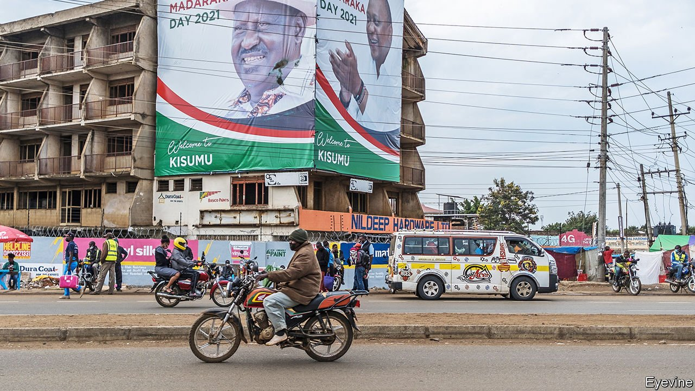

###### Not above the law

# Kenya’s judges do their duty. A pity about its politicians 

##### A political scheme cloaked as constitutional reform fails 

 

> Aug 28th 2021 

BREAKING CONSTITUTIONS is often easier than making them. Kenya’s first two presidents, Jomo Kenyatta and Daniel arap Moi, took a hatchet to the one negotiated at independence from Britain in 1963. By the time the butchery ended, Kenya was a one-party state run by untouchable kleptocrats. Fixing the damage took decades. Under international and domestic pressure, Moi repealed the provision banning all parties but his own in 1991. But it took 19 more years of bitter struggle before Kenya again had a constitution worthy of the name.

In recent years the hatchets have been out again. Kenya’s politicians finally accepted a new dispensation after post-election bloodshed claimed more than 1,000 lives in 2007-08. But the chastening effect of the violence did not last long. After another election controversy, in 2017, Uhuru Kenyatta, Kenya’s president (and Jomo’s son) joined forces with Raila Odinga, his rival-turned-sidekick, to push for yet another constitutional overhaul under the sweetly named Building Bridges Initiative (BBI). On August 20th Kenya’s Court of Appeal thwarted the initiative and granted the constitution from 2010 a reprieve.


On the surface the BBI seemed a worthy enterprise. It was purported to be the glue that held the reconciliation between Messrs Kenyatta and Odinga (pictured, right and left) together. In 2017 the president secured re-election in a brace of contentious polls. Kenya teetered dangerously for months as Mr Odinga rejected the president’s initial victory, boycotted a court-ordered re-run and finally had himself sworn in as “the people’s president” before a baying mob of supporters. Nearly 100 people died in the accompanying political violence. The stand-off was defused only after the two rivals shook hands in March 2018 following secret talks. They have been inseparable ever since.

Yet it was little more than political expediency that underpinned the reconciliation. For the president it defused a nasty crisis, shored up his iffy legitimacy and neutralised an opponent. Better still, it offered a handy opportunity to ditch his deputy president, William Ruto, whose uses had waned after he helped secure his boss a second term. Although Mr Ruto remains in office, he is clearly an outcast, his place in the sun now taken by the more malleable Mr Odinga. (The deputy president is all too familiar with the carousel of betrayal in Kenyan politics, having previously abandoned Mr Odinga for Mr Kenyatta.)

Mr Odinga also benefited. After four failed bids for the presidency, he appears to have concluded that a share of power was better than none at all. More important, the president would now presumably back him rather than Mr Ruto as his successor in the election next August, when Mr Kenyatta is required to stand down.

A deal built on rank expediency needed a cloak of respectability, however. Mr Odinga had to justify to his supporters his reconciliation with the man he accused of thrice cheating him. The BBI helped cover the stink. Kenya’s ethnic and political divisions could be presented not as man-made but the result of surmountable constitutional flaws. A popular initiative to fix these would usher in a new era of peace and prosperity and allow its architects to cast themselves as saviours.

Kenyan civil society was appalled. However the politicians dressed it up, there was no popular clamour to alter the constitution. Nor was the initiative suggesting the odd tweak here and there. It would do real damage to the essence of the charter. The BBI would have altered 14 of its 18 chapters, reckons Jerotich Seii, an activist who campaigned to stop it.

Buried in the verbiage was what the activists considered the real purpose of the initiative: an expansion of executive power by creating the post of prime minister and two deputies. This would ease efforts by Messrs Odinga and Kenyatta to build an electable coalition by allowing them to dangle plum positions before the kingpins of smaller tribes.

Kenya’s judges were quick to sense a stitch-up. In May the High Court sided with Ms Seii and her fellow plaintiffs, who argued that the BBI was a meretricious attempt to hoodwink the Kenyan people. The judges ruled that the constitution permitted amendments resulting from a popular initiative, but the BBI had clearly been driven by the president, not the people. On August 20th the Court of Appeal upheld the High Court’s judgment and put a halt to a referendum to enshrine the BBI’s proposals into the constitution. Although there may yet be another appeal, Mr Odinga said he would accept the judgment and focus instead on next year’s election.

Some good has come out of a tawdry process. Kenya’s judiciary, which ordered a re-run of the presidential election in 2017 over irregularities, has again shown its mettle. The constitution itself has proved resilient, while the judgment has made it harder for politicians to meddle with it.

Bridges to nowhere

If the BBI enhanced the reputation of Kenya’s judges, its politicians emerged with less credit. Mr Kenyatta had hoped to secure his legacy with a grandiose national-development strategy meant to reach full speed by the end of his term. It has largely stalled, partly because he chose instead to waste his efforts on a failed piece of opportunistic scheming. His ally seems equally damaged. During the president’s first term, Mr Odinga offered robust and often principled opposition. Given how readily it was sacrificed for the sake of ambition, such principle looks increasingly coincidental.

If there is a political winner, it is Mr Ruto, who has noisily been thanking God for delivering Kenya from the disaster of the BBI. In reality the opposition he offered was tepid. Had the matter gone to a referendum, it is doubtful he would have led a “no” campaign. “It’s not worth expending political capital on,” a senior ally confided earlier this year.

That won’t stop Mr Ruto from making mileage out of the BBI’s failure. The deputy president believes his ticket to the top job lies in casting himself as an alternative to the corrupt political dynasties embodied by Messrs Kenyatta and Odinga (whose families have dominated Kenyan politics since independence). Never mind that Mr Ruto is rich and has been linked to numerous scandals (he denies any wrongdoing). Reinvention is a staple of Kenyan politics, and he has been able to recast himself as a principled outsider. Standing apart from the BBI fray has strengthened his narrative. With less than a year to go before Kenyans vote for a new president, Mr Ruto will be content with his position. ■

