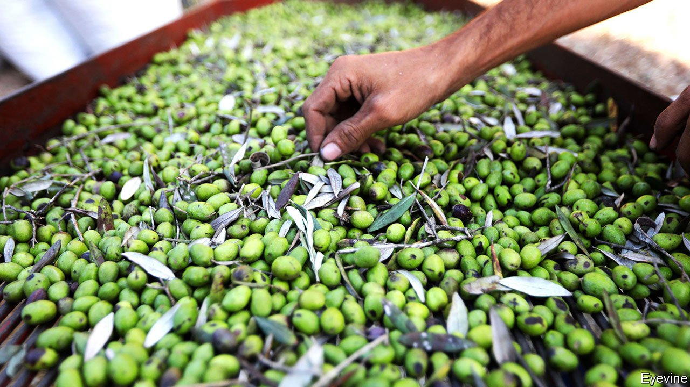

###### Extra-virgin territory

# The global ambitions of Lebanon’s hard-pressed olive-oil makers 

##### A tasty diversion from Lebanon’s crisis 

 

> Aug 28th 2021 

IT BEGAN WITH a case of homesickness. Ibrahim El Kaakour missed his family’s olive groves in Baasir, so four years ago he gave up his engineering career abroad and returned to Lebanon. At the time farming was just a hobby for his family. But Mr Kaakour had a goal, to reinvigorate the groves—and Lebanon’s long-dormant olive-oil industry, which traces its roots all the way back to the Phoenicians. He launched Genco Olive Oil, named after Vito Corleone’s front company in “The Godfather”.

Mr Kaakour is not alone. A short drive from Baasir lives Walid Mushantaf, who converted wheat fields into olive groves in 2010. Now the company he co-owns, Bustan El Zeitoun, grows Italian olive varieties (among others). Deeper in Lebanon’s mountains, Rose Bechara Perini grows the local souri variety on her extended family’s land. She calls Deir Mimas, her picturesque home town, the Bordeaux of olive oil.


They all face the same challenge. Though olive oil was once a key ingredient in Lebanese cuisine, today locals don’t use it much. They prefer imported vegetable oil, which until recently was quite cheap thanks to the overvalued Lebanese pound. Meanwhile, the smallholder farmers who grow most of the country’s olives have let the quality of their product slip. The upshot is that the average Lebanese consumes 1.6kg of olive oil each year, a tenth of what the average Spaniard consumes.

Lebanon’s long-running financial and economic crisis compounds the challenge. The country produces little, so nearly everything, from bottles to fertiliser, must be imported using dollars. As the Lebanese pound plunged in value, prices rose and dollars became scarce. There is also a shortage of fuel, which will be needed to run the olive presses once the annual harvest starts in September. And then there is the pandemic, which has ravaged restaurants, big buyers of extra-virgin olive oils.

The drop in the pound has made imported vegetable oil costlier, which should help growers like Mr Kaakour. But he has his sights set on the international market. He wants to export high-end, extra-virgin olive oil, using olives from all over the country. Lebanese wine is a model. Before the 1970s, not much was exported. Then, during the civil war, Serge Hochar of Chateau Musar in Ghazir, near Beirut, started blending reds and selling them abroad. The brand took off after winning acclaim at the Bristol Wine Fair in 1979. Today about half of Lebanon’s wine is exported.

Its olive-oil producers also believe they can compete with foreign heavyweights, such as Spain and Italy, in terms of quality, if not scale. The labels of Mr Kaakour, Mr Mushantaf and Ms Bechara Perini have won awards in international competitions. The founder of one of those competitions, Antonio Giuseppe Lauro, believes the Lebanese product is improving. Mr Kaakour hopes to make him and others an oil they can't refuse.

