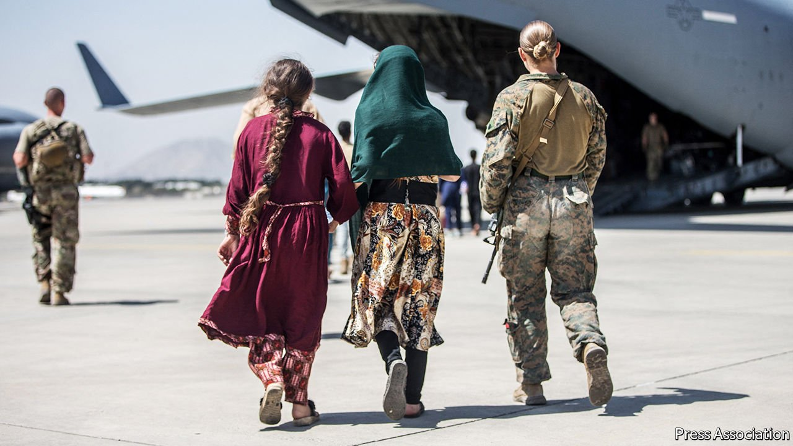

###### Willing hosts

# Uganda receives its first flight of evacuees from Afghanistan 

##### The country has long welcomed refugees, but politics is also at play 

 

> Aug 28th 2021 

NO SOONER HAD the Taliban marched into Kabul than politicians in Uganda, a mere 5,000km away, were readying for the arrival of evacuees from Afghanistan. “The world will look at Uganda as a reliable partner,” explained one cabinet minister. Another said that evacuees would bring business for local hotels. A third joked, grotesquely, about how Ugandan men were praying for the safe landing of beautiful Afghan women.

The first plane arrived at Entebbe airport on August 25th, carrying 51 evacuees. Up to 2,000 are expected in the coming weeks. They will stay in hotels while American officials review their applications for resettlement in the United States and elsewhere, a process which could take months. Uganda is among two dozen countries, from Kosovo to Costa Rica, that have offered to take in Afghans temporarily; Rwanda is preparing to host the staff and student body of Afghanistan’s only all-girls boarding school. The welcome they have shown puts richer countries to shame, but their motives are not entirely altruistic.


Uganda already hosts 1.5m refugees, more than any other country in Africa, with most coming from its troubled neighbours. Its openness draws on local traditions of welcome. Many Ugandans, including the president, Yoweri Museveni, know first-hand what it means to live in exile. But the country’s liberal approach, hailed by visiting dignitaries as a model for the world, also helps an authoritarian state to burnish its image and bring in money. Humanitarian aid provides rich pickings for contractors and officials. The arrival of the Afghans is a boon for hotels, emptied by the pandemic. America will foot the bill.

For Mr Museveni, whose government is busy shutting down civil-society groups, the crisis is a chance to repair his deteriorating relationship with the West. In January he was declared the winner of an election, after opposition supporters were shot, abducted and tortured. The Biden administration described the process as “neither free nor fair” and imposed visa restrictions on Ugandan securocrats. By hosting Afghans, Mr Museveni is sending a reminder that he can be useful in cleaning up America’s mess. And not for the first time: since 2007 he has sent Ugandan soldiers to Somalia, itself once a scene of inglorious American retreat. There they battle Islamists with American training and arms.

The use of African countries to process Afghan evacuees reflects “a growing pattern” of rich states shirking their responsibilities, says Achieng Akena of the International Refugee Rights Initiative, a non-profit group in Kampala. From 2013 Israel deported thousands of Eritrean and Sudanese asylum-seekers to Uganda and Rwanda, dumping them at the airport with $3,500 and no documents. The secret arrangements were long denied by the host countries. More transparently, the UN has evacuated asylum-seekers from Libyan detention centres to Rwanda and Niger. And this year Denmark passed a law that will allow it to deport asylum-seekers for processing in a third country, with Rwanda again rumoured as a possible destination.

Historians recall that during the second world war the British government sent 7,000 Polish refugees to Uganda, where they stayed for several years. The new arrivals from Afghanistan will hope they are not left in limbo for so long. ■

