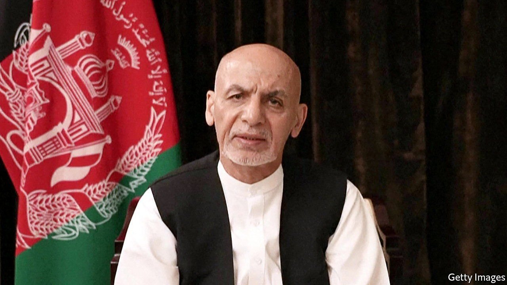

###### Retirement home for exiles

# Why Afghan officials have washed up in the United Arab Emirates 

##### In some cases, their cash arrived first 

 

> Aug 28th 2021 

FOR DAYS the world wondered where President Ashraf Ghani had gone as the Taliban advanced on Kabul, the capital of Afghanistan. It was little surprise when he surfaced in the United Arab Emirates (UAE) on August 18th. Mr Ghani joins a long list of former leaders who have sought shelter in the sunny Gulf state. Pervez Musharraf, a former Pakistani president, Thaksin Shinawatra, a former Thai prime minister, and Juan Carlos, Spain’s erstwhile king, are all thought to call the UAE home.

Most of these leaders left their countries under a cloud. Mr Musharraf was convicted of treason for abrogating and suspending Pakistan’s constitution in 2007. Thaksin Shinawatra was convicted of corruption committed while prime minister. Juan Carlos is accused of dodgy dealing with Saudi Arabia. And Mr Ghani (pictured) has been criticised for cutting and running, though he denies reports that he left Kabul with millions of dollars in cash. In a video posted on Facebook he said he fled “with one set of traditional clothes, a vest and the sandals I was wearing.”


Other Afghan officials planned ahead: they are suspected of having moved hundreds of millions of dollars from Kabul to Dubai, the UAE’s financial hub, over the years. A former vice-president, Ahmad Zia Masood, once flew to Dubai with $52m (£38m) in cash, according to American diplomatic cables. (The average yearly income in Afghanistan is around $500.) Some of this money has gone towards real estate. Sher Khan Farnood, the late chairman of Kabul Bank (and high-stakes poker player), reportedly owned dozens of properties on the ritzy Palm Jumeirah in Dubai—or, at least, his name was on the property records. He gave loans to associates of Hamid Karzai, a former Afghan president, for the purchase of villas in the emirate. “What I’m doing is not proper, not exactly what I should do,” Farnood told the Washington Post in 2010. “But this is Afghanistan.”

Just as important, it is Dubai, which takes a relaxed attitude towards dirty money. The UAE scores poorly on an index of money-laundering risk put together by the Basel Institute on Governance. That has made it the bane of foreign governments trying to tackle corruption—but a preferred haven for money-launderers, arms-smugglers and shady officials. Stable and secure, Dubai usually benefits when capital takes flight from more volatile parts of the region. Afghan officials are not the first to show up with suitcases full of cash. Baathists from Iraq rushed there when America invaded in 2003. So did relatives of Syria’s blood-soaked president, Bashar al-Assad, in 2012.

Fugitives and political exiles who wash up in the UAE assume they can live safe, secluded (often luxurious) lives. “There’s no paparazzi—no one’s going to hunt you down,” says a former resident. More importantly, the country is not known for aiding international pursuits of justice. Extraditions are rare and prosecutions for financial impropriety abroad even rarer. The UAE does have an extradition treaty with Afghanistan, but it might not be respected should the Taliban make a request. South Africa has waited years for the UAE to help deliver the Gupta brothers, who are accused of corruption and said to be living in Dubai. The countries signed an extradition treaty this year. South Africa is still waiting. (The Guptas deny wrongdoing.)

In return for a welcome, the UAE often gets influence. Some exiles, such as Muhammad Dahlan, a Palestinian, find seats in the court of Muhammad Bin Zayed, the UAE’s crown prince and de facto ruler. Prince Muhammad “keeps joker cards to play in key geographies”, says a former Emirati official. Mr Dahlan, who alienated both of Palestine’s main parties, helps with diplomacy in Serbia, Ethiopia and Israel. High-profile refugees also broadcast the attractions of the UAE. “They serve as a signal that it is, by and large, a safe haven for the international grey and black markets,” says Christopher Davidson, an expert on the Gulf states. “It provides a bolthole for the world’s shadow elite.”

Sometimes the UAE seems to harbour political fugitives and exiled leaders in order to gain leverage or curry favour with America, a key ally. Mr Ghani, says the foreign ministry, was accepted on humanitarian grounds. Fair enough: when the Taliban last seized power they tortured, castrated and murdered one of his predecessors. His warm welcome may also be a shot at Qatar, a rival of the UAE. Back in the 1990s the UAE was one of only three countries to recognise the Taliban’s rule over Afghanistan (and was rewarded with cash flows from the poppy harvest). But more recently the Taliban and other Islamist exiles found a home in Qatar, which the UAE accuses of supporting extremism.

Qatar won kudos last year by hosting talks between America and the Taliban, intended to end the Afghan conflict. But should the Taliban revert to their savage ways, that association may look bad. By contrast, the UAE now hosts the last democratically elected president of Afghanistan. Mr Ghani has brought symbolic value to his new home, if nothing else. ■

