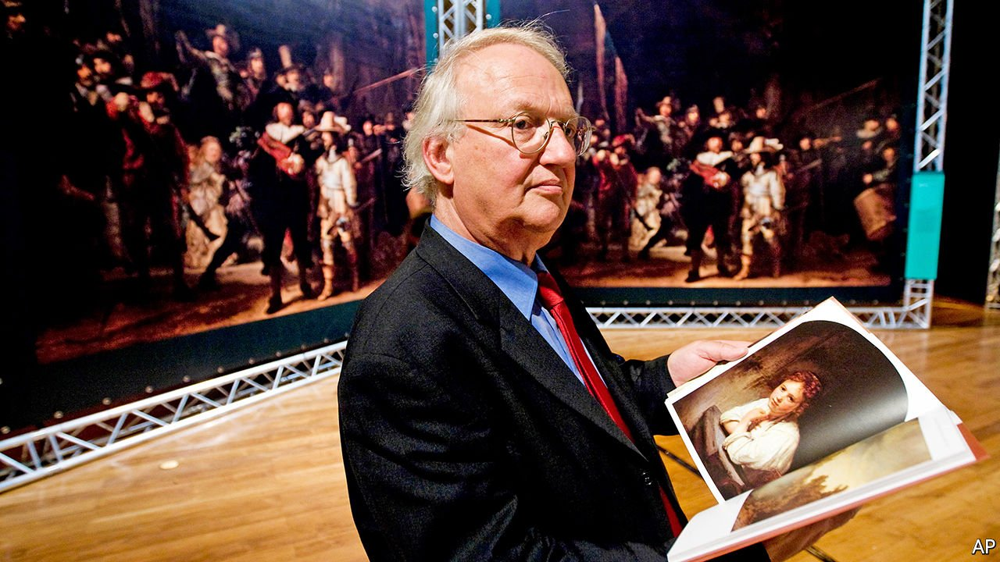

###### Nobody but him

# Obituary: Ernst van de Wetering could spot a Rembrandt anywhere 

##### The art expert died on August 11th, aged 83 

 

> Aug 28th 2021 

AT ALMOST ANY time between 1968 and 2014, if you chanced to be visiting the Rijksmuseum or the Rembrandthuis in Amsterdam, you might spot Ernst van de Wetering at the centre of a knot of people. He was hard to miss: bulky and untidy, with his glasses slipping on his nose and a goofily crooked smile. He would be standing by a Rembrandt—where else?—pumping his arms and kneading his hands, as if carried away by emotion. “They call this a self-portrait!” he would cry. “Wrong!”

It was not a self-portrait, he would explain, but a tronie, a mirror-study in which the artist was practising how to catch human expressions or strange effects of light. His favourite in the Rijks-museum was the “Self-portrait with dishevelled hair”, in which the young Rembrandt was broodingly lit from behind. He also loved a tiny tronie, now in the Getty Museum, called “Rembrandt laughing”, painted when the artist was 22 and in Leiden (the Leiden years, he thought, had been badly neglected by art historians). It was in oils on a piece of copper as thin as paper, a work at once so precise and so youthfully exuberant that it lifted anyone’s heart.


Especially his own heart, which for almost half a century, as he worked for and then led the Rembrandt Research Project, had been devoted to establishing which paintings were by the master, and which not. The world contained thousands of paintings that looked, in a murky way, like Rembrandts. Weeding out the copies and fakes and authenticating the originals was meant to be a ten-year task for him and his small band of art-historian colleagues. It took nearly five times as long, and several fallings-out, to get to the sixth and final volume of the “Corpus of Rembrandt Paintings”—by which time the number of authenticated Rembrandts had fallen from 624 (Bredius’s estimate in 1935) to 340, including 70 he had reinstated all by himself.

This caused alarm and confusion among curators, but also brought him a surge of fame. Two or three times a week someone would contact him to say they had a possible Rembrandt hanging in the lounge or the bedroom, attaching a blurry photo, and he would take a look. This could be annoying, and he talked seriously of blocking any e-mails with “Rembrandt” in them, but then he would relent. Thanks to those lazy random callers, no fewer than eight originals had finally turned up.

And if he said they were originals, the matter was more or less settled. He was no fool. Many art experts, including colleagues, relied on what he called “connoisseurship”, claiming that they could tell a true Rembrandt at a glance. He begged to differ. He had come to art research as a trained painter, a maker of things, so he did not go by merely looking at images. He went by the working methods of artists and studios, and by the science.

Under his guidance, Rembrandt’s paintings were analysed by every method science could devise. After simple X-rays, to detect not only underpainting but the weave of the canvas and the presence of lead pigments, he might call in infra-red reflectography, raking-light photography, dendrochronology and gas chromatography. Analysis of paint samples revealed, for example, that the wonderful chunkiness of the husband’s gold-brocaded sleeve in “The Jewish bride” was achieved by mixing chalk and ground glass with roughly milled pigments. He could hardly resist touching that sleeve, or feeling the silk of the bride’s dress, in which carmine had been glazed over vermilion to make it shimmer.

Apprentices in the workshop, however, also used those paints, and panels from the same oak, and did overpainting on work that might have been the master’s. It took Mr van de Wetering, armed with his knowledge of how Rembrandt approached the very act of painting, to uncover the marks of an authentic piece. He found, for example, a “defect” in Rembrandt’s technique that caused his brush to make breaks when he was painting people’s curls. Other clues, however, showed cleverness. Smudging the contours of his figures caused their faces to loom from the dark. Making the men’s collars grey, rather than white, in “The anatomy lesson of Dr Tulp”, emphasised both the body on the slab and the thickness of the air. Blurring Anna’s hand and spinning wheel in “Tobit and Anna” boldly suggested continuous movement. Painting that seemed rough was in fact meticulous and magical. It became a sort of “handwriting”, revealed too in the rhythm and steadiness of the brush, clear enough for him to say: “It can be nobody but him.”

Tracing Rembrandt’s hand was one thing. It was harder, though, to track his thinking. The master loved certain themes and kept returning to them, evidently because they would sell and he had to make a living; but sometimes, as in his various versions of “The supper at Emmaus”, to kindle devotion in the viewer. He found light in rooms a constant challenge, agonising over windows, shadows and reflections and even, in a late self-portrait, altering his cap from white to brown to change the daylight’s flow. If his pursuer had to sum him up in a word, it was “searching”. Rembrandt was never still, making artistic explosions one after another, soaring past the rules of art that prevailed in 17th-century Europe and striving to get “the greatest and most natural effect of movement”, as he wrote once, in bodies and in souls.

Mr van de Wetering did not imagine he had really plumbed that mind. He still did not know why some works had been abandoned, and some completely changed; or, very occasionally, who the maker was. So, though insisting that his statements were fact and not opinions, he did his best not to crow too much. He was glad of any firm authentication not because it proved him right, but because it did justice to Rembrandt—and would help the public look at this painting with fresh eyes.

As for him he searched afresh in every Rembrandt he saw. He was endlessly drawn to those miracles, large or small. It was nonsense, he still insisted, to say you could tell a Rembrandt at a single glance. But wandering on alone through the Rijksmuseum, leaning as close as possible to some work of the master, he could feel genius touch him, and it was unmistakable. ■

