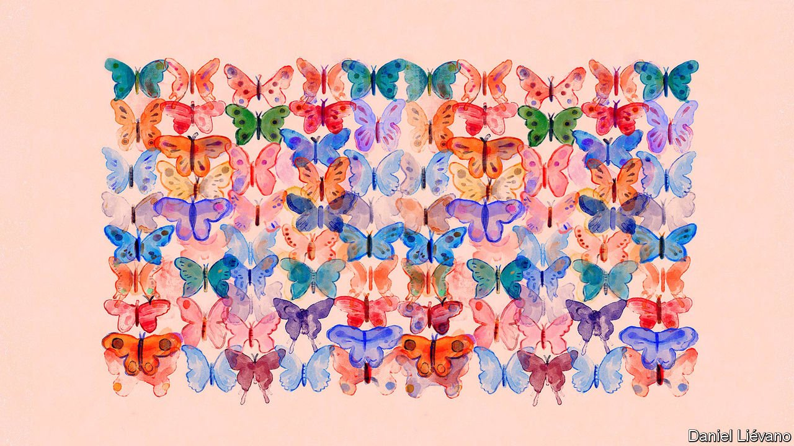

###### Biology brief

# On the origin of “species” 

##### The term, though widely used, is hard to define 

 

> Aug 25th 2021 

CHEMISTS HAVE it easy. Their art has many subtleties, but its fundamental constituents are clearly definable. A carbon atom is always a carbon atom. It has a nucleus which contains six protons, no more, no fewer. All atoms with exactly six protons in their nuclei are carbon, whether they find themselves in a steak, a diamond pendant or the burning heart of Sirius, the brightest star in the night sky. Some types of carbon atom can gain or lose protons through nuclear decay. But when they do so, they immediately stop being carbon.

The biological study of species offers no equivalent to such transmutation. An individual which belongs to a given species will always belong to that species, come what may. And assigning an individual to a species is for the most part pretty straightforward. But finding something which defines a species, as the number of protons defines an element, is impossible.


The practical identification process depends on a sample, known as a type specimen, which is typically held in a specialised collection and described in a published paper. That specimen defines the species. Subsequent discoveries either belong to the same species as the type, or they don’t. Various international bureaucracies keep track of this process, providing ever evolving lists of the constituents of the living world. At the moment, about 1.2m species have been given recognised scientific names by this process. Most are multicellular eukaryotes (animals, plants, algae and fungi).

This is certainly an underestimate of the real figure. By modelling the degree to which humans might be undersampling the true variety of life one estimate came up with a number of multicellular eukaryotes over seven times bigger. But whether they number 1.2m or 8.7m says little about what species actually are.

Attempts to define species by their essence, rather than by comparison with an exemplar, date back to Aristotle, a Greek philosopher, in the fourth century BC. Aristotle liked categorisations in which general types of thing (genera) were sorted according to particular details in order to form species. He applied the idea to life forms as well as to much else. Over 2,000 years later Carl Linnaeus, a Swede, provided a systematic update of the idea based on morphology. His system produced a new standard for botanists and zoologists and introduced the helpful practice of combining genus and species into a binomial name, such as Homo sapiens.

Linnaeus’s system was extremely useful. Its underpinning, though, remained obscure. In the 1850s, a century after Linnaeus, Charles Darwin wrote to his friend Joseph Hooker that, when they spoke of “species”, it was “really laughable to see what different ideas were prominent in various naturalists’ minds”. Some drew entirely on physical shape, some on appeal to God’s plan, some on notions of creatures’ ancestry. The result was a mess. “It all comes, I believe, from trying to define the undefinable.”

In “On the Origin of Species”, published three years later, Darwin put forward the idea that what creatures of the same species shared was common ancestry. They were more closely related to each other than to any others. The same applied to the higher levels of taxonomy, too. Linnaeus had grouped genera into families, families into orders and so on. These, Darwin argued, were also matters of descent.

In modern terms, the fact that Homo sapiens is part of the family hominidae, the great apes, which is in the order of primates, in the class of mammals, the phylum of chordates, the kingdom of animals and the domain of eukaryotes means that you are more closely related to a chimp than to another primate such as a lemur, more closely related to a lemur than to a lizard, more closely related to a lizard than to a starfish and more closely related to a starfish than to an oak.

Darwinism explains a huge amount about life, and about species. But it still does not say where, on the journey from twig-tip to trunk, the juncture is which marks a species-defining common ancestor. One answer was provided in 1942 by a German-American zoologist called Ernst Mayr. He suggested that a species is a group of individuals which can interbreed to produce fertile offspring only among themselves. In other words, they are part of an exclusive gene pool. If they try to breed outside that group, their offspring, if any, will be either sterile or unviable. A new species arises when that inter-fertile group is divided in such a way that some can no longer breed with each other.

Imagine a climate-sensitive species spread continuously through a mountain chain. If the world warms, the lower slopes will become uninhabitable. This will fragment the population, with different groups ending up isolated on different mountain tops. Unable to exchange genes, these populations will evolve in different ways. If they are separated for long enough they may evolve so much that when the climate changes back and they can mix again, they may no longer be able to (or may no longer choose to) breed with each other. They have become separate species.

The first, obvious and insuperable problem with this approach is that it has nothing to say about asexual creatures—and thus about all the bacteria and archaea and many single-celled eukaryotes. It is not really clear to what degree the concept of a species makes sense for such creatures. But to the degree to which it does, sex does not enter into it.

Leaving that aside, Mayr’s idea provides a useful way of thinking about how far back you need to go to find the common ancestor of a species. As long as all of a creature’s descendants can interbreed, you can go back further. Once its descendants form two groups which cannot, you have gone too far. But in practical terms, there are problems.

Though many species recognised as such by naturalists surely meet Mayr’s criteria, that is hard to prove. And some widely recognised species do not. Wild members of the genus Canis—wolves, coyotes and jackals—are all treated by naturalists as clear and proper species. (The domestic dog is controversial; some regard it as a separate species, Canis familiaris, some as a type of wolf, Canis lupus.) Crosses between them, however, produce viable offspring. Big cats (lions, tigers and so on) are similarly inter-fertile, as are many bears.

The usual get-out here is to argue that such hybrids do not happen in the wild, either because individuals have fitter offspring with their own kind, and evolution has taken this into account in shaping their preferences, or because they never meet. This makes membership of a species curiously contingent. It is also not true. Whole groups of binomially named and recognised animal species, such as cichlid fish and heliconid butterflies, are thought to be the products of natural hybridisation, as are many plants. In eastern North America a hybrid with wolf, coyote and domestic-dog genes in its chromosomes has emerged and is spreading.

There is also a problem of differential attention. Animals in which people are particularly interested tend to become ever more finely split up. Once-unitary species are divided either into multiple species or subspecies, a way for taxonomists to hedge their bets when they are not sure how different two populations are.

The narcissism of small differences

Take the great apes. Until the 20th century there were three species: chimpanzees, gorillas and orangutans. In 1903 eastern and western gorillas were recognised as separate. Then, in 1933, bonobos (Pan paniscus) were split from common chimpanzees (Pan troglodytes)—which themselves now have four subspecies. In the 1990s Bornean orangutans were split from Sumatran ones. And in 2017 Sumatran orangutans were also split into two species.

In many such cases, promotion has brought more conservation effort. The new species have, by definition, smaller populations and so are at greater risk. And the status of being a species puts them higher up in the conservationists’ pecking order. In many countries the need to protect species imposes legal duties.

Things get even trickier when you go back in time. In the world of fossils, who could breed with whom is hard to tell. In the deep past, morphology is all you have. The history of humans unites the difficulties of understanding past species and the tendency to agonise more about distinctions close to home.

There was a time when textbooks said, on the basis of fossils, that Homo heidelbergensis evolved from Homo erectus, and that Homo neanderthalensis and, later, Homo sapiens both evolved from Homo heidelbergensis, with the former going extinct. But more fossil finds and the advent of genome sequencing have muddied that all up considerably. It is now clear that modern humans and Neanderthals could and did interbreed with each other. They also both interbred with another group, Homo denisova. Hardly any fossils of these Denisovans have been found, but Europeans and Asians carry their genes. And the genomes of some Africans suggest that their ancestors crossbred with another population at least as distinct as the Denisovans, but which is not seen in the fossil record at all.

Species, then, may look like natural categories. But their definition depends as much on what you are interested in saying about them as on the biology behind the answer. The results may be coherent biological entities. But you certainly should not bet on it. ■

In this series on the levels of life

1 

2 

3 

4 

5 What is a species, anyway?*

6 Finding living planets

