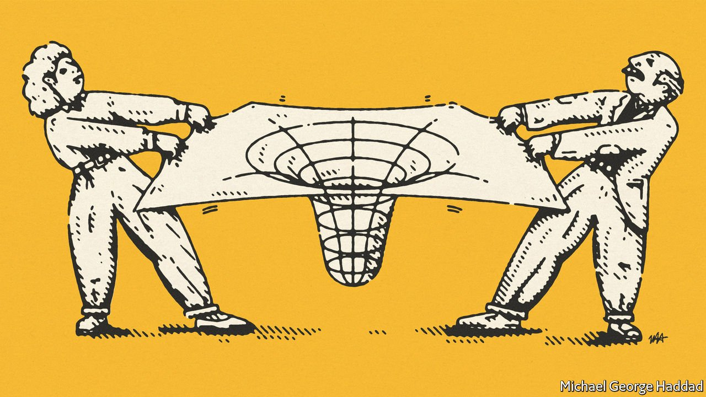

###### Life, the universe and everything

# Physics seeks the future 

##### Bye, bye, little Susy 

 

> Aug 25th 2021 

A WISE PROVERB suggests not putting all your eggs in one basket. Over recent decades, however, physicists have failed to follow that wisdom. The 20th century—and, indeed, the 19th before it—were periods of triumph for them. They transformed understanding of the material universe and thus people’s ability to manipulate the world around them. Modernity could not exist without the knowledge won by physicists over those two centuries.

In exchange, the world has given them expensive toys to play with. The most recent of these, the Large Hadron Collider (LHC), which occupies a 27km-circumference tunnel near Geneva and cost $6bn, opened for business in 2008. It quickly found a long-predicted elementary particle, the Higgs boson, that was a hangover from calculations done in the 1960s. It then embarked on its real purpose, to search for a phenomenon called Supersymmetry.


This theory, devised in the 1970s and known as Susy for short, is the all-containing basket into which particle physics’s eggs have until recently been placed. Of itself, it would eliminate many arbitrary mathematical assumptions needed for the proper working of what is known as the Standard Model of particle physics. But it is also the vanguard of a deeper hypothesis, string theory, which is intended to synthesise the Standard Model with Einstein’s general theory of relativity. Einstein’s theory explains gravity. The Standard Model explains the other three fundamental forces—electromagnetism and the weak and strong nuclear forces—and their associated particles. Both describe their particular provinces of reality well. But they do not connect together. String theory would connect them, and thus provide a so-called “theory of everything”.

String-driven things

String theory proposes that the universe is composed of minuscule objects which vibrate in the manner of the strings of a musical instrument. Like such strings, they have resonant frequencies and harmonics. These various vibrational modes, string theorists contend, correspond to various fundamental particles. Such particles include all of those already observed as part of the Standard Model, the further particles predicted by Susy, which posits that the Standard Model’s mathematical fragility will go away if each of that model’s particles has a heavier “supersymmetric” partner particle, or “sparticle”, and also particles called gravitons, which are needed to tie the force of gravity into any unified theory, but are not predicted by relativity.

But, no Susy, no string theory. And, 13 years after the LHC opened, no sparticles have shown up. Even two as-yet-unexplained results announced earlier this year (one from the LHC and one from a smaller machine) offer no evidence directly supporting Susy. Many physicists thus worry they have been on a wild-goose chase.

They have good reason to be nervous. String theory already comes with a disturbing conceptual price tag—that of adding six (or in one version seven) extra dimensions to the universe, over and above the four familiar ones (three of space and one of time). It also describes about 10{+500} possible universes, only one of which matches the universe in which human beings live. Accepting all that is challenging enough. Without Susy, though, string theory goes bananas. The number of dimensions balloons to 26. The theory also loses the ability to describe most of the Standard Model’s particles. And it implies the existence of weird stuff such as particles called tachyons that move faster than light and are thus incompatible with the theory of relativity. Without Susy, string theory thus looks pretty-much dead as a theory of everything. Which, if true, clears the field for non-string theories of everything.

The names of many of these do, it must be conceded, torture the English language. They include “causal dynamical triangulation”, “asymptotically safe gravity”, “loop quantum gravity” and the “amplituhedron formulation of quantum theory”. But at the moment the bookies’ favourite for unifying relativity and the Standard Model is something called “entropic gravity”.

Here be monsters

Entropy is a measure of a system’s disorder. Famously, the second law of thermodynamics asserts that it increases with time (ie, things have a tendency to get messier as they get older). What that has to do with a theory of gravity, let alone of everything, is not, perhaps, immediately obvious. But the link is black holes. These are objects which have such strong gravitational fields that even light cannot escape from them. They are predicted by the mathematics of general relativity. And even though Einstein remained sceptical about their actual existence until the day he died in 1955, subsequent observations have shown that they are indeed real. But they are not black.

In 1974 Stephen Hawking, of Cambridge University, showed that quantum effects at a black hole’s boundary allow it to radiate particles—especially photons, which are the particles of electromagnetic radiation, including light. This has peculiar consequences. Photons carry radiant heat, so something which emits them has a temperature. And, from its temperature and mass, it is possible to calculate a black hole’s entropy. This matters because, when all these variables are plugged into the first law of thermodynamics, which states that energy can be neither created nor destroyed, only transformed from one form (say, heat) into another (say, mechanical work), what pops out are Einstein’s equations of general relativity.

That relationship was discovered in 2010 by Erik Verlinde of Amsterdam University. It has serious implications. The laws of thermodynamics rely on statistical mechanics. They involve properties (temperature, entropy and so on) which emerge from probabilistic descriptions of the behaviour of the underlying particles involved. These are also the particles described by quantum mechanics, the mathematical theory which underpins the Standard Model. That Einstein’s equations can be rewritten thermodynamically implies that space and time are also emergent properties of this deeper microscopic picture. The existing forms of quantum mechanics and relativity thus do indeed both seem derivable in principle from some deeper theory that describes the underlying fabric of the universe.

String theory is not so derivable. Strings are not fundamental enough entities. But entropic gravity claims to describe the very nature of space and time—or, to use Einsteinian terminology, “spacetime”. It asserts this is woven from filaments of “quantum entanglement” linking every particle in the cosmos.

The idea of quantum entanglement, another phenomenon pooh-poohed by Einstein that turned out to be true, goes back to 1935. It is that the properties of two or more objects can be correlated (“entangled”) in a way which means they cannot be described independently. This leads to weird effects. In particular, it means that two entangled particles can appear to influence each other’s behaviour instantaneously even when they are far apart. Einstein dubbed this “spooky action at a distance”, because it seems to violate the premise of relativity theory that, in the speed of light, the universe has a speed limit.

 


As with black holes, Einstein did not live long enough to see himself proved wrong. Experiments have nevertheless shown he was. Entanglement is real, and does not violate relativity because although the influence of one particle on another can be instantaneous there is no way to use the effect to pass information faster than light-speed. And, in the past five years, Brian Swingle of Harvard University and Sean Carroll of the California Institute of Technology have begun building models of what Dr Verlinde’s ideas might mean in practice, using ideas from quantum information theory. Their approach employs bits of quantum information (so-called “qubits”) to stand in for the entangled particles. The result is a simple but informative analogue of spacetime.

Qubits, the quantum equivalent of classical bits—the ones and zeros on which regular computing is built—will be familiar to those who follow the field of quantum computing. They are the basis of quantum information theory. Two properties distinguish qubits from the regular sort. First, they can be placed in a state of “superposition”, representing both a one and a zero at the same time. Second, several qubits can become entangled. Together, these properties let quantum computers accomplish feats such as performing multiple calculations at once, or completing certain classes of calculation in a sensible amount of time, that are difficult or impossible for a regular computer.

And because of their entanglement qubits can also, according to Dr Swingle and Dr Carroll, be used as stand-ins for how reality works. More closely entangled qubits represent particles at points in spacetime that are closer together. So far, quantum computers being a work in progress, this modelling can be done only with mathematical representations of qubits. These do, though, seem to obey the equations of general relativity. That supports entropic-gravity-theory’s claims.

Put your analyst on danger money

All of this modelling puts entropic gravity in poll position to replace strings as the long-sought theory of everything. But the idea that spacetime is an emergent property of the universe rather than being fundamental to it has a disturbing consequence. It blurs the nature of causality.

In the picture built by entropic gravity, spacetime is a superposition of multiple states. It is this which muddies causality. The branch of maths that best describes spacetime is a form of geometry that has four axes at right angles to each other instead of the more familiar three. The fourth represents time, so, like the position of objects, the order of events in spacetime is determined geometrically. If different geometric arrangements are superposed, as entropic gravity requires, it can therefore sometimes happen that the statements “A causes B” and “B causes A” are both true.

This is not mere speculation. In 2016 Giulia Rubino of the University of Bristol, in England, constructed an experiment involving polarised photons and prisms which achieved exactly that. This spells trouble for those who have old-fashioned notions about causality’s nature.

However, Lucien Hardy of the Perimeter Institute, in Canada, has discovered a way to reformulate the laws of quantum mechanics to get around this. In his view, causality as commonly perceived is like data compression in computing: it is a concept that gives you more bang for your buck. With a little bit of information about the present, causality can infer a lot about the future—compressing the amount of information needed to capture the details of a physical system in time.

But causality, Dr Hardy thinks, may not be the only way to describe such correlations. Instead, he has invented a general method for building descriptions of the patterns in correlations from scratch. This method, which he calls “the causaloid framework”, tends to reproduce causality but it does not assume it, and he has used it to reformulate both quantum theory (in 2005) and general relativity (in 2016). Causaloid maths is not a theory of everything. But there is a good chance that if and when such a theory is found, causaloid principles will be needed to describe it, just as general relativity needed a geometry of four dimensions to describe spacetime.

Amplitude modulation

Entropic gravity has, then, a lot of heavy-duty conceptual work to back it up. But it is not the only candidate to replace string theory. Others jostling for attention include an old competitor called loop quantum gravity, originally proposed in 1994 by Carlo Rovelli, then at the University of Pittsburgh, and Lee Smolin, of the Perimeter Institute. This, and causal dynamical triangulation, a more recent but similar idea, suggest that spacetime is not the smooth fabric asserted by general relativity, but, rather, has a structure—either elementary loops or triangles, according to which of the two theories you support.

A third option, asymptotically safe gravity, goes back still further, to 1976. It was suggested by Steven Weinberg, one of the Standard Model’s chief architects. A natural way to develop a theory of quantum gravity is to add gravitons to the model. Unfortunately, this approach got nowhere, because when the interactions of these putative particles were calculated at higher energies, the maths seemed to become nonsensical. However, Weinberg, who died in July, argued that this apparent breakdown would go away (in maths speak, the calculations would be “asymptotically safe”) if sufficiently powerful machines were used to do the calculating. And, with the recent advent of supercomputers of such power, it looks, from early results, as if he might have been right.

One of the most intriguing competitors of entropic gravity, though, is the amplituhedron formulation of quantum theory. This was introduced in 2013 by Nima Arkani-Hamed of the Institute of Advanced Study at Princeton and Jaroslav Trnka of the University of California, Davis. They have found a class of geometric structures dubbed amplituhedrons, each of which encodes the details of a possible quantum interaction. These, in turn, are facets of a “master” amplituhedron that encodes every possible type of physical process. It is thus possible to reformulate all of quantum theory in terms of the amplituhedron.

Most attempts at a theory of everything try to fit gravity, which Einstein describes geometrically, into quantum theory, which does not rely on geometry in this way. The amplituhedron approach does the opposite, by suggesting that quantum theory is actually deeply geometric after all. Better yet, the amplituhedron is not founded on notions of spacetime, or even statistical mechanics. Instead, these ideas emerge naturally from it. So, while the amplituhedron approach does not as yet offer a full theory of quantum gravity, it has opened up an intriguing path that may lead to one.

 


That space, time and even causality are emergent rather than fundamental properties of the cosmos are radical ideas. But this is the point. General relativity and quantum mechanics, the physics revolutions of the 20th century, were viewed as profound precisely because they overthrew common sense. To accept relativity meant abandoning a universal notion of time and space. To take quantum mechanics seriously meant getting comfortable with ideas like entanglement and superposition. Embracing entropic gravity or its alternatives will require similar feats of the imagination.

No theory, though, is worth a damn without data. That, after all, is the problem with Supersymmetry. Work like Dr Rubino’s points the way. But something out of a particle-physics laboratory would also be welcome. And, though their meaning is obscure, the past few months have indeed seen two experimentally induced cracks in the Standard Model.

On March 23rd a team from CERN, the organisation that runs the LHC, reported an unexpected difference in behaviour between electrons and their heavier cousins, muons. These particles differ from one another in no known properties but their masses, so the Standard Model predicts that when other particles decay into them, the two should each be produced in equal numbers. But this appears not to be true. Interim results from the LHC suggest that a type of particle called a B-meson is more likely to decay into an electron than a muon. That suggests an as-yet-undescribed fundamental force is missing from the Standard Model. Then, on April 7th, Fermilab, America’s biggest particle-physics facility, announced the interim results of its own muon experiment, Muon g-2.

In the quantum world, there is no such thing as a perfect vacuum. Instead, a froth of particles constantly pops in and out of existence everywhere in spacetime. These are “virtual” rather than “real” particles—that is, they are transient fluctuations which emerge straight out of quantum uncertainty. But, although they are short-lived, during the brief periods of their existence they still have time to interact with more permanent sorts of matter. They are, for example, the source of the black-hole radiation predicted by Hawking.

The strengths of their interactions with types of matter more conventional than black holes are predicted by the Standard Model, and to test these predictions, Muon g-2 shoots muons in circles around a powerful superconducting magnetic-storage ring. The quantum froth changes the way the muons wobble, which detectors can pick up with incredible precision. The Muon g-2 experiment suggests that the interactions causing these wobbles are slightly stronger than the Standard Model predicts. If confirmed, this would mean the model is missing one or more elementary particles.

Cracks of dawn

There is a slim chance that these are the absent sparticles. If so, it is the supporters of supersymmetry who will have the last laugh. But nothing points in this direction and, having failed thus far to stand their ideas up, they are keeping sensibly quiet.

Whatever the causes of these two results, they do show that there is something out there which established explanations cannot account for. Similarly unexplained anomalies were starting points for both quantum theory and relativity. It looks possible, therefore, that what has seemed one of physics’s darkest periods is about to brighten into a new morning. ■

