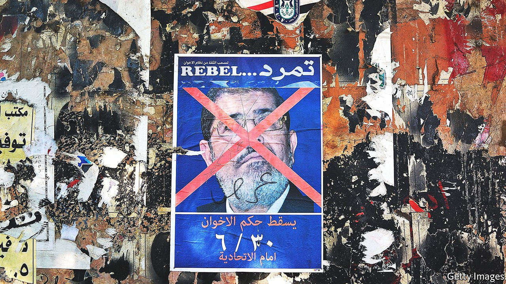

###### No solution

# Across the Arab world, Islamists’ brief stints in power have failed 

##### They have proved out of touch with those they claimed to support 

 

> Aug 24th 2021 

BEFORE 2011 many Arabs believed that, given a fair chance, Islamists would be an unstoppable force in democratic politics. This view was shared by supporters and opponents alike. The former saw Islamists as clean, unsullied by power, adept at providing social services and well-placed to run campaigns. The latter thought they would use democracy to swoop to power and then abolish it: “one man, one vote, once”, as the saying goes.

For decades, few could test this hypothesis. Islamism was the main ideological challenger to Arab nationalism, but it was repressed throughout the region. The Muslim Brotherhood, founded in Egypt in 1928, was officially “banned but tolerated”, allowed to perform charitable work but mostly kept out of politics. Algeria endured a brutal civil war in the 1990s after the government negated an Islamist victory at the polls. Hafez al-Assad flattened much of Hama in 1982, killing thousands, to quash an Islamist revolt.


This experience did much to shape Islamists vying for power after the Arab spring. Many were the products of brutal repression or long exile. The first created movements like the Brotherhood, with rigid, secretive hierarchies ill-suited to democratic rule. The second meant that Islamists were often out of touch with those they sought to represent. In both cases, they overestimated the depth of popular support—though this was not immediately apparent after the Arab spring. When Egypt held its first free parliamentary elections in 2011 and 2012, the Muslim Brotherhood romped to victory: its Freedom and Justice party won 44% of the seats, a plurality. It then broke a promise not to field a presidential candidate and won that election, too, albeit by only three points.

In hindsight, some Brotherhood supporters wish they could reverse that decision. Muhammad Morsi, the only freely elected president in Egypt’s history, was never meant to hold the job. He stepped in after the army disqualified the Islamists’ preferred candidate (wags dubbed him “the spare tyre”). His brief tenure was a debacle. He alienated liberals by declaring his decisions beyond judicial review; he infuriated the army by attending a rally where clerics urged Egyptians to join a jihad in Syria; and he lost the public through his bumbling style. He once reversed a raft of controversial tax increases, well after midnight, in a Facebook post.

His failings were not all his fault. The army, security services and courts conspired to undermine him. Police were largely invisible in early 2013 (residents of smart Cairo suburbs swapped horror stories about carjackings) only to make an abrupt return after the coup. Still, his rule was inept and divisive; by the time he was overthrown, many Egyptians were happy to see him gone.

Hamas, the Islamist group that controls Gaza, has turned corrupt and authoritarian: “Fatah with beards”, critics call it, referring to the much-loathed nationalist faction that runs the West Bank. The Islamist tinge of many Syrian rebels helped push minorities to throw in their lot with the Assad regime. The only Islamist party to emerge with its reputation intact, Tunisia’s Ennahda, is best known for ceding power in 2014 after a spate of assassinations, saving (perhaps only briefly) Tunisia’s nascent democracy.

After a decade in which Islamists sought influence across the Middle East, the only places they control are not states at all: Hamas in Gaza, and Hayat Tahrir al-Sham (HTS), a jihadist group that holds a chunk of north-west Syria. Elsewhere they are again on the defensive, losing support from even close backers. They may never re-emerge as a hegemonic force. Islamists’ brief experiments at governing suggest they have few ideas for what to do.

The Turkish model

By 2011 Turkey had accumulated plenty of soft power in the Arab world. It was a popular tourist destination and the source of beloved soap operas dubbed into Arabic. It had a moderate Islamist government with a booming economy and a positive reputation—a model of what some Arab activists hoped to build.

Unsurprisingly, it staked its reputation on the Islamists who sought power after 2011. Turkey was one of the few states vocally to oppose the coup in Egypt. As the Arab counter-revolution grew, it became a safe haven for Islamists hounded out by repressive regimes. It treats the HTS-ruled enclave in Syria as a protectorate. Leaders of Hamas have found safe haven in Istanbul.

After the Tunisian revolution Rachid Ghannouchi, leader of Ennahda, explicitly cited Turkey as a model. One no longer hears such talk today. That is partly because Turkey has lost appeal. Recep Tayyip Erdogan, the country’s ruler since 2003, is increasingly autocratic, intolerant of protesters and the press. His economic policies debased the currency and fuelled high inflation. A foreign policy once described as “zero problems with neighbours” has flipped into one of zero neighbours without problems.

Open support for Islamists has triggered a backlash in the Arab world. At times it has been petty. In 2019 MBC, a Saudi-owned television network, aired a series called “Mamalik al-Nar” (Kingdoms of Fire), which depicted the final conflict between the Ottomans and the Mamluks. It cast the early Ottomans not as benevolent overlords, as they are often portrayed in Arab historiography, but as harsh occupiers. Saudi television takes its cue from the government; the series was seen as an effort to sour public opinion against Turkey. But the kingdom has also taken concrete measures. It imposed an informal embargo on Turkish goods last year. Data from a Turkish industry group found exports to Saudi Arabia in the first quarter down by 93% on last year, from $811m to $56m.

All this has prompted Turkey to reconsider its policies. In recent months it has ordered Brotherhood-linked television channels in Turkey to tone down their rhetoric; several outspoken journalists have been pulled off air. In April an adviser to Mr Erdogan said Turkey was eager to repair relations with Saudi Arabia. He even praised the Saudi legal system for how it handled the murder of Jamal Khashoggi, a Saudi journalist butchered inside the kingdom’s consulate in Istanbul in 2018. This about-face has been head-spinning for Arab dissidents based in Turkey, a reminder that Islamists, like many politicians, are motivated less by ideology than by self-interest—a trend also apparent in the Arab world.

When Islamists did come to power, they seem not to have considered how to use it. In the autumn of 2012 the Brotherhood-led Egyptian government oversaw an effort to draft a new constitution. One of the most contentious articles dealt with the role of sharia (Islamic law) in Egyptian courts. The nuances of the debate tended toward the esoteric, incomprehensible to anyone without a background in law and religion. Liberals were angry that the Brotherhood’s proposal went too far, and ultraconservative salafists fumed that it did not go far enough. The question consumed the government for weeks, at a time when it should have focused on more pressing issues, such as the economy. Not that it had much to offer on that front. Islamist parties tend to be capitalist, often more so than nationalists. But their economic philosophies rarely go beyond a vague faith in markets.

Ennahda offers a telling example, if only because Tunisia’s democratic transition gave it a decade to play politics. It mostly avoided trying to impose religion on a country with an influential secular population inspired by French notions of laïcité. And its economic policies have often been indistinguishable from those of the ancien régime. It struck a deal with the IMF, imposed austerity and clashed with the country’s powerful trade unions.

Mr Ghannouchi deserves credit for his 2014 resignation and his partnership with Beji Caid Essebsi, head of an anti-Islamist coalition. “We placed all our bets on an alliance with our adversaries from yesterday,” he said. But voters punished him: Ennahda’s share of the vote fell from 28% in 2014 to 20% in 2019. Within the party he seems increasingly autocratic, on his third term as leader (defying rules that limit him to two) and planning a fourth.

Then came Kais Saied, the political outsider elected as president in 2019. In July he staged a form of coup, stretching the constitution to invoke emergency powers, sack the prime minister and suspend parliament. It was a nakedly undemocratic move, yet many Tunisians, fed up after a decade of political paralysis and economic pain, supported it or were indifferent.

At first Ennahda branded his move a straight coup, a description unpopular even with some of its supporters: young cadres urged the leadership to resign. It has since toned down its language and accepted a need for “self-criticism”. It is not solely to blame for Tunisia’s woes, but Mr Ghannouchi has been reluctant to admit that his party had any responsibility for them. After decades supposedly preparing for power, Islamists found themselves unready for the task—and facing a wall of opposition from other Arab states, which see political Islam as a mortal threat. ■

Full contents of this special report


Islamism and its discontents: No solution*


