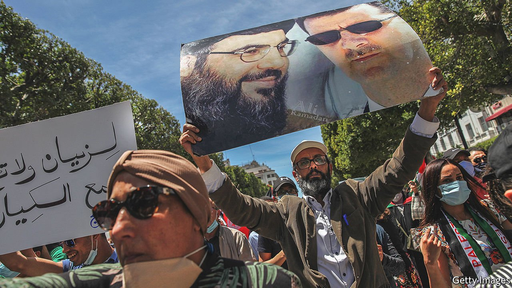

###### The resistance axis?

# Iran scores a pyrrhic victory in its cold war with Saudi Arabia 

##### Its allies are impoverished 

 

> Aug 24th 2021 

VISITORS TO BEIRUT last year noticed an odd diptych on the drive from the airport. Head north along Imam Khomeini avenue and one passed billboards to Qassem Suleimani, an Iranian general assassinated by America in January 2020. Yet just a kilometre farther on his gaunt visage gave way to a jowly image of Benjamin Franklin, one of America’s Founding Fathers.

General Suleimani was a frequent visitor to the city. He helped build Hizbullah, a Shia militia-cum-political party, into the strongest actor in Lebanon, with a sizeable base of popular support and the muscle to silence critics. But it now wields its influence in a country plunged into what the World Bank says may be one of the three worst financial crises since the 1850s. The Lebanese pound, once pegged to the dollar, has lost more than 90% of its value in two years, and greenbacks have become scarce. Hence those images of Franklin: a local money-transfer firm wanting to reassure customers it had $100 notes left. The billboards are a small illustration of the success and failure of Hizbullah—a story repeated elsewhere in the region. Groups backed by Iran wield great power from Baghdad to Beirut. Yet the “axis of resistance” props up ossified regimes that control but cannot govern.


For decades observers have seen the Middle East through the prism of a Saudi-Iranian cold war, a conflict that dates from Iran’s Islamic revolution in 1979. Ayatollahs in Tehran hoped, and monarchs on the Arabian peninsula feared, that the revolutionary wave would cross the Gulf. Saddam Hussein framed his eight-year war against Iran in the 1980s as an effort to shield Arabs from Iranian hegemony. The Gulf states, particularly Saudi Arabia and Kuwait, lent more than $37bn to his war effort.

This binary view of a proxy war has outlived its usefulness—because the Saudis lost. They failed to build a deep well of support in other Arab countries, settling for ineffective chequebook diplomacy with fickle politicians and warlords. Iran is undeniably the strongest foreign actor in Lebanon, Syria and Iraq. (Ironically, it owes thanks to its arch-foe America, which swept Saddam away in 2003, transforming Iraq from hostile neighbour to fertile ground for Iranian influence.) The Saudis still fight a rearguard action in Yemen, but their six-year war against the Houthis, a Shia group, has served mostly to benefit Iran. Diplomats from the Gulf curtly describe several Arab states as “outside the Arab fold”.

Yet Iran’s victory is a hollow one. The axis of resistance is one of misery. Life in Syria and Lebanon is defined by petrol queues, lengthy blackouts and growing hunger. Iraqis swelter through another summer of widespread power cuts, with temperatures soaring to 52°C (126°F). Yemen has endured bouts of famine and cholera. Iran and its allies are not wholly to blame for these problems. Lebanon’s bankruptcy stems from decades of misrule by the political class. But the Iranians do not even pretend to offer solutions. Instead they have become guardians of failed regimes. In Syria, Iran helped Bashar al-Assad brutalise his opposition and preserve his grip on power. More recently Hizbullah helped put down a protest movement in Lebanon, and Iranian-backed militias in Iraq have killed protesters.

When Hizbullah was founded in the 1980s, it had something to resist: the Israeli occupation of south Lebanon. Many Lebanese, regardless of sect or political persuasion, saw this as a legitimate struggle. The group’s popularity soared after the Israeli withdrawal in 2000, and stayed high even after war with Israel in 2006, which began with the capture of two Israeli soldiers. Though devastating for Lebanon—even leaders of Hizbullah later admitted it was a mistake—it ended in a draw, and for Hizbullah survival was victory. Arabs of all stripes cheered it for giving Israel a bloody nose, a feat no Arab state had managed in decades.

But Hizbullah has since mostly turned its guns on other Arabs. In 2008 its militants briefly took over west Beirut, a moment that stretched the definition of “resistance”. The Syrian civil war brought more contradictions. To support its allies, Mr Assad and Iran, Hizbullah had to fight Syrian rebels. This time it claimed to be resisting the takfiris, or Sunni extremists, and protecting Shia shrines in Damascus. Some Lebanese Christians, unnerved by the more radical elements of the Syrian opposition, applauded. But Hizbullah’s popularity in the Arab world broadly plunged.

Redefining resistance

Today Hizbullah and its allies speak of a “resistance economy” in Lebanon—another shift. In areas where the group holds sway, shops offer Syrian and Iranian goods at prices below those elsewhere. In April Hizbullah trumpeted the Sajjad card, a ration-card scheme named after a Shia imam that offers discounts to participants based on their incomes. But their supporters are still not spared the indignities that define life in Lebanon. Pharmacy shelves are bare: expats visiting for the summer stuff their suitcases with medicines, not only prescription pills but even basics like paracetamol that are unavailable in the country. Petrol stations, if not closed, have hours-long queues that snake for blocks.

The story is similar elsewhere in Iran’s sphere of influence. The World Food Programme estimates that 12.4m Syrians cannot get enough to eat—nearly 60% of the population, and twice as many as in 2018. A basket of staple foods has increased in price by almost 200% in the past year. Subsidised bread, the cheapest source of calories, is of ever-lower quality, and Syrians often queue for hours to procure any. Meanwhile Iraq, the world’s sixth-biggest oil producer, generates barely half the estimated 30 gigawatts of electricity its citizens need during scorching summers. Billions of dollars spent on post-war reconstruction have vanished, siphoned off by corrupt officials.

To hear Hassan Nasrallah tell it, such woes are largely the result of a Western “siege”, a term he has used in speeches over the past year. Even critics of the Hizbullah leader would admit that he is a charismatic speaker with a flair for the dramatic. Not only that: he offers more than empty words. In a televised speech during the 2006 war, Mr Nasrallah told his viewers to look out to sea. Moments later a missile slammed into an Israeli destroyer off the coast, damaging the vessel and killing four sailors.

A decade and a half later, though, Mr Nasrallah has become what he once abhorred. He has made dozens of speeches since Lebanon’s plunge into crisis, many devoted to backing the existing order. Initially he endorsed anti-government demonstrations in 2019, but he quickly changed his mind. In his later assessment the protesters—hundreds of thousands, from all walks of life—had been infiltrated by a fifth column on the payroll of foreign embassies. As for the economic crisis, he offers a pat solution: to bypass the Western “siege” and “look east”, to Asian powers such as China, which stand ready to pour billions into Arab economies despite supposed howls of outrage from the Americans.

Much of this is fantasy. Sanctions on Lebanon are limited to companies and individuals, many affiliated with Hizbullah. There are no broad prohibitions on trade. And America has not kept China out of the Middle East. Since 2005 it has invested $137bn in Egypt, Jordan and the six Gulf states, according to a tally by the American Enterprise Institute, a think-tank. It has also signed $13bn-worth of deals in neighbouring Israel. All of these are close American partners—countries that would be sensitive to criticism from America over their dealings with China. The real obstacle to Chinese investment in Lebanon is Lebanon itself: unchecked corruption, parlous infrastructure.

Iraq struggles to attract non-oil foreign investment for similar reasons. Sanctions may be a bigger issue in Syria, where America has banned a range of commercial transactions with the regime. Even there, though, Mr Assad acknowledges that his biggest economic problem is Lebanon’s financial crisis, which erased tens of billions of dollars of Syrian capital stashed in Lebanese banks. “Sanctions haven’t prevented us from securing our basic needs,” he said in a speech in July.

Hizbullah remains Israel’s strongest Arab foe. Generals in Tel Aviv acknowledge that another war with the group would be painful. Aside from a few brief border skirmishes, however, it has not fought Israel in 15 years, and now can ill afford to. A bankrupt country still reeling from the self-imposed ruin of its capital is in no position to support a war.

Similarly, the militias that fought America after 2003 claimed to be fighting a foreign occupier. But the meagre American presence in Iraq is there at the behest of an elected government, keen to prevent a resurgence of Islamic State. In Syria, Iran and its partners led a counter-revolution to shield a hereditary dictator whose regime was no exemplar of resistance: the Assads, père et fils,kept the border with Israel quiet since 1973, and the younger was negotiating a peace deal with the Israelis as late as 2010.

“Resistance” has thus given way to self-preservation. If they are impoverished and ideologically incoherent, though, Iran’s allies are also well-armed. That has been enough to preserve their grip on power. Yet they have proved no more effective than the regimes they once sought to topple—a problem that, ironically, also afflicts their ideological opposites.■

Full contents of this special report


The resistance axis: Pyrrhic victory for Iran*


