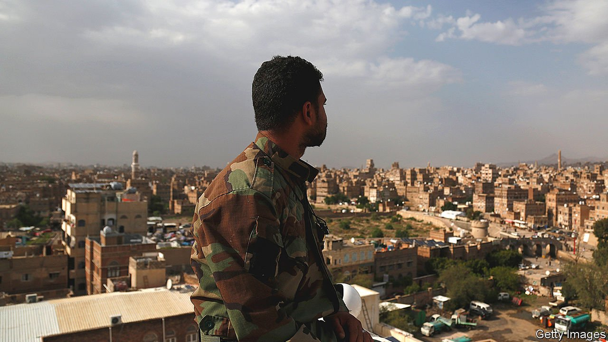

###### Staying at home

# Most Arab countries now focus on domestic concerns, not unity 

##### But the presence of foreign powers is still dearly felt 

 

> Aug 24th 2021 

A FEW SUMMERS ago, scores of people packed into a Beirut concert hall for an evening of nostalgia. An Iraqi-born singer performed songs by Umm Kulthum, Egypt’s most famous diva. “The Lady” was an icon of Arab nationalism: a champion of the Palestinian cause and friend of Nasser, who often scheduled his speeches to follow her monthly concerts. On this evening the mostly Lebanese crowd was drawn from a mix of sects and classes. Some wept through “Enta Omri”, a love song that seems to speak to today: “Your eyes took me back to the days that used to be/they’ve taught me to regret the past, and its wounds…”

The evening felt like a nostalgic ode to a time when the region was more cosmopolitan and aspirational. That emotion is hardly unique to the Middle East, but today it is ubiquitous. Nationalists pine for a time when Arab states fought for a cause and stood up to foreign powers. Islamists look back further, to a time when the caliphates were global centres of learning and culture. Less political types reminisce about a past when the electricity was more stable.


The past decade has been one of disappointment. The axis of resistance has become a reactionary force. The Muslim Brotherhood’s slogan, “Islam is the solution”, turned out to be hollow: faith alone cannot solve socioeconomic problems. What seemed a zero-sum contest to reshape the Middle East has been fought to a draw, leaving much of the region miserable. “Some of those battles are not winnable in the short or long run,” acknowledges a diplomat from the Gulf. “We’re going to have to just make sure that we, at home, are in the safest possible position.”

Foreign powers will be less present, though they are not leaving the region altogether. Both Barack Obama and Donald Trump tried and failed to turn their backs on the Middle East. Joe Biden is unlikely to do so either. He has already been dragged into regional politics: dispatching a special envoy to Yemen, playing a role in the Gaza ceasefire, dealing with attacks on American forces in Iraq by Iranian-backed militias. Yet America’s place in the region—measured in troop levels, diplomatic engagement or influence—is not what it was. Talk of freedom and democracy has yielded to a narrower focus on countering extremism and promoting stability. An America focused on China seems unlikely to embark on grand crusades in the Middle East.

Emmanuel Macron, the French president, flew to Beirut a year ago after the catastrophic blast that shattered the Lebanese capital, hoping to cajole its venal leaders into serious reforms. A year later he is fundraising to ensure that the Lebanese army continues to feed its soldiers, a more modest ambition. Other European powers have little to do with the region. Russia and China look out only for their own narrow interests. Yet outsiders still loom large in the popular imagination. Indeed, there is an odd nostalgia for a time when they were more active. Arab intellectuals who oppose Iran want America to drive it from the Middle East, but they cannot articulate how it is meant to dismantle groups such as Hizbullah. Others still see America as the source of all woes, and talk of its withdrawal from the region as a panacea.

Ibn Khaldun, a 14th-century Arab philosopher, popularised the notion of asabiyyah, a sense of group cohesion which he saw as the linchpin of civilisation. His most famous work, the Muqaddimah, posited a unified theory of how civilisations rise and fall: groups with strong cohesion band together, only to grow sedentary and decadent and lose their solidarity, which leads to inevitable decline. Like all grand theories, this one has flaws: the endurance of the House of Saud, a decadent regime if ever there was one, seems to offer a modern-day counterexample.

The notion of asabiyyah remains relevant. Societies need something to bind them together. But unity of a region of 400m people spread across four time zones cannot be imposed from the top down. “Neither Nasser nor Assad nor certainly Saddam, all of these guys were not democrats,” says Ghassan Salame, a Lebanese academic and diplomat. “Arab nationalism has been tainted by its very intimate association with authoritarianism.”

The EU did not emerge from the womb fully formed: European unity was the work of decades, the result not of grand ideologies but of banal initiatives like the coal-and-steel community and common agricultural policy. The Arab League took the opposite tack, presupposing a unity that did not universally exist. “It was an attempt, so far a failed attempt, to translate a cultural concept into a political one and a strategic one,” says Mr Salame.

When ideologies and institutions fail, people turn to more local identities. In Lebanon it is common to hear talk of federalism as a solution to the country’s woes. At just 10,452 square kilometres, Lebanon is half the size of Wales. While its demography corresponds a bit with its geography—the north is heavily Sunni, the south heavily Shia—its sects are mixed enough to make it impossible to divide them into cantons. A growing number of its citizens want to do exactly that, however, thinking a Swiss model would somehow end Lebanon’s infighting.

Some countries are too far gone to return to the status quo ante. Foreign diplomats still hope for a peace deal that returns Yemen to the control of a UN-backed government. Yet a plethora of armed groups, many with competing interests, makes this impossible. This “Westphalian fantasy”, writes Nadwa al-Dawsari, an analyst at the Middle East Institute, a think-tank, “will not stop Yemen’s fracturing, and could even make it worse.” Such is the state of things: unity has failed, nation-states are failing, but further division offers no solutions.

The Arab world is too big and diverse to be dominated by one ideology. It needs greater unity, but of the boring, technocratic sort: deals to let Arabs travel and trade freely, a security system that works. And it needs national leaders willing to see their jobs as more than zero-sum contests for power and money. That requires respect for human rights and civil society, and economic reform to ensure there are enough resources to go round.

The alternative is more wasted years that the region can ill afford. The problems of the past decade pale before those to come: young populations needing jobs, an energy transition that may gut the budgets of oil-producing states, climate change that could make parts of the region unfit to live in. If the Arab world’s leaders cannot stop fighting over old ideologies, they may find there is nothing left to fight for.■

Full contents of this special report


The future: Staying at home*

