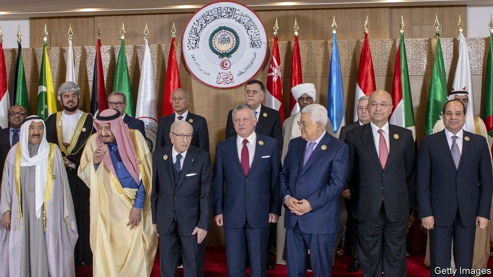

###### Talking heads

# The Arab League has done little for its members in nearly 70 years 

##### It was among the first post-war multilateral bodies, and one of the least useful 

 

> Aug 24th 2021 

NO ONE COULD blame Morocco. In 2016 the kingdom was due to host an Arab League summit, an expensive undertaking. The meetings are so dull that some heads of state fall asleep. So in February, two months beforehand, Morocco said it could not be bothered to play host. “This summit will be just another occasion to approve ordinary resolutions and to pronounce speeches that give a false impression of unity,” the kingdom said. Leaders ended up gathering in a tent in Mauritania instead.

Founded in 1945, the Arab League was one of the first multilateral bodies set up after the second world war. It expanded rapidly over the next few decades, adding members and striking treaties on defence and commerce. Members proposed a common market in 1953 and signed an economic unity agreement in 1957, the year when six European countries signed the Treaty of Rome that set up what became the European Union. The aspiration, in the Middle East as in Europe, was to pull down trade barriers and link regional economies. Almost 70 years later, none of that has happened.


Consider trade: Arab countries do pitifully little business with each other. Less than 5% of the Arab world’s non-oil trade is internal, estimates Alain Bejjani, chief executive of Majid Al Futtaim, a retailer in Dubai. EU members send at least one-third of their exports inside the bloc; in ASEAN around 20% of trade is similarly internal. Within the Arab world tariffs remain high, and poor infrastructure makes trade more expensive. French-speaking countries in north Africa have lower trade costs with Europe than with each other. Despite talk of a Schengen-style free-movement zone, travel remains difficult. A citizen of America may travel to 16 of the 22 members of the Arab League without applying for a visa. A citizen of Egypt, where the Arab League is based, may visit only six. Israelis enjoy more travel privileges in Arab states than Syrians.

 


The league has not been much good at diplomacy, either. In 2011 it tried to mediate in Syria. Mr Assad agreed to halt attacks on protesters and free political prisoners; the league deployed observers to verify. The monitoring mission lasted barely a month, but there were few consequences. The league froze Syria’s membership and voted for sanctions on Syrian officials, yet many Arab states maintained ties with Mr Assad’s regime.

The Arab Peace Initiative, which the league endorsed in 2002, seemed to be one of its few meaningful ventures: it promised Israel normal relations if it ended the occupation of Palestinian territory. This has not happened, but last year four Arab states went ahead and normalised relations with Israel anyway. The league has been on the sidelines during the covid-19 pandemic, co-ordinating neither economic stimulus nor distribution of vaccines.

The Gulf Co-operation Council (GCC) had a more hopeful start. When founded in 1981, three of its six members had been independent for only a decade. Most were small states, satellites orbiting a much larger Saudi Arabia. Integration was logical. The GCC is the closest thing in the Arab world to a multilateral institution. Citizens of its six stable monarchies enjoy free movement and the right to work across the bloc. A customs union and unified standards have eased internal trade. The bloc boasts a joint military force, known as Peninsula Shield. Though it accounts for only 13% of the Arab world’s population, its oil and gas resources have made it an economic heavyweight. In 2020 the GCC accounted for 71% of the Arab world’s foreign trade, up from 61% in 2000. It drew 59% of the region’s foreign direct investment.

Yet efforts at deeper unity have gone nowhere. Talk of a common currency remains just that. Big infrastructure projects, such as a railway network connecting the six Gulf states, are behind schedule. Peninsula Shield was not strong enough to shield the peninsula when Saddam Hussein invaded Kuwait in 1990. Its main accomplishment was to smash a popular uprising in Bahrain in 2011: less a tool of defence than one for internal repression.

In 2017 three members of the GCC—Bahrain, Saudi Arabia and the UAE—imposed a travel and trade embargo on Qatar, a fellow member. The blockade was meant to compel Qatar to abandon its pro-Islamist foreign policy and tone down its media. It was not the first dispute with Qatar, long the bête noire of the Gulf. Nor was it successful: the blockade was abandoned in January having secured no substantive concessions. But it caused a schism that paralysed the GCC. Saudi Arabia and the UAE even formed a “co-ordination council”, a sort of mini-GCC, to bypass the larger body.

The largest Gulf states, in population and GDP, are natural partners. Even they cannot see eye-to-eye. In the past few years they have disagreed over the war in Yemen, which the UAE started leaving in 2019; over how to embrace Israel, which the UAE did last year; and over production caps at OPEC, from which the UAE is contemplating withdrawal. The biggest dispute is not political but economic. On July 3rd Saudi Arabia imposed tariffs on goods manufactured in free zones in the UAE, where many foreign firms are based, making a mockery of the GCC’s customs union. Lorries backed up on the border as firms tried to work out the rules.

It was a sign of further friction to come. The Saudis are desperate to diversify their oil-bound economy. Muhammad bin Salman, the crown prince, has made this his priority, announcing trillions of rials in investments. The kingdom’s once-activist foreign policy has taken a back seat to building tourist resorts and fanciful robot-filled cities. “The options are already limited. You’re running a risk that your main source of wealth will become, very quickly, a stranded asset,” says Nasser Saidi, an economist in Dubai. In the short term, the easiest way to diversify is to steal business from the UAE, which is further along with post-oil plans. Officials in both countries insist this need not be a zero-sum game. But it will be a fierce competition that will test the GCC’s unity. There is precious little of that across the region, even in the country that was once the beating heart of Arabism.■

Full contents of this special report


Regional institutions: Talking heads*


