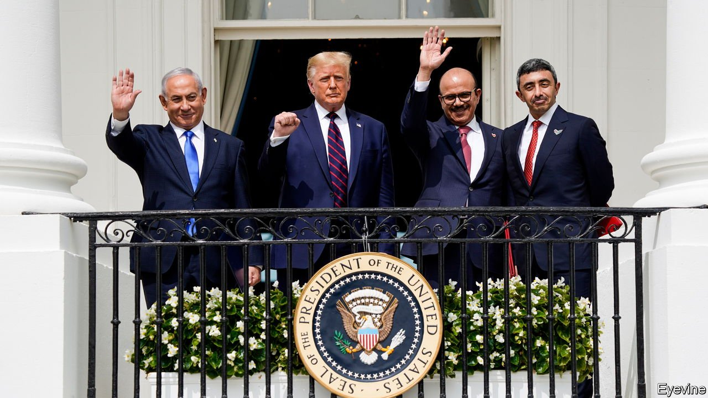
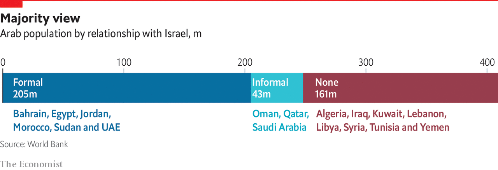

###### A farewell to arms

# The Palestinian cause no longer binds the Arab world 

##### Their struggle against Israel still looms large, but for Arab governments it has outlived its purpose 

 

> Aug 24th 2021 

IN THE FIRST years after Israel’s founding, David Ben-Gurion promoted an “alliance of the periphery”. The father of modern Israel saw the Arab world as implacably hostile. So he sought ties with non-Arab states, chiefly Turkey and Iran, which both established diplomatic relations with Israel in 1950 (the first Muslim-majority countries to do so).

The periphery looks rather different now. Israeli strategists point to Iran and Turkey as their chief regional adversaries: the first for its nuclear programmes and promotion of Shia militias, the second for harbouring Sunni Islamists, such as Hamas leaders. The Arabs no longer seem so implacable. Last year the UAE and Bahrain established diplomatic relations with Israel under the so-called “Abraham accords”; Sudan and Morocco followed suit. Fully half of Arabs now live in states that recognise Israel.


This is not to say that the Palestinian cause has lost relevance. A glance at a television in May, when Israel fought an 11-day war with Hamas, showed otherwise: the bombardment of Gaza was an omnipresent fixture on the news. It is hard to speak with authority about public opinion in a region with such repressive regimes. But it is safe to say that most Arabs see Israel’s treatment of the Palestinians as a moral outrage—even if fewer think it can or should be wiped from the map.

Most of Israel’s peace treaties in the Arab world are decidedly cold ones. Egypt reaped diplomatic and security benefits from its 1979 treaty, but Egyptians have few cultural or economic ties with their neighbour. The new Israeli envoy in Morocco struggled for months to find office space. Even so, the Palestinian cause, once a central issue to the Arab world, is now just one among many. No Arab state has fought Israel in almost 50 years, and no non-Palestinian group since 2006. In effect, the Arab-Israeli conflict, which once did so much to stitch together the region, no longer meaningfully exists.

Unity and disunity

Even in the heady days of Arab nationalism, Arab unity was a stretch. The United Arab Republic (UAR), a merger between Egypt and Syria, lasted only three years. The rulers of Syria and Iraq, both adherents of Baathist ideology, were often at daggers drawn. And the potentates of the Gulf wanted no part in a nationalist wave they feared would crash over their own palaces. Egypt fought a ruinous proxy war with Saudi Arabia in North Yemen in the 1960s.

The Arab-Israeli conflict was an exception. The “three nos”—no peace with Israel, no recognition and no negotiations—were shared policy for decades. Arab states banded together to fight Israel in 1948, 1967 and 1973. The defeat in 1967, which saw four Arab armies brought to heel by the Jewish upstart, played a big part in the demise of Arab nationalism. Nasser resigned, though he then reversed his decision. The defeat left him humbled: he was forced to sue for peace in Yemen.

Mohammed Heikal, a Nasser confidante, quipped after the war that power in the Arab world had shifted from thawra (revolution) to tharwa (wealth). The shift was not quite straightforward: at first religion would supplant revolutionary nationalism. But today the region’s centre of gravity has moved to the rich Gulf states. Many did not become independent until the 1970s, when the Arab nationalist tide had already begun to ebb. Sheikh Zayed, founder of the UAE, spoke often about the Palestinians and called Israel an enemy. But he never needed to act on these words: the last Arab-Israeli war was fought less than two years after the UAE became a sovereign state in 1971.

 


Even as a rhetorical device, the struggle with Israel has outlived its usefulness. “With all our love for the Palestinians, and our traditional support for them, there comes a point where we will no longer be able to sacrifice our interests for local struggles on the Palestinian side,” says a diplomat from a country that has normalised relations with Israel. One can quibble with this framing. The Gulf states had quiet security ties with Israel for years; they sacrificed little for the Palestinians. To call it a “local struggle”, though, underscores how little point it now has for Arab governments.

In February an Emirati probe successfully entered orbit around Mars, making the UAE the first Arab state (and the fifth overall) to reach the red planet. The Emirates sought to frame this as an Arab accomplishment: for days billboards in Dubai offered “congratulations to the Arabs”. Assembled in America and launched into space by a Japanese rocket, the probe was hardly a wholly local endeavour. But the messaging was a sign of the extent to which the UAE sees itself as a regional leader. It may seem an unlikely candidate. It lacks Egypt’s size, Saudi Arabia’s religious clout, or the long history of Arab capitals such as Baghdad and Damascus. Citizens make up only 10% of its 10m population. Even its location, on the toe of the Arabian peninsula, is on the periphery, closer to Delhi than to Cairo.

Many Arabs harbour chauvinism toward the khaleejis, desert-dwelling parvenus whose success stems from oil, luck and the hard work of foreigners. Yet many also aspire to live there. Dubai offers personal security and material comfort that are lacking in other Arab states. For decades that has been the main source of the UAE’s soft power. “We want to have a Middle East, and an Arab world, that is similar to the way in which we run our own country,” says one official.

Emirati officials rattle off priorities that sound drawn from an IMF report: efficient, lean government; support for small business; investment in education. It can seem a caricature of bloodless, technocratic liberalism. But there is little altruism in the UAE’s regional policies. It invests in agriculture in Sudan to safeguard its own food security, and funds ports on the Red Sea to support its global logistics hub. It joined the war in Yemen only to secure allies in the south, then withdrew; it is now quietly building an air base off its coast.

Most of all, the UAE has an aversion to mass politics. That is what makes Israel a logical partner, a state that offers cutting-edge surveillance tools, such as Pegasus software used to spy on journalists, activists and others. The Arab-Israeli conflict was an exercise in mass politics, instrumentalised by Arab leaders. The Abraham accords were its opposite: a way to shelve one of the few causes that resonates across the region but that Arabs have proved powerless to resolve.■

Full contents of this special report


The Abraham accords with Israel: A farewell to arms*


