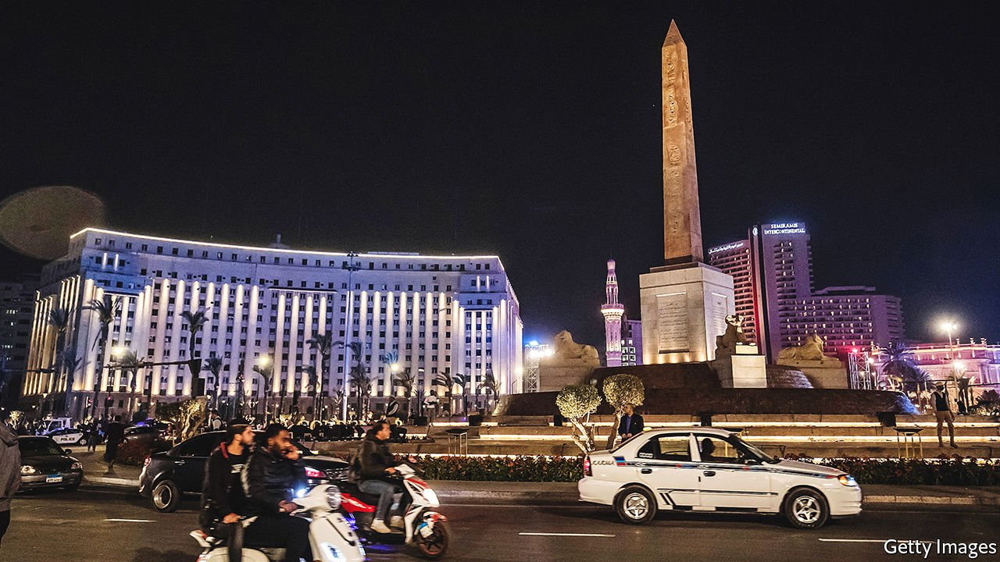
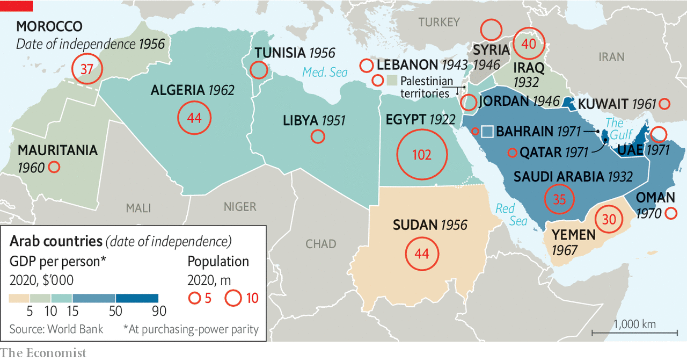

###### A misshapen square

# Why the Arab world has an identity crisis 

##### The region is mired in conflict and collapse 

 

> Aug 24th 2021 

TO WANDER TODAY through Tahrir Square, the heart of Egypt’s 2011 revolution, is to stroll through an empty, haunted house. During those 18 days of unrest the atmosphere alternated between festive and terrifying. Young people sang, schemed and spoke freely about politics. Thugs on camels rode past the Egyptian museum and charged headlong into the crowds. For years after Hosni Mubarak’s departure, the square exerted a magnetic pull. “Back to Tahrir” became a mantra for activists whenever Egypt’s democratic transition seemed troubled.

The army put paid to all this in 2013, and now the square resembles a military man’s idea of public space. It has been smartened up, with fresh paint on the buildings, well-kept grass and the central roundabout anchored by an obelisk—and also cleared of people. Guards shoo away anyone who lingers too long.


South of the square sits the Mugamma, a bureaucratic edifice where countless Egyptians have wasted countless hours and paid countless bribes for official paperwork. It is being moved to a grandiose new capital in the desert. North is the neoclassical museum, a building that entranced generations of tourists. Its treasures too are being shifted to a new $1bn museum on the Giza plateau. Though still full of traffic, Tahrir feels void of life, as if Egypt’s rulers hoped for a physical break with the chaos of a decade ago.

That makes it fitting that the square hosts the Arab League, an institution set up in 1945 that now feels like a monument to an earlier age. Built on the site of an old British barracks, the league was a nod to the mid-century Arab nationalist wave and Egypt’s role in it. Some 75 years after its founding, though, it has fallen far short of what Arabs hoped for. The nationalist wave has ebbed, as has Egypt’s place in the region. To walk past the building, into the eerie emptiness of Tahrir, invites a question: when even national identities in the Middle East are in doubt, what is the Arab world?

Before Islam came, the Arabs were, simply, Arabic-speaking nomads of the Arabian peninsula and Mesopotamian desert. The conquests of Islamic caliphates then spread their tongue and faith as far afield as modern-day Spain and Pakistan. But the last caliphate fell to the Ottomans in the 16th century, ushering in a 400-year period when most Arabs were ruled by outsiders.

By the 1800s Ottoman rule had begun to grate. Arab intellectuals looked with frustration at the technological and political progress of Europe, advances that seemed built atop the work of older Arab thinkers. The Ottoman empire felt stagnant and increasingly heavy-handed. What emerged from this frustration was Arab nationalism, an ideology that posited a historic Arab nation, bound by ties of language and culture, poised for renewal if it could only throw off the Turkish yoke.

To put this into practice would take another century. As the Ottoman empire waned, European powers carved up the Arab territories. Britain and France drew arbitrary borders that endure to this day and broke repeated promises to withdraw and grant the Arabs independence. In the decade after the second world war, though, Arabs finally assumed control of their nation-states. Some borders may have been haphazard, but they were sovereign, for the first time in centuries, and their citizens were eager for growth and development—and representative government.

 


What followed was a decades-long effort to create an expansive, transnational Arab identity. Arab nationalism would become the region’s ascendant ideology. Its main competitor, Islamism, found its own pan-Arab manifestation in the Muslim Brotherhood. The Arab League was meant to integrate the region and safeguard states’ independence. The conflict with Israel became a touchstone: a joint military struggle for some, an ideological cause for all.

Away from politics, mass media helped forge a common culture. Egyptian cinema grew universally popular. The haunting voice of Fairouz, Lebanon’s most celebrated diva, crooned from cafés and car radios from Tunis to Baghdad. There were pan-Arab newspapers and Sawt al-Arab (“Voice of the Arabs”), a Cairo radio station that could be heard across the Arabic-speaking world.

The Arab spring that began in 2010 was also a pan-Arab endeavour. The self-immolation of a street peddler in Tunisia set off protests in much of the region, their spread galvanised by al-Jazeera, a Qatari-funded satellite news channel that saw its popularity peak as the unrest spread. Slogans and tactics migrated from one place to the next. Demonstrators in one country chanted in solidarity with their kin in another.

Hollow pillars

Yet it also revealed how hollow were the pillars of Arabism. The Arab League played little part, except as the butt of jokes on social media. Arab nationalism, long associated with ruthless dictators and ill-conceived socialist policies, was already discredited; it was not a unifying ideology. Islamists claimed some brief opportunities to govern, but their divisive and incompetent rule left their reputations in tatters. And the battle with Israel lost some of its resonance as Arabs turned their ire on their own rulers, who killed vastly more people in a decade than Israel has ever done.

This special report is about the regional order that has emerged from the past decade. It has three distinct characteristics. First is the external weakness of many Arab states: the most powerful countries in the Middle East are all non-Arab. Second is their internal brittleness. Bulging young populations and unproductive economies are existential threats that often call for harsh repression. Apart from the Gulf countries, the Arab world is a string of failed and failing states.

Alongside these crises of legitimacy and governance, is a third: a crisis of identity. With no ideologies or institutions to stitch together the region, many states have fallen back on a narrow, self-interested nationalism. Ask young Arabs what it means to be Arab and many struggle to find an answer. “Sitting in fuel queues,” quips a journalist in Beirut. “A desire to emigrate,” says an Egyptian businessman. “It’s a longing for home,” offers a Bahraini academic. Two centuries after Arab intellectuals dreamed of a prosperous, sovereign and united region, the main thread that connects people from Marrakech to Muscat is often a shared sense of unhappiness.

The post-war era was hardly a peaceful time in the Middle East. But this was when Arabs took centre stage in their own conflicts. Today the region is divided into three camps, each led by a powerful non-Arab state. The Iranian one styles itself as the “axis of resistance”. It counts the Syrian regime as an ally, along with powerful Shia militias in Iraq, Lebanon and Yemen. Next is a Turkish-backed group rooted in Sunni Islamism. Qatar is its closest Arab partner; it also wields influence in Libya, northern Syria and among the diaspora. Opposed to both are the Gulf monarchies. Wealthy and stable, but nervous for their own security, they have thrown in their lot with a third non-Arab state: Israel, the region’s strongest country.

There have been no winners in this contest. Years of civil war have left Libya, Syria and Yemen unrecognisable as sovereign states. The Iraqi government midwifed by the American-led invasion in 2003 has stood by while Iranian-backed militias loot the treasury and murder critics. Lebanon has plunged into a depression that ranks as one of the worst anywhere in history. The Arab world accounts for 5% of the world’s population but almost 50% of its refugees and 25% of its internally displaced people.

Most Arab countries suffer from severe poverty, unemployment and woeful basic services. Egyptians overthrew a dictator only to welcome another. Tunisians built the Arab world’s only true democracy, and even that is now under threat. Both countries had higher unemployment in 2020 than in 2010, higher poverty rates, and higher debt-to-GDP ratios. Even the Gulf states, relative oases of stability, fret about the end of their rentier economic models. With the possible exception of the United Arab Emirates (UAE), none has worked out how to build a prosperous Arab economy for a post-oil future.

Arabic has two words for nationalism: qawmiyya, from the word qawm, which connotes a group of people unbound by borders, and wataniyya, from watan, a word often rendered in English as “homeland”. The Arab nationalism of the 20th century aspired to be the first, even if reality fell short of this. “The Arab world” is a vast region of up to 22 countries and more than 400m people, with more scattered in a far-flung diaspora. Yet the region’s factionalism was not inevitable. Foreign powers deserve some blame. America and the Soviet Union both propped up lousy Arab regimes during the cold war. Since 2003 American policy has been inconsistent but almost always terrible. A straight line connects the invasion of Iraq with the rise of Islamic State a decade later.

For Arab rulers, aspirational talk of unity was often a pretext for larger states to meddle in the affairs of smaller ones. Corruption and incompetence left even energy-rich countries in a state of decay. Autocrats failed to invest in education, repressed civil society and stoked internal division, all but ensuring that efforts to set up democracies would fail. What exists today is increasingly just the second sort of nationalism. The Arab League lurches on, but has not built the ties of trade and travel that have integrated other regions. And far from promoting regional unity, a new crop of autocratic rulers who survived or emerged from the Arab spring struggles to hold together even national identities.■

Full contents of this special report

The Arab world: Identity crisis*


