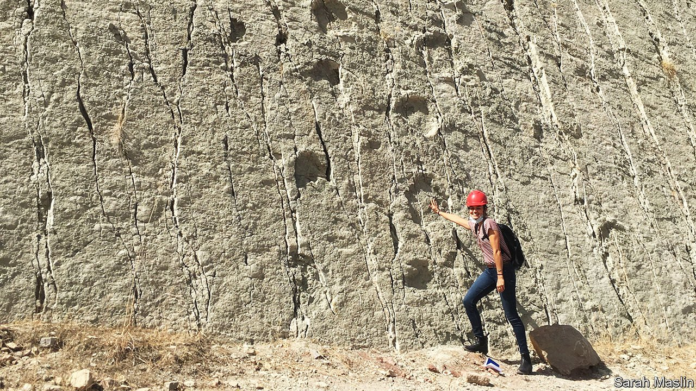

###### A palaeontological paradox

# Bolivia has thousands of dinosaur footprints, but few bones 

##### The discrepancy has both natural and all too human causes 

 

> Aug 25th 2021 

WHEN MARIO JALDIN was growing up in the 1950s in Torotoro, a village in the Bolivian Andes, he noticed hundreds of huge three-toed footprints on the edge of town. There were round ones with fat toes, thin ones with pointy claws, prints in straight lines and at odd angles, as if the beast that left them had had a change of heart. Mr Jaldin’s grandfather, who didn’t like him to stay out late, told him that they belonged to “a monster who comes out at night and is so strong he leaves prints in solid rock”. In 1984 an Italian palaeontologist revealed their true origin: dinosaurs.

After similar discoveries at other “tracksites”, Bolivia now has over 15,000 confirmed prints, one of the highest numbers anywhere in the world. The dinosaurs that roamed its prehistoric turf include long-necked sauropods, spiked ankylosaurs and theropods, which walked on two legs. With chains of tracks that stretch thousands of kilometres, “one must have died en route,” says Bernardino Mamani of the Natural History Museum in La Paz.


But unlike Brazil, Chile and Argentina, with which Bolivia shared a migration route, or “dinosaur highway”, Bolivia has yet to find a skeleton. This paradox has both natural and all too human causes.

Dinosaurs lived during the Mesozoic era, from 252m to 66m years ago. Mesozoic rock is scarce in Bolivia, and the shifting of tectonic plates left some layers in accordion-like folds. According to Christian Meyer, a Swiss palaeontologist who spent a decade studying 12,000 prints at Cal Orck’o, the near-vertical face of a limestone quarry near the city of Sucre, such folding helps expose prints and could expose bones. But Mesozoic rock tends to be in hard-to-reach areas and can have characteristics that make digs tricky. For instance, experts believe that Torotoro was once engulfed by an alkaline-heavy lake (t’uru is Quechua for “mud”; t’uru t’uru, “a lot of mud”). Such environments are ideal for sealing prints but not for preserving bones, says John Flynn of the American Museum of Natural History, in New York.

Such challenges could be overcome if it were not for human factors. Bolivia, which is South America’s poorest country after Venezuela, has few palaeontologists and little funding for science. “The lower the intensity of exploration, the lower the chance of finding fossils,” says Mr Flynn.

As in many countries, Bolivia’s first fossils were unearthed by accident. Oil and mining geologists became experts at identifying species they found, from 485m-year-old trilobites to relatives of armadillos that lived one million years ago. Foreign palaeontologists like Mr Meyer, who specialises in fossilised footprints, or “ichnites”, published papers establishing Bolivia as a dinosaur mecca. As a result, local interest grew.

Whereas other South American countries created science councils to allocate funding for research and university courses to teach palaeontology, Bolivia’s government did little beyond building a few museums. The Natural History Museum, which has 26,000 specimens, has occupied a warehouse since its original building started to collapse ten years ago.

Inside it, Mr Mamani gestures at cramped shelves in a tiny office filled with femurs and tusks of mastodons, known as “South American elephants”. He oversees vertebrates; his co-curator does invertebrates. “We don’t have time to specialise,” he sighs. Giovanni Rios, a visitor, says he spent hours here as a teenager in the 1990s, making signs for exhibitions. Mr Rios has written two books about Bolivia’s palaeontological riches. But these days he searches for dinosaurs only at weekends, with a club of amateur palaeontologists called FosilBol. He works as an architect.

Some Bolivian dinosaur-lovers, amateur and professional, express resentment about foreign scientists taking samples out of the country, but they admit that Bolivia lacks the equipment and manpower to analyse and care for them. Boosting capacity would not cost much. Mario Suárez, one of Bolivia’s first palaeontologists, who got his start working for the state oil firm, says that with $20,000 he could pay a small team for six or seven months to explore a low-lying area in the state of Santa Cruz where he has discovered fragments of dinosaur bones and where, in 2009, the skeleton of a crocodile-like species from the Cretaceous period was found. “We’ve only scratched the surface,” he says.

State investment is unlikely. Bolivia has more urgent problems, admits Mr Mamani. “Palaeontology doesn’t put food in stomachs.” For a few years under a previous president, Evo Morales, the vice-minister of science met palaeontologists. Work began on paving the road between Torotoro and Sucre. A guide to the “dinosaur route” was published. But the meetings stopped and the work was paused because of political instability and covid-19.

On a recent visit to Cal Orck’o, where the limestone mine is still active, the sound of crushers drowned out a tour guide’s patter. The Inter-American Development Bank helped pay for a visitor centre, which opened in 2006, but it may be moved so that the mine can expand. Despite a law to preserve palaeontological heritage, in 2010 a layer of the quarry fell, erasing its best-loved track, which looked like two dinosaurs walking side-by-side.

Some locals are starting to see palaeontology’s potential. Small hotels now fill Torotoro, which is home to Bolivia’s most popular national park. Mr Jaldin, no longer scared by his grandfather’s tales, grew up to be a guide. Still spry at 69, he hops between dinosaur prints. Nowadays, he says, locals know how to identify them. In Anzaldo, a village near Torotoro, a farmer taking his cows to pasture recently found a set that appear to be unusually light-footed. If the theory of Germán Rocha, a young local palaeontologist, is confirmed, they add to the increasing evidence that land dinosaurs could swim.■

