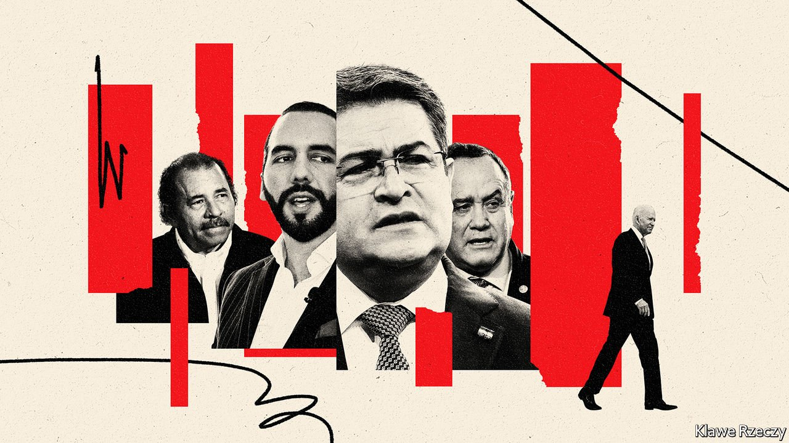

###### Joe Biden’s other headache

# Democracy is quickly eroding in Central America 

##### Things are looking grim in El Salvador, Honduras, Guatemala and Nicaragua 

 

> Aug 25th 2021 

ENRIQUE, A LAWYER (not his real name), worked for the authorities in El Salvador for over a decade, going from advising a local council to being employed in the transport ministry. Despite his misgivings about graft in politics, he worked with the two parties that have dominated the country since the end of the civil war in 1992. But shortly after Nayib Bukele, the president, came to power in 2019, he went back to private practice. “This government is worse—it attacks anyone who doesn’t take its position and abuses of power go unchecked,” he says. “There is no rule of law.”

Mr Bukele, a 40-year-old populist, is threatening the fragile democracy that was built up in El Salvador over 30 years of peace. Shortly after coming to power he entered the legislature with armed soldiers to force lawmakers to vote for a loan to buy equipment for the police and military. In May the Congress, which Mr Bukele’s party now controls, dismissed the attorney-general and all five members of the constitutional chamber of the Supreme Court, replacing them with cronies. In June he did away with CICIES, an anti-corruption body. He expelled a journalist for El Faro, a digital-news publication, from the country and proposed sweeping changes to the constitution, including one that would extend the president’s term by a year.


El Salvador is a striking example of democratic regression. In last year’s democracy index compiled by the EIU, a sister company of The Economist, it was demoted from “flawed democracy” to “hybrid regime”, meaning semi-authoritarian. Its neighbours are troubled, too. Although Latin America generally became more democratic in the 1980s and has held up reasonably well over the past few years (with notable exceptions, such as Venezuela), Central America has not. In four of its seven countries—El Salvador, Honduras and Guatemala, collectively known as the “Northern Triangle”, and Nicaragua—the systems are buckling. That matters for those who live there, but it also affects the United States.

Each Central American country differs from the others and has its own unique problems. Yet all have certain things in common. They have long been dominated by small yet powerful political and economic elites that do not necessarily favour democracy. Institutions are young, weak or politically charged. Economies tend to work best for those at the top. Corruption is depressingly common.

Poor governance has led to insecurity, economic stagnation and shoddy public services. Institutions that ought to uphold the rule of law, such as the courts and UN-backed bodies, have been co-opted or dismantled, allowing corruption to increase. The pandemic has added to these problems. The region “fell off a cliff” last year, says Dan Restrepo, a former adviser to Barack Obama who is now at the Centre for American Progress, a think-tank in Washington, DC. The pandemic provided a pretext to curtail civil liberties in the name of public health.

In Guatemala things went from bad to worse in 2019 when CICIG, a UN-backed anti-corruption body, was disbanded. It had looked into government sleaze and abuses of power by the army, which ruled the country until 1996. Over the past two years military men, corrupt officials and criminals have only become more powerful, says Carmen Rosa de León, who heads the Institute for Sustainable Development, a Guatemalan think-tank. American hopes that the country could be its main ally in the Northern Triangle are evaporating as President Alejandro Giammattei’s government attacks the justice system. On July 23rd Juan Franciso Sandoval, the anti-graft prosecutor, was fired, allegedly for bias. Mr Sandoval, who fled the country, said he was dismissed because he was investigating high-ranking officials. Drug money has started to seep into the state, too. Ms de León’s organisation has connected 38 lawmakers to drug-traffickers.

The criminality of the state is also the biggest concern in Honduras. Drug barons have seemingly infiltrated politics at every level. Juan Orlando Hernández, the president, has been fingered in at least threeUS cases against drug-traffickers, including one in May in which his brother was sentenced to life behind bars. Elections in November are unlikely to change much. Yani Rosenthal, a leading presidential candidate, served three years in a jail in the United States for money-laundering.

In Nicaragua Daniel Ortega, the authoritarian president, acts with increasing impunity. Over the past four months seven presidential hopefuls, as well as numerous intellectuals and former ministers, have been detained. On August 6th Nicaragua’s electoral council disqualified the main opposition party, Citizens for Liberty, from running. As of December NGOs must register as “foreign agents”. Police are also going after La Prensa, the country’s oldest newspaper. There is “no trace of democracy”, says a Nicaraguan businessman.

Few ordinary folk in these countries think they can change things through elections or protests. Many think their only option is to flee from their homes. In July US border guards had 213,000 encounters on the southern border, the largest number in a month since 2000. Some 44% were from the Northern Triangle. But this understates the problem. Many more of those fleeing spend time in Mexico, before trying to go farther north, while many Nicaraguans go south to Costa Rica.

President Joe Biden has made Central America, especially the Northern Triangle, a foreign-policy priority. (Officials fear they can do little about Nicaragua.) Rather than simply reinforcing the border, the administration wants to tackle the democratic regression and its effects.

That is easier said than done. The United States has some diplomatic tools at its disposal, such as slapping visa bans on the ruling elites. Last month the State Department published a list of more than 50 current and former officials accused of corruption or undermining democracy in Guatemala, Honduras and El Salvador. They will not be allowed to travel to the United States and may face further sanctions. (Similarly, Nicaraguans linked to the regime have been issued with visa bans.) The Justice Department says it will launch a task-force to investigate corruption and human trafficking in the region.

Boosting governance, security and prosperity in Guatemala, Honduras and El Salvador from afar will be much trickier. Some violence-reduction programmes may have had a bit of success over the past few decades. But even assessments by USAID admit that past aid efforts have had little effect. American officials say they have learned from previous mistakes. Their initial focus now is on improving prosperity, by working with the private sector in each country. For example, US officials are trying to persuade local businesses to provide more jobs. They also want them to lobby for policy changes, such as the introduction of well-regulated public-private partnerships for infrastructure projects. Such projects are typically wholly state-run and highly prone to graft.

Mr Restrepo says that American efforts need to be more “disruptive”. That could be achieved by creating a parallel market for captive industries, such as sugar. Producers could then sell goods directly to the United States rather than going through local cartels. Such work, he says, “takes a lot of nerve”. Mr Biden and his team may not have enough.■

For more coverage of Joe Biden’s presidency, visit our dedicated 

