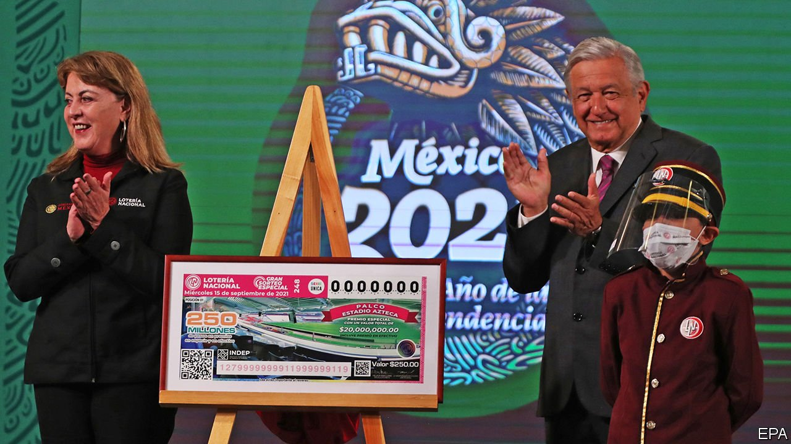

###### A bad lot

# Mexico’s president has put El Chapo’s house up for sale 

##### But will anyone bid for it? 

 

> Aug 28th 2021 

IF THE POPULARITY of the Netflix series “Narcos: Mexico” is anything to go by, people would jump at the chance to own a former abode of Joaquín Guzmán Loera, a notorious Mexican drug lord better known as “El Chapo”. It was from this house in Culiacán, in the north-western Mexican state of Sinaloa, that the kingpin escaped capture in 2014, fleeing through a tunnel under the bathroom floor as the Mexican marines stormed in. (He was subsequently captured and extradited to the United States, where he is serving a life sentence.)

The house is among a bunch of prizes up for grabs in a special draw run by the Mexican National Lottery to be held in September, along with 20 other properties and a VIP box at Azteca stadium, the home of the national football team. Many of the items are the confiscated property of criminals and corrupt former officials, put up by the Institute to Return Stolen Goods to the People, a public body that also auctions off recovered booty.


President Andrés Manuel López Obrador (pictured, right) has a penchant for showy acts that suggest his government is fighting corruption. (On August 1st he held a referendum on whether to prosecute his five predecessors. A paltry 7% of voters turned out, far short of the legally binding 40%.) He says the money raised from the raffle will be spent on things to improve life for the poor, including medicines, scholarships and roads.

Yet it is unclear how many people will shell out 250 pesos ($12.45) for one of the 2m tickets. El Chapo’s two-bedroomed house has repeatedly failed to attract interest at auction—perhaps less because of fear that one of his sicarios might not look kindly on a new tenant, than because the property is now decidedly rough round the edges.

When Mr López Obrador, who flies economy class, failed to find a buyer for the presidential plane after taking power in 2018, he offered it as the main prize in a similar draw. When it dawned on the authorities that the average Mexican would not be able to house or maintain a Boeing 787-8 Dreamliner, they replaced the prize with the cash equivalent. Despite the riches on offer, about a quarter of tickets remained unsold.

