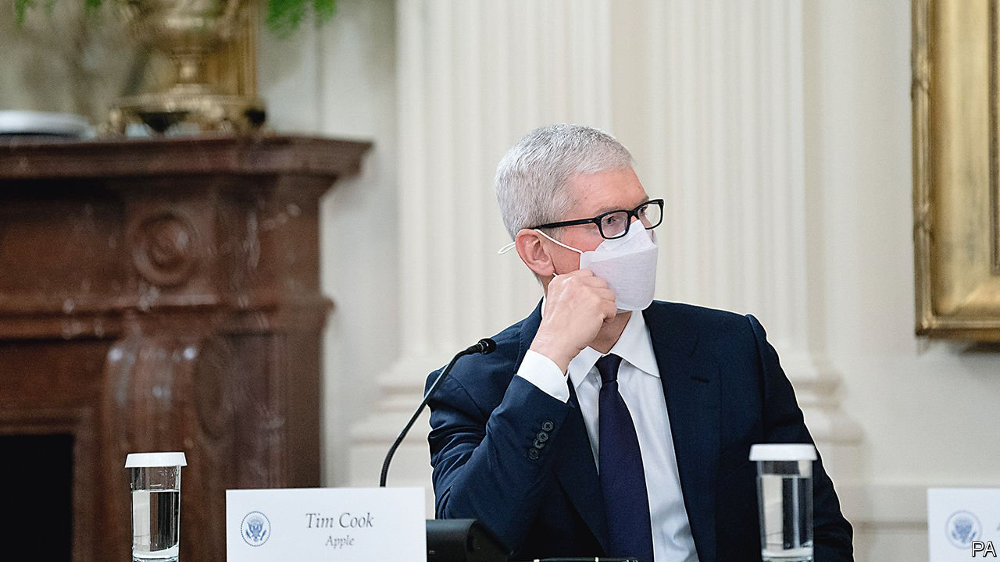

###### 

# Business this week 

#####  

 

> Aug 28th 2021 

Joe Biden held a summit at the White House with the chief executives of America’s biggest tech, financial and infrastructure companies to discuss cyber-security. Those attending included Tim Cook of Apple (pictured), Satya Nadella of Microsoft and Jamie Dimon of JPMorgan Chase. Criminal hackers have attacked several critical infrastructure- and software-systems this year. Mr Biden urged companies to help fill the half a million job vacancies in cyber-security.

Chinese tech stocks had a good few days, in part because robust quarterly earnings from JD.com, one of China’s biggest e-commerce companies, suggested that it was coping well with the government’s regulatory crackdown on the tech industry. China’s internet giants are making sure they are seen to respond to the latest edicts. Pinduoduo and Tencent, two online platforms, said they would donate billions to worthy causes, after President Xi Jinping pressed high-income enterprises to “return more to society”. See . 


The share prices of Uber, Lyft and other gig-economy companies wobbled after a judge in California struck down Proposition 22, a voter-approved measure that allows the firms to continue classifying their drivers as independent contractors rather than workers. The judge found that the measure was unconstitutional and unenforceable, but stayed his decision until appeals can be heard.

Providing a contrast to the image of tech companies as fiendish reprobates, Airbnb offered free temporary housing to 20,000 Afghan refugees around the world. The home-rental platform and its charity have housed 25,000 refugees over the past four years.

South Africa’s official unemployment rate rose to 34.4%, the highest level since the current method of counting joblessness began in 2008. Including those in the labour force who are discouraged from looking for work, the rate rose to 44.4%.

South Korea’s central bank raised its benchmark interest rate by a quarter of a percentage point, to 0.75%. It was the first rate increase in almost three years, and comes amid growing consumer debt in the surging economy.

Lengthening the odds

Britain’s Competition and Markets Authority published its report into the proposed takeover of Arm, a British chip designer, by Nvidia, America’s most valuable semiconductor manufacturer. The CMA concluded that the deal would result in less competition and called for an official investigation. The government has already voiced separate concerns about the takeover on national-security grounds.

Virgin Orbit said it would list on the Nasdaq stockmarket by merging with a special-purpose acquisition company (SPAC) in a deal that includes an investment by Boeing. An offshoot of Virgin Galactic, Virgin Orbit is expanding its satellite-launch business and developing a constellation for internet-of-things services.

Maersk, the world’s biggest container-shipping firm, ordered eight vessels with dual-fuel engines that will be powered mostly by “green” methanol. Maersk is busily decarbonising as freight customers look to reduce their own emissions in supply chains. But it may encounter problems securing stock of the methanol, which is made from renewable sources such as biomass and solar energy.

The British government rejected a plea by the retail and transport industries to fill an acute shortage of lorry drivers by giving temporary work visas to lorry drivers from the EU. The shortage of drivers has been caused by covid-19 measures and the departure of EU nationals after Brexit. Delayed deliveries are causing goods shortages. McDonald’s ran out of milkshakes this week because of “supply-chain issues”.

Goldman Sachs became the latest big bank in America to insist that employees and visitors to its offices produce proof of vaccination against covid-19. Delta Air Lines became the first big company to impose a health-insurance surcharge, of $200 a month, on unvaccinated staff, though it is not requiring its workers to have the jab.

Matt Mendelsohn was appointed as Yale University’s chief investment officer after the death of David Swensen in May. Mr Mendelsohn worked closely with Swensen and now takes on full responsibility for Yale’s influential $31bn endowment fund.

The latest porn hub

Perhaps confirming the adage that sex sells, OnlyFans reversed its ban on explicit acts by adult performers on its platform, after a backlash from the porn stars who have driven the site’s success (they say it gives them a safe space to earn money). OnlyFans had introduced the ban on rumpy pumpy after coming under pressure from creditors worried about reputational risks, but it has now found alternative ways “to support our diverse creator community”. See .

