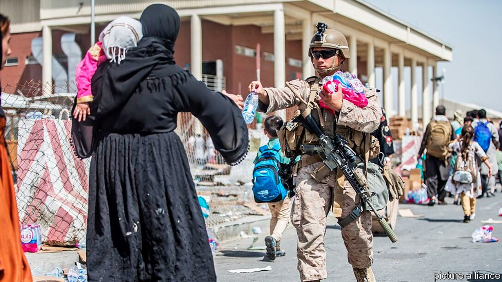
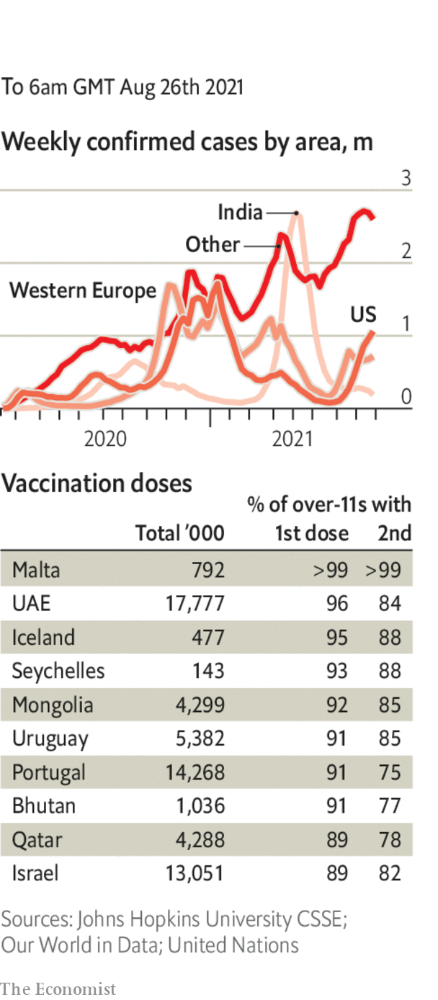

###### 

# Politics this week 

#####  

 

> Aug 28th 2021 

Having seized control of  Afghanistan, the Taliban told women to stay at home, supposedly for their own safety. America and other countries advised their citizens not to go to Kabul airport because of the imminent threat of a terrorist attack. The Taliban warned that there would be “consequences” if American troops remain ed beyond the evacuation deadline of August 31st. Ashraf Ghani, Afghanistan’s former president, turned up in the United Arab Emirates. A group of fighters in the Panjshir Valley continued to resist the new regime. See  and .

The World Bank suspended funding to Afghanistan, in part over concerns that the Taliban would interfere with development projects aimed at women. The IMF has already halted payments to the country. America and other countries froze almost all of Afghanistan’s $9bn in foreign reserves. Experts warned of a looming economic crash.


Ismail Sabri Yaakob was sworn in as Malaysia’s prime minister following the resignation of the unpopular Muhyiddin Yassin. Mr Ismail Sabri comes from the same circle of politicians who backed the previous government, which mishandled the pandemic. He was picked by Malaysia’s king, who wants him to face a vote of confidence in parliament.

The ruling parties of Japan and Taiwan prepared to hold their first-ever security talks on August 27th to discuss the military threat from China. The talks are between parties and not governments because Japan and Taiwan do not have diplomatic relations.

In an unexpected move, China’s parliament delayed imposing a requirement that Hong Kong uphold an anti-sanctions law. The bill, passed in June, mandates the punishment of firms that comply with sanctions against Chinese companies or officials.

Joe Biden nominated Nicholas Burns to be his ambassador to China. Mr Burns was appointed to a role in the State Department during the presidency of George W. Bush and is a former American ambassador to NATO. Mr Biden also nominated Rahm Emanuel, a chief of staff under Barack Obama, as ambassador to Japan.

America’s Supreme Court overruled Mr Biden’s decision to allow asylum-seekers at the Mexican border into the United States while their cases are heard. Mr Biden had suspended an order from Donald Trump that directed the asylum-seekers to wait in Mexico. The court said the order must be reinstated, because Mr Biden’s action was probably “arbitrary and capricious”.

Kathy Hochul was sworn in as the governor of New York state, following the resignation of Andrew Cuomo amid claims of sexual harassment.

The House of Representatives passed a $3.5trn budget with a provision that avoids a filibuster when the spending plan is debated in the Senate. Before the vote the Democratic leadership in the House faced a mini-revolt from party moderates, who were placated with assurances that an infrastructure measure that has bipartisan support will come up for a vote before September 27th.

At least 20 people died when floods swept through rural areas in west Tennessee. Flooding also killed at least 20 people in Venezuela.

The left-wing government in Bolivia charged Jeanine Áñez, a former interim president, with “genocide”. The far-fetched charge refers to the deaths of 20 protesters, some of whom were supporters of the current government, during clashes with police in 2019. She has been in jail since April on charges of planning a coup against Evo Morales, her predecessor as president, and has been hospitalised recently for hypertension and trying to harm herself.

After calling a snap election Justin Trudeau, Canada’s prime minister, faced a double whammy of tightening polls and a barrage of criticism over a slow response to evacuating Canadian interpreters from Afghanistan. Polls suggest that Mr Trudeau’s Liberal Party will narrowly win the election on September 20th. But some are within the margin of error, and the Conservatives have criticised him for holding the vote while the country faces a fourth wave of covid-19. Inflation may also hurt his party.

An appeals court in Kenya upheld a decision by the High Court blocking a constitutional overhaul supported by President Uhuru Kenyatta. The scheme would have created dozens of new constituencies and several new posts, such as a prime minister. Many saw it as an effort by Mr Kenyatta to make it harder for his estranged deputy, William Ruto, to succeed him next year.

Hissène Habré, who ruled Chad from 1982 to 1990, died after contracting covid-19. He was serving a life sentence in Senegal for crimes against humanity. Thousands of people were executed, tortured or jailed under his regime. See . 

Tunisia’s president, Kais Saied, extended his suspension of parliament until further notice, raising concerns about the future of the Arab world’s only real democracy. Last month Mr Saied dismissed the prime minister and assumed executive authority, actions that his opponents called a coup. But the president, who was elected on a promise to clean up corruption, has widespread support.

Coronavirus briefs

 


America’s Food and Drug Administration gave its full approval for the Pfizer vaccine, which hitherto has been used under an emergency authorisation. The decision will embolden public and private bodies thinking of mandating the jab.

TheDepartment of Defence was one of the first to respond and said it would enforce vaccine mandates on its troops. New York City decided that all staff who work in schools must have a least one shot by September 27th.

Taiwan began inoculating people using a vaccine developed by Medigen, a Taiwanese drug company. Critics say the emergency authorisation of the vaccine has been rushed.

Facing another wave of covid-19 despite its high vaccination rate, Israel expanded its booster-shot programme to over-30s. There are signs that the extra dose may be working to curb infections.

