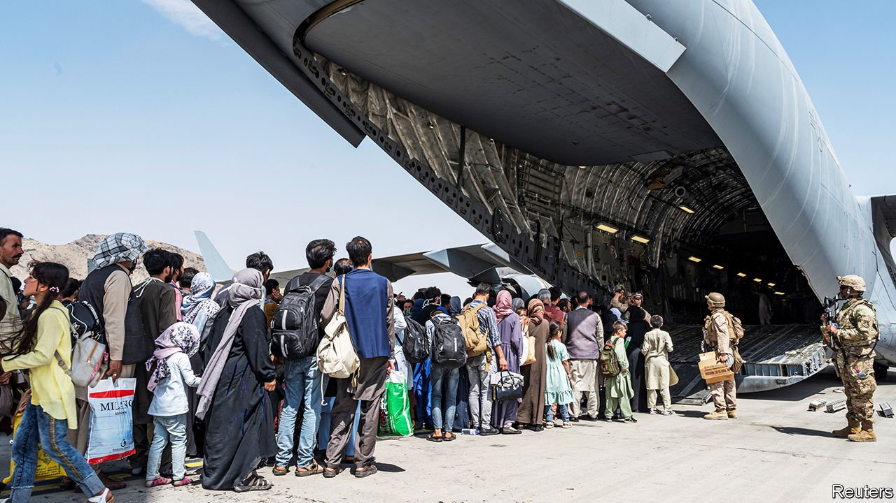

###### The left-behind

# America’s rush for the exit in Kabul 

##### The private army of volunteers helping trapped Afghans can do only so much 

 

> Aug 28th 2021 

THEY RAN from safe house to safe house across Kabul, dodging Taliban gunmen. When given the green light over WhatsApp, the women rushed to one of the gates manned by American soldiers at Kabul’s international airport. In Washington, Meighan Stone of the Council on Foreign Relations and other volunteers passed their information to the State Department, in the hope that the women are on the list for one of the flights that day. At the airport perimeter the women navigated Taliban checkpoints, stampeding crowds and sporadic gunfire. As they headed to the gate, praying it remains open, the volunteers corresponded with officials to make sure soldiers on the ground could identify the refugees. They are the lucky ones. For thousands of other vulnerable Afghans spread across the country, even taking the road to Kabul is dangerous.

After a chaotic start the operation to remove US citizens greatly improved, though it remains perilous, as the explosions outside the airport on August 26th, in which at least 13 American troops and 60 Afghans were killed, confirmed. But the abandonment of Afghans who worked with American forces was both swift and a long time in the making. Many are eligible for the Special Immigrant Visa (SIV). Reforms by Congress in 2009 mandated a nine-month process, but the paperwork took applicants around three years. Almost 2,000 were brought to America in the two weeks before the fall of Kabul, while 71,000 applicants and their family members waited in the growing backlog. There may be up to 80,000 Afghans eligible for these visas across Afghanistan. Congress, long frustrated by the administration’s glacial pace, passed a bill in July to accelerate the process. But for now, boarding a flight still requires visa papers or an American passport.


The State Department created a Priority 2 (P-2) designation in early August for Afghans who had worked with American forces or on American projects but are ineligible for the SIV programme. They, along with P-1 refugees, who must be referred by the UN High Commissioner for Refugees, an American embassy or certain NGOs, are at the mercy of the limited charter flights and an unforgiving bureaucracy. American citizens, permanent residents and SIVs have priority. But rather than risk capture by Taliban fighters, who say Afghans will no longer be allowed access to the airport, many refugees have opted instead to attempt the dangerous crossing into neighbouring Iran, Pakistan or Tajikistan.

The president could circumvent these logistical hurdles, but has refrained from doing so. Mike Waltz, a Republican congressman and a former Green Beret who served in Afghanistan, points out that President Gerald Ford granted humanitarian parole for Vietnamese refugees leaving crumbling South Vietnam in 1975, and cajoled Congress into funding the operation. This allowed American forces to bring more than 100,000 refugees to Guam before granting visas.

In addition to presidential haste and bureaucratic coldness, Afghans who worked with America may be victims of an electoral calculation. The administration is frequently attacked as soft on immigration. Tucker Carlson, a TV host, and Stephen Miller, an adviser to President Donald Trump, have warned of the supposed threat posed by Afghan refugees.

In the absence of help from the federal bureaucracy, a volunteer army of hundreds of former American diplomats, aid workers and veterans has sprung up over email chains and Signal threads to pool funds for charter planes and pass along vital information. Many feel an obligation to Afghans they worked with during the 20-year war. One group of veterans, Allied Airlift 21, provides logistical support to Afghan SIV applicants and their families. As the sun sets in Washington and rises in Kabul, the veterans start their watch, constantly communicating with refugees and trying to guide them to safety.

Almost 20,000 people were evacuated on the best day, according to the Pentagon. But America is struggling to keep the airfield secure and find third countries to host Afghans while their visas are processed. The retreat is meant to end on August 31st, by which date Mr Biden has promised to get every US citizen out. The State Department reckons a thousand may still be in Afghanistan. Mr Waltz says many more Afghan allies will be left behind: “We’re handing them a death sentence when the last American soldier leaves.” ■


For more coverage of Joe Biden’s presidency, visit our dedicated 

