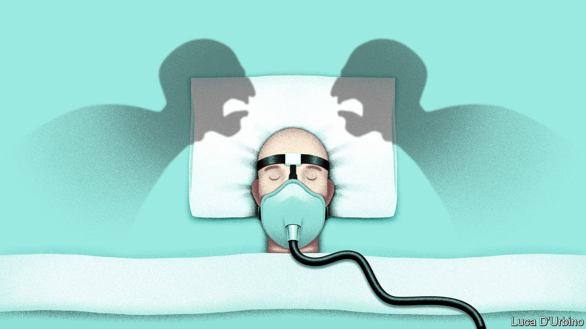

###### Signs of vitalism

# Improved technology collides with religious beliefs at the ICU 

##### The ability to keep patients alive almost indefinitely is creating problems for hospitals 

 

> Aug 26th 2021 

WHEN TINSLEE LEWIS was ten months old, doctors said that the treatment keeping her alive was causing her pain and should cease. Born with grave heart and lung conditions that surgery could not ease, she had no prospect of getting better, they said. Her family disagreed. Nearly two years and several court judgments later, Tinslee remains on life support in a hospital in Texas. In April the hospital, requesting that a court’s final ruling, expected in January, should be brought forward, described how the child’s body had been “ravaged” by invasive treatments. Her mother countered that the two-year-old, who is heavily sedated but conscious, had shown some signs of improvement.

This battle is about more than the suffering of a child, her family and those who care for her. Texas Right to Life, a pro-life group that is funding the Lewises’ legal fight, hopes it will result in the overturning of a state law designed to protect doctors’ right to withhold what is known as “futile” or “non-beneficial” care. The law allows doctors to see if another hospital will accept the patient and, if that fails, to stop treatment after ten days.


Yet the questions this case raises, about how clashes between doctors who want to discontinue care and patients’ families who want to continue it should be adjudicated, are familiar to doctors in hospitals across America. Many say that such conflicts are happening more often.

Robert Truog, a paediatric intensive-care doctor at Boston Children’s Hospital and the director of Harvard Medical School’s Centre for Bioethics, says advances in medical technology mean it is “very hard to die in a modern ICU [intensive-care unit] these days”. This can make it harder for families to accept that there is no chance a fatally ill patient will recover. Their hopes, he says, are often bolstered by experimental treatments discovered online. A decade ago there used to be one or two patients a year being kept alive against doctors’ judgment in Dr Truog’s ICU; now there are two or three at any time. “Families are increasingly likely to go to the courts. Doctors don’t want to be all over social media, so they increasingly choose the path of least resistance.”

Such conflicts affect patients of all ages. In recent years a rapid increase in the use of extracorporeal membrane-oxygenation machines, which keep patients alive when their heart or lungs (or both) do not work, has meant that relatives are more likely to push for continued treatment.

The combination of mighty life-support systems with religious belief—or the plain power of grief—can create big problems for hospitals. Thaddeus Pope, a bioethicist and professor at the Mitchell Hamline School of Law in Minnesota, says the influence of vitalism, which holds that life must be preserved at all costs, has meant that a growing number of brain-dead patients are kept in hospital. And “doctors definitely do not want dead patients in their hospital”, he says.

Such cases can cause enormous distress to medical staff, especially the nurses who care for patients hourly. Even washing and feeding someone who cannot feel a thing can cause anguish to a person who is trained to heal. Tending to conscious patients in a way that causes suffering but no benefit can inflict an intolerable strain. The most recent court filing from the hospital where Tinslee Lewis has spent her life describes how the nurses who change her nappy first apologise, “in hopes she will understand that the torturous exercise she is undergoing is not their choice”.

Providing futile medical care can create other problems. It can delay other patients’ admittance to intensive-care units. Though the hospital says its staff do not consider the financial cost of keeping Tinslee alive, her care, paid for by Medicaid, has cost more than $24m, according to the hospital’s most recent court filing.

In any health-care system that prioritises the expertise of doctors and the wishes of patients’ families, clashes about the end of life are inevitable. Drawing up policies that make them less likely may be more difficult in a decentralised health system. Texas is one of three states, along with California and Virginia, which has legislation giving doctors more power to withdraw care without consent. Others have passed laws that prohibit this.

Common to all disputes is the fact that once doctors have established that further treatment is futile, the decision about what happens next is as much a moral judgment as a medical one. “The life she has may not be a life we would want for our children, but we don’t get to make that decision,” says John Seago, legislative director of Texas Right to Life. “The hospital is making a moral decision. She is alive, that means the care is not futile.” He says the Texas law gives hospitals too much power.

Wishing and hoping

Other pro-life groups disagree, arguing that prolonging the process of dying is antithetical to their beliefs. Such organisations were involved in drawing up the Texas law in 1999, in the belief that it would bring timely resolution to excruciating conflicts. The row has exposed an unusual rift among pro-life groups, which tend to present a unified front on abortion. Kyleen Wright, the president of Texans for Life, says that antiabortionists’ defence of the law has allowed them to build links with progressive lawmakers that would otherwise be unthinkable.

The battle over Tinslee may dissuade other states from introducing such legislation. Yet other improvements to the system are possible. Many are critical of the role played by the hospital ethics committees that weigh in on such conflicts. Because their members tend to be employed by hospitals, there are concerns they may do their bidding. Independent panels, appointed by the states, could offer more reassurance to grieving relatives.

In the case of adults, advanced directives can help. Patients tend to be less enthusiastic about life-sustaining interventions than families or guardians are. “People don’t want the guilt that may follow the decision that treatment should be withdrawn,” says Mr Pope.

Sometimes the best solutions are the simplest ones. Arif Kamal, a palliative-care expert at Duke University, says involving people who are trained to talk about death “beyond the clinical details” can help reconcile families to what doctors are telling them. Once a disagreement arises this, unfortunately, becomes a lot less likely.■

