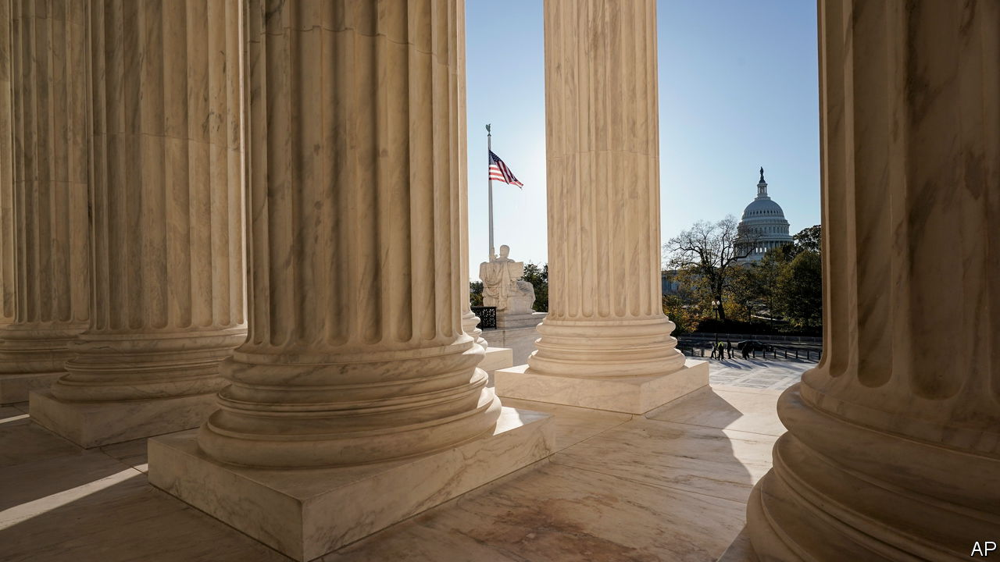

###### In the shadows

# Many of the Supreme Court’s decisions are reached with no hearings or explanation 

##### The nine justices are making more and more use of the “shadow docket” 

 

> Aug 28th 2021 

IN FIVE WEEKS the Supreme Court will return from its summer break to hear a batch of new disputes, including clashes over abortion and guns. After scrutinising briefs from litigants and amici curiae (friends of the court), the justices will hear oral argument in these cases and—weeks or months later—release opinions explaining why one party won and the other lost. But this methodically adjudicated “merits docket” represents a shrinking proportion of the Supreme Court’s notable business. Although the justices handle about five dozen cases this way each year (down from more than 150 in the 1980s), they dispatch thousands of other legal tangles without fanfare—and often with scant explanation.

The so-called “shadow docket” (a term coined in 2015 by Will Baude of the University of Chicago) includes emergency appeals from parties who believe they would be irreparably harmed without quick intervention from the justices. Whereas cases arrive on the regular docket if at least four justices agree to take them up, anyone can try their hand at filing an emergency appeal. Most shadow-docket orders are unremarkable. Some, like that of the man seeking to lift the federal airline mask requirement so he could fly to Germany without triggering an anxiety disorder, border on the comical. (His application was denied.)


Other orders, including a pair this week, are big news. On August 24th, with the liberal justices in dissent, the court rejected President Joe Biden’s plea not to be compelled to reinstate Donald Trump’s border policy, which required asylum seekers to await word on their applications while living on the Mexican side of the southern border. And as The Economist went to press, the second iteration of Mr Biden’s moratorium on tenant evictions awaited a quick judgment.

It has been a busy month in the penumbras. On August 12th, acting on her own, Justice Amy Coney Barrett rebuffed eight students who claimed Indiana University’s covid-19 vaccine requirement violated their constitutional rights. No explanation accompanied the denial. Two hours later, the court agreed to block part of New York state’s moratorium on evictions in response to a plea from a group of landlords. This time the majority offered a short opinion—with a single sentence of justification—and the three liberal justices appended 1,000 words in dissent. Some were not impressed with the majority’s reasoning. On a podcast he co-hosts, Mr Baude, who clerked for Chief Justice John Roberts, panned the terse explanation, asking “How could this even be right?”

The shadow docket—officially, the “orders list”—has always been part of the Supreme Court’s work. Requests from condemned criminals to have their executions blocked or delayed routinely reach the justices this way. Of the 8,000 or so annual petitions to review a decision in a lower court, about 99% are denied. The justices also use the shadow docket to respond to litigants requesting extensions to file their briefs or to handle similarly quotidian matters. A few important orders are sprinkled through Supreme Court history: a (brief) execution reprieve for Julius and Ethel Rosenberg came on the orders list in 1953, as did a halt to the bombing in Cambodia in 1973.

Historically, though, the Supreme Court has adjudicated few matters of consequence in the shadows. That changed in 2017 when several policies of the Trump administration ran aground in lower courts. A litany of Mr Trump’s moves—from a ban on travel from Muslim countries and diversion of funds to pay for his border wall to a prohibition on trans soldiers and aggressive use of the federal death penalty—were blocked by federal judges, prompting the administration to beg the Supreme Court to intercede. According to Steve Vladeck, a law professor at the University of Texas, the Trump administration filed a staggering 41 emergency applications in its four years—compared with just eight during the 16-year period when George W. Bush and Barack Obama sat in the Oval Office. That is a 20-fold increase in presidential use of the shadow docket. And it paid off: of Mr Trump’s 41, the justices at least partially came through for him 28 times.

These results may not be surprising given the court’s increasingly conservative complexion. But outcomes aside, the spike in shadow-docket cases involving issues of national importance—including battles over election rules and public-health measures to fight covid-19—highlights a deficit of transparency and accountability. The court usually affirms or denies a request without a word of explanation, though sometimes a short opinion (or dissent) is attached. Individual justices decide whether to reveal their votes—they usually remain hidden. With only a week or so between application and decision, time for briefing is limited and the justices do not have the benefit of questioning the parties in an oral argument.

What is to be done? Mr Vladeck, who testified before a House subcommittee investigating the shadow docket in February, wants to see the court include “at least a brief explanation” whenever it makes a change to the status quo. Leah Litman, a law professor at the University of Michigan, says a justification is particularly important when the Supreme Court reinstates a death sentence that has been blocked by a lower court. Mr Vladeck would also like the justices to own up to their votes by identifying themselves and, for important issues that do not require immediate resolution, hold fast-tracked oral arguments before rendering a judgment. The court’s pandemic-era pivot towards hearings by telephone may supply a handy way to do this.■

