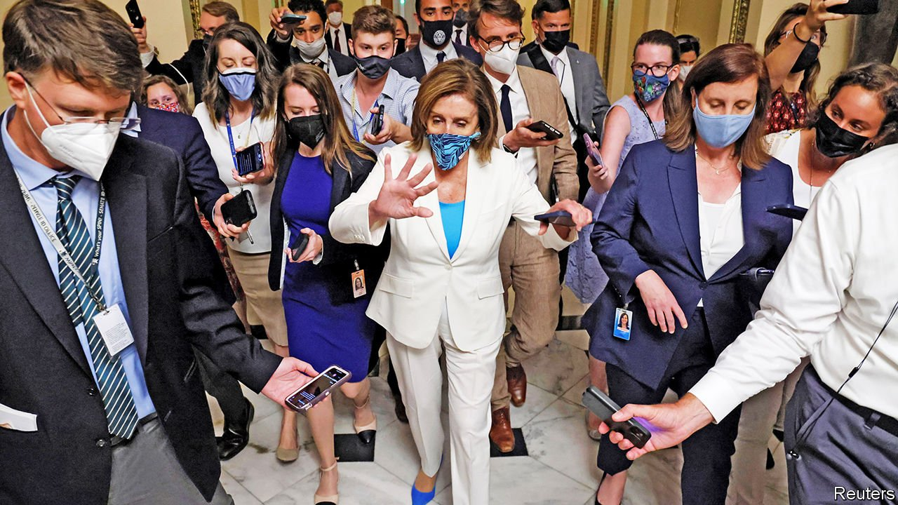

###### Infrastructure month

# September will be the most crucial month of Joe Biden’s presidency 

##### Democrats are trying to push through ambitious spending plans with tiny majorities in Congress 

 

> Aug 28th 2021 

ONLY TWICE since 1935 has a sitting president’s party managed to gain seats in mid-term elections. With Democratic majorities in Congress already as thin as can be, almost any loss would spell a Republican takeover of one chamber and thus an end to President Joe Biden’s ambitious legislative agenda. He will hope, in 2022, to counteract this rule of political gravity and his sliding approval-ratings (which seem to have been accelerated by the Afghan withdrawal, and are sensitive to what happens next in Kabul) by presenting a long list of domestic achievements to voters.

For all those reasons, this September may be the most critical month for Mr Biden’s presidency. The fate of his “Build Back Better” agenda, a $4trn spending package, is expected to be thrashed out. At present, it is divided into two components. The first is a bipartisan bill passed by the Senate, costing $566bn, 2.5% of GDP, and focusing on core infrastructure like roads and bridges. The second is a gargantuan bill (still being written) to be stuffed with every other item on the Biden agenda. This bit—tax increases for rich Americans and multinational corporations, big climate-change spending, and even bigger spending on a much-expanded social safety-net in the form of subsidised child care, paid family leave and community college—can pass only on a party-line vote.


The two are in a delicate tango: to keep moderates and progressives from defecting, neither is supposed to reach the president’s desk until the other is ready. The balancing act is fragile. A group of nine moderate Democrats nearly derailed the effort by insisting on an immediate vote on the Senate-approved bipartisan bill, threatening to withhold their votes to advance the partisan bill. In the end, in an otherwise terrible news week for Mr Biden, he avoided a setback at home, too. On August 23rd Nancy Pelosi, the Democratic speaker of the House, staved off the modest insurrection by shepherding through a deal ensuring the survival of the partisan bill in exchange for a guaranteed vote on the bipartisan one by September 27th.

That promises a tumultuous month ahead in Congress. Much of it will be consumed with the actual drafting of the Democratic omnibus legislation, which is being subdivided among various congressional committees. If past years of legislating are any guide, there will probably be scant time for the public to digest what is in the bill—its sweeping reforms to taxing, the health-care system, education, climate spending, among others—before a party-line vote is held on it. Frenzied behind-the-scenes negotiations with Democratic swing votes, the moderate senators Joe Manchin and Kyrsten Sinema, will take precedence over public policy debates. Ms Sinema is adamant that she will not support a package costing $3.5trn, as Mr Biden is hoping for. Preliminary budgetary instructions seem to anticipate this: they would allow up to $1.75trn of spending to be deficit-financed, with the total spending figure subject to future negotiations. Something slimmer is almost sure to emerge from all the to-ing and fro-ing.

This haggling must also take place as other must-pass legislation approaches its deadline. Somehow by the end of September, deals must also be struck to pass a budget keeping the federal government open and ensuring that it does not exceed its debt ceiling, as it is on the brink of doing. Such is the haphazard way that the world’s biggest economy is managed.■

For more coverage of Joe Biden’s presidency, visit our dedicated 

