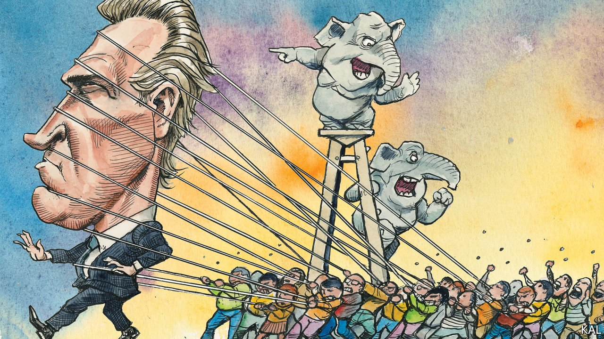

###### Lexington

# The trials of Gavin Newsom 

##### One of the Democrats’ great white hopes is on the ropes 

 

> Aug 28th 2021 

PROFILES OF Governor Gavin Newsom often note what terrific eye-candy he is. And that is not only because the 53-year-old Democrat is tall and lithe, with Hollywood teeth and a greased-back mane of tastefully greying hair. It is also because his good looks are emblematic of a charmed politician. His rise owes, California-style, to a combination of fierce ambition and family connections. A Getty helped launch him in business and then, after the governor had built a hospitality empire, joined with other rich pals to help make him San Francisco’s youngest mayor in a century. Mr Newsom became known there for promoting gay marriage and by the moniker “Mayor McHottie”. His progress to Sacramento was assured.

Yet the Democratic golden boy’s career could be about to end in the most humiliating fashion. He faces a recall vote on September 14th that the polls suggest Mr Newsom—who was elected by a 24-point margin less than three years ago—is even-money to lose. In the midst of a covid-19 spike, surging unemployment and homelessness, and some of the worst wildfires in California’s history, he has launched a $60m survival campaign. And when Lexington spoke to him one evening this week the strain was telling.


“It’s a hell of a thing,” he croaked down the line, sounding wearier than he had when geeing up 100 black women organisers on a Zoom call shortly before. “When you see a string of bad polls you usually dismiss them and say they’re missing something. I don’t think they are. They show what I have seen, which is the intensity of the other side.”

This turn of fortune is especially remarkable because Mr Newsom does not obviously deserve it. His record is pretty much what one would expect of a California governor: a few progressive measures before covid-19 struck—including a boost to pro-poor tax credits and death penalty moratorium—then a painstakingly cautious pandemic response. Notwithstanding the irritation his lockdown measures have caused, his ratings have been positive for most of that time, and still are. And if this makes his predicament seem strange, consider the likely outcome of a Newsom defeat.

The favourite to succeed him—at the helm of the world’s fifth-biggest economy and America’s most progressive state—is currently a Trump-loving talk-radio host, who wants to cut Medicaid, opposes gun control and calls climate change a “crock”. Even the Republican agitators who engineered the recall vote say Larry Elder is unfit to govern. A recent girlfriend of the shock-jock, who accuses him of turning a gun on her while high on cannabis, says worse. How has this happened?

The main explanation is the madness of Californian direct democracy. Other states have ballot initiatives; the Golden State holds so many such “propositions” as well as referendums and recalls that its voters in effect represent a fourth branch of government. It was a system designed in the progressive era to check special interests. Because only a modest number of signatures are required to get an issue on the ballot, however, it has been captured by them. In the current case, the interested group is a Republican Party that cannot hope to win the governorship in a regular election yet, with the support of only 12% of the electorate, can have a fair crack at destabilising a Democratic one.

To survive the recall, Mr Newsom must win 50% of the vote, a serious threshold even in easy times. The Democrats’ young, heavily non-white voters are harder to turn out than the Republicans’ older, whiter ones. And single-party rule has made them additionally complacent in California—not least because of the polished but risk-averse politicians it throws up. Mr Newsom’s career—much like that of his fellow San Franciscan Kamala Harris, whose presidential ambitions he is assumed to share—has been more an exercise in calculatedly wooing all the Democratic factions, and offending none, than solving big problems. The result is support wider than it is deep, a vulnerability when things get tough, as they now have.

Though most advocates of Mr Newsom’s removal are Republican, his covid-19 measures have got the goat of many independents and Democrats, too. “It’s been fraught,” he acknowledges. “I’ve had a dozen small businesses myself. I recognise that people are looking to cast aspersion and blame.” Alas, gilded princelings make tempting targets for such anger. That is why Mr Newsom’s lockdown-breaking appearance at a fancy French restaurant last year, an act that reeked of elite hypocrisy, has assumed such an outsized role in the case against him.

His hopes rest on Democrats rallying to him—Mr Elder should help. “The things he’s saying would make Trump blush. It’s a matter of life and death,” the governor told the women organisers.

Mr Elder’s closeness to power is in fact partly down to Mr Newsom having ensured no credible Democrat is vying to replace him. But it mostly reflects another structural flaw. If the governor fails to win a majority, his job will go to the winner of a concurrent contest between his 40-odd would-be successors. In other words, he could win 49% of the vote and be replaced by a nonentity who has secured less than 20%; the level at which Mr Elder is polling.

A worse democratic arrangement is hard to imagine. So it is good that some Democrats are mulling reform. The recall bar should be raised drastically. Even separating the two votes, to make the succession contest more serious, would help.

When it’s broken, fix it

That is not to absolve Mr Newsom of all blame for his predicament. But the governor’s shortcomings are not the main point here. His job is on the line because of a democratic quirk which Californian conservatives, ending a long tradition of mutual forbearance, are weaponising to their advantage. To override such tactics, in California and beyond, Democrats should not rely on their ability to unearth a more visionary leader. They should try to fix the quirk.■

