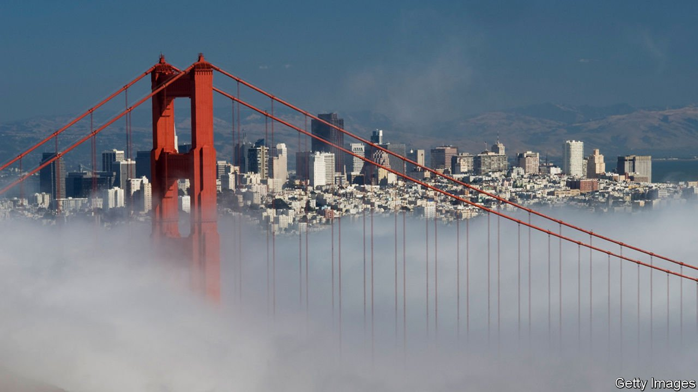
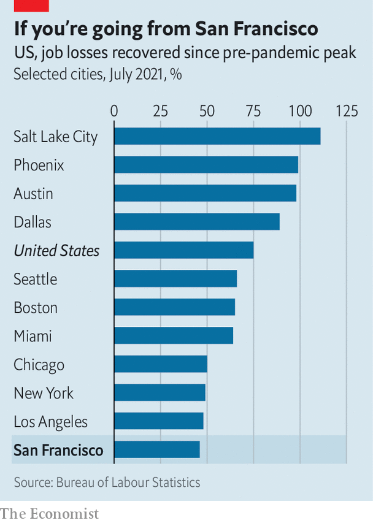

###### Fogged in

# Why San Francisco’s city government is so dysfunctional 

##### Covid-19 has exposed many of the city’s old problems—and some new ones, too 

 

> Aug 28th 2021 

SAN FRANCISCO boasts the lowest death rate from covid-19 of any big American city. An early shutdown, a culture of caution and mask mandates helped curb the spread of the virus. “Our response to covid-19 has been hailed as a national model,” crows London Breed, the mayor. More than 78% of those eligible are fully vaccinated, one of the highest rates in the country.

The City by the Bay may have avoided a heavy death toll from covid-19 but, counter-intuitively, it could feel the virus’s impact longer than other places. Ted Egan, the city’s chief economist, admits as much. “San Francisco could well have a slower economic recovery than other cities,” he says. The city, with a GDP which roughly matches that of Greece, is facing a swathe of problems. These include emigration, a rise in some types of crime, drugs and homelessness. Dysfunctional and corrupt governance makes them harder to fix.


Faced with the prospect of paying steep rents while enduring some of the longest, strictest lockdowns in the country, people left—some permanently. According to CBRE, a commercial-property firm, 27% of offices are being marketed as available in San Francisco (compared with 19% in Manhattan). An analysis by California Policy Lab at the University of California shows that “net exits” from San Francisco (those leaving minus those arriving) rose by 649%—from 5,200 to nearly 39,000—in the last three quarters of 2020. The drop in apartment rents was the largest in the country, although they are climbing back. Even with this adjustment, the cost of living in San Francisco is still around two and a half times higher than the national average and 44% more than New York City.

 


Much attention has been paid to techies taking their laptops to the suburbs, the Sierras or Austin, Texas, but the less well-off have moved too. In the first quarter of 2021 average wages increased 34% year-on-year, the largest jump of any big county and six times the national average. This suggests a severe shortage of workers, especially in hospitality, says Mr Egan.

With less bustle and fewer commuters, San Francisco’s problems have become more obvious. “We’re a smaller city, a dense city, so our social problems are more visible to people,” says Matt Haney, who represents the troubled Tenderloin neighbourhood on the 11-member Board of Supervisors, which functions as the city’s legislative branch. “Our city government overall fails to meet the moment and has for some time,” he admits.

Start with schools. San Francisco was the only top-25 city not to bring most middle- and high-school pupils back to classrooms at all in the 2020-21 academic year. Meanwhile the school board used its time to scrap merit-based admissions to its leading high school in order to boost diversity, and spent months researching and then voting to change schools named after people it deemed objectionable on grounds of racism or otherwise standing in the way of progress, such as George Washington and Abraham Lincoln, before abandoning the idea after a public outcry.

The renaming-while-not-reopening saga was almost a parody of San Francisco. A school-board commissioner criticised for racist tweets tried to sue her fellow board members and the school district for $87m. Parents who could afford to do so, including the former head of the Parent-Teacher Association, moved their children to private schools. Now an effort is under way to gather enough signatures to remove three commissioners from the school board in a special recall election. On Twitter some teachers and school board members are firing back at “reopener” parents.

A similar dysfunction afflicts policing and the criminal-justice system. Before covid-19 San Francisco was the car-break-in capital of America; but with fewer tourists, criminals have shifted their attention. Home burglaries are up. Shootings have more than doubled in the past year. Viral videos show daytime heists, with perpetrators sauntering out of stores without consequence. Lax enforcement of drug laws can become fatal when even small amounts can kill. In 2020 San Francisco saw around 700 deaths from overdoses, mostly from fentanyl: more than double the number from covid-19.

The district attorney (DA), Chesa Boudin, who ran on a platform of sending fewer people to prison and assumed office in January 2020, is the public’s person-of-interest. Two recall campaigns to remove him from office were started. One failed, but the other looks poised to gather enough signatures to trigger a vote. Mr Boudin, the son of two members of the leftist Weather Underground who were convicted for their involvement in the murder of two police officers and a security guard, has many critics, including, unsurprisingly, the police. Tony Montoya, who runs the police union, says officers are taking some cases directly to federal prosecutors, because they feel the DA is loth to prosecute them and pursue maximum charges.

Mr Boudin says he is being unfairly targeted. “None of the recall groups talk about how our courthouse has been mostly closed for the past year,” he says. “The issues have been driven more by a pandemic than any policy I’ve pursued.” Nor are the police blameless. In the fourth quarter of last year, the “clearance” rate for robbery (which measures the share of reported crimes that result in an arrest) was half that of New York City. The police are notoriously unresponsive. Gillian Morris, a startup founder, called three times about two office break-ins and one stolen package but never heard back. She describes San Francisco as “the most dysfunctional place I’ve ever lived when it comes to the protection of property and public safety”. (She left and now lives in San Juan, Puerto Rico.)

All this is despite San Francisco’s budget more than doubling since 2010 while the population rose less than 9%. As Michael Shellenberger, a journalist, writes in his forthcoming book, “San Fransicko”: “Though I have been a progressive and Democrat all of my adult life, I found myself asking a question that sounded rather conservative. What were we getting for our high taxes? And why, after 20 years of voting for ballot initiatives promising to address drug addiction, mental illness, and homelessness, had all three gotten worse?”

One City Hall insider suggests that San Francisco overreacts to issues that are in the national news, and designs solutions to the country’s problems rather than its own. For example, when Mr Boudin ran on his platform of less punitive justice, San Francisco already had one of the lowest incarceration rates in the country. In 2019, 106 adults were in prison for every 100,000 people, one-fifth the rate in California and the nation. If the rest of the country behaved like San Francisco, the prison population would decline by 80%, says James Austin of the JFA Institute, a think-tank that evaluates criminal-justice policies.

City politics would look very different, quips one prosecutor, if everyone who got fed up could vote after they left San Francisco. Joel Kotkin of Chapman University blames high costs for the city’s political make-up: “You wouldn’t have the politics of San Francisco if there was still a middle class left,” he says. Young techies are transient and older residents, who locked in affordable housing decades ago, are happy enough with the status quo. The well-heeled can insulate mostly themselves, opting out of public schools and hiring neighbourhood security guards. As it is, the city has been safely Democratic for 40 years and seems allergic to choosing a Bloomberg-type figure from one of the big tech companies to try something different.

No elected mayor has failed to be re-elected in 20 years, points out Griffin Gaffney of Together SF, a volunteer group. That is despite a slew of corruption scandals. Joe Eskenazi, a reporter for Mission Local, an online news site, reckons “San Francisco’s problems aren’t liberalism. They’re incompetence and corruption.” Municipal graft has long been a feature of the city, dating back to the Barbary Coast days and the Gold Rush. But many are unaware that their city is currently at the centre of a big public corruption probe by the Federal Bureau of Investigation (FBI).

Already three former City Hall department heads have been charged by federal prosecutors, including the former boss of the Public Works Department, Mohammed Nuru, who has been accused of bribery. Craig Fair, the FBI agent in charge, describes “insidious corruption plaguing San Francisco”. Mayor Breed, who once dated Mr Nuru, recently agreed to pay a fine of $23,000 to the city’s Ethics Commission for accepting payment for her car repairs from Mr Nuru and using mayoral stationery to press the then-governor to reduce her brother’s prison sentence.

Ms Breed is also the highest-paid mayor in the country, earning a salary of $351,000. She sits at the summit of a highly paid bureaucracy. In 2020 nearly 150 city employees earned salaries of over $300,000, and roughly one-fifth earned salaries of over $150,000. The cost of living contributes to these pay-packets. But city government also functions like one of those clubby, richly valued startups that politicians accuse of ruining San Francisco—flush with cash, but operating with little oversight. ■

