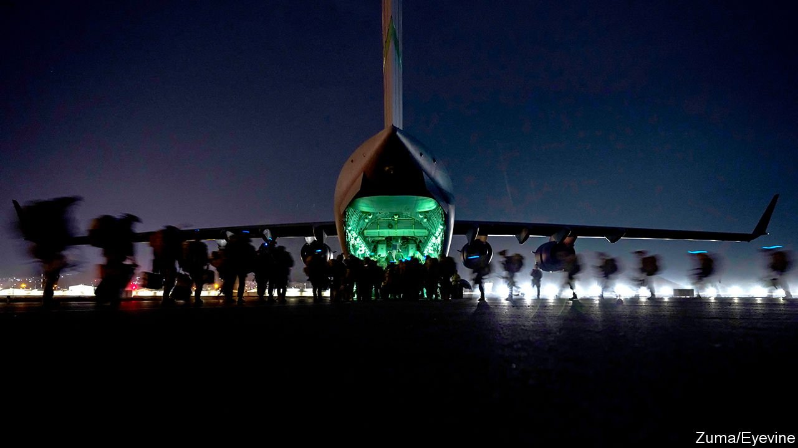

###### After the airlift

# Foreign powers ponder how and whether to engage with the Taliban 

##### The new rulers of Afghanistan crave recognition and cash 

 

> Sep 4th 2021 

“AMERICA WAS defeated,” Zabihullah Mujahid, the Taliban’s spokesman, declared at Kabul airport on August 31st. Hours earlier the last American soldiers in Afghanistan had trudged onto a cargo plane and flown home, leaving their client state in ruins and their enemies in charge. Celebratory gunfire echoed around the city. But Mr Mujahid was circumspect in victory: “We want to have good relations with the US and the world.”

The US and the world, though, are playing it cool. On August 30th the UN Security Council issued a list of demands to the Taliban. The first was that they should combat terrorism: an implicit rebuke of their alliance with al-Qaeda, a terrorist group. Another was that they should respect human rights and form an “inclusive” government “with the full, equal and meaningful participation of women”. The third was a warning that the Taliban should allow free emigration; tens of thousands of Afghans eligible for resettlement abroad have been left behind.


The Taliban are eager to shed their old image as theocratic brutes. Yet they are not rushing to meet these conditions. On the same day that diplomats met in New York, Amin al-Haq, a former security chief for Osama bin Laden, returned triumphantly to his home in Nangarhar province, no longer afraid of American drones. The Taliban’s proposed cabinet is not just insular, but so dominated by southern Talibs that it has “enraged the easterners and northerners” in the movement, says Antonio Giustozzi of King’s College London.

The West’s hope is that a mix of carrot and stick can induce better behaviour. Aid to Afghanistan previously ran to $8.5bn a year, or 42% of GDP. Less than $800m of that, spent on humanitarian projects, is likely to survive. The World Bank and the IMF have suspended financing, and America has frozen $7bn in Afghan foreign reserves held in New York. At home, the Taliban can raise $3bn annually at best, says one expert. They will have smaller outgoings than the old regime—they will not need to bankroll such a bloated army—but they will still face a crunch, and an acute shortage of dollars. A weakening currency is already causing prices to rise.

On August 24th Boris Johnson, Britain’s prime minister, boasted that the G7, a club of rich countries, had “huge leverage” over the Taliban. In fact, the two sides are co-dependent. Around 200 Americans and over 100 Britons remain in Afghanistan, along with large numbers of vulnerable Afghans. Getting them out requires not only the assent of the Taliban, who have said they want to discourage emigration, but also a functioning airport. Qatar, which hosts the Taliban’s political office in Doha, currently has a technical team at the airport, and, along with Turkey, is in talks with the Taliban to reopen and run it. Yet this cannot happen without the Taliban dropping their opposition to a foreign military presence.

There may also be pragmatic deals to be done on counter-terrorism. Though the Taliban remain close to al-Qaeda, they detest Islamic State Khorasan Province (ISKP), a jihadist outfit which killed over 170 Afghans and 13 American troops on August 26th. During its evacuation from Kabul, America quietly slipped intelligence to the Taliban about ISKP, according to an American general, and the Taliban thwarted some attacks. It may be America that is soon in need of the intelligence; a drone strike targeting ISKP on August 29th is reported to have killed ten Afghan civilians. Yet co-operation with the Taliban would be awkward, if not legally tricky.

For the Taliban, the West is not the only purveyor of cash, recognition and co-operation. Qatari and Turkish involvement suggests that Saudi Arabia and the United Arab Emirates, their rivals, cannot be far behind. Pakistani sources say that recognition of the Taliban is not yet on the cards, but they urge the West not to cut off the group entirely. One official acknowledges that recognition and aid should be conditional on behaviour, but insists that the group is not as autarkic as it once was: “They realise that to make a government and run a country, they need international support. It can’t be run like North Korea.”

Notably, China and Russia both abstained from the UN Security Council Resolution on August 30th. Behind the scenes, they argued it was unnecessary and diluted its language to ease pressure on the Taliban, says Richard Gowan of the International Crisis Group, a think-tank headquartered in Brussels. Russia publicly criticised the scale of America’s evacuation, describing it as a “brain drain”.

China’s interests in Afghanistan—political stability and counter-terrorism, particularly against Uyghur militants—are not dissimilar to those of America, says Andrew Small of the German Marshall Fund, a think-tank in Washington. On August 28th Yue Xiaoyong, China’s envoy to Afghanistan, demanded that the Taliban make a “clean break with all terrorist organisations”. Yet his government is undoubtedly keener than the West to move ahead with diplomatic recognition. “We are pleased to see that all forces from different traditions, tribes, nationalities or political parties have come together,” said Mr Yue. (They have not).

Some sceptics have fallen in line. India, which views the Taliban as a proxy of Pakistan, sent a diplomat to meet Sher Mohammad Abbas Stanikzai, the head of the Taliban’s political office, in Doha on August 31st—India’s first ever official meeting with the group. Officials from Britain and the Netherlands made the same trip.

Sir Nicholas Kay, a former British ambassador to Afghanistan, says he doubts that the Taliban have changed much at all, but he urges Britain to re-establish a diplomatic presence in Kabul, if not a full-blown embassy. “We test what they say by their actions, but engaging is very important,” he adds. “We ought to be a great deal more realistic and humble than we have been over the last 20 years about our ability to influence Kabul.”■

