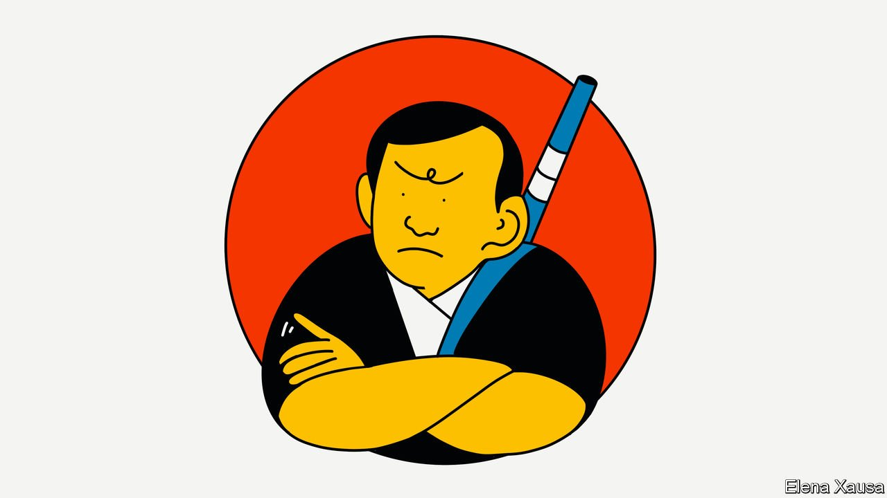

###### Banyan

# Suga Yoshihide is unpopular, uninspiring and struggling to survive 

##### Japan’s prime minister faces a leadership vote at the end of September 

 

> Sep 4th 2021 

AN IMAGE OF seven samurai hangs in the meeting room of Amari Akira, a heavyweight from Japan’s ruling Liberal Democratic Party (LDP). Designed by a popular video-game artist, the print served as promotional fare ahead of the country’s last nationwide parliamentary elections, an upper-house ballot in 2019. The principal samurai is meant to be Abe Shinzo, then the prime minister, while the secondary figures represent his allies, including Mr Amari and Suga Yoshihide, who served as Mr Abe’s chief cabinet secretary for nearly eight years.

When Mr Suga took over as LDP president, and thus as Japan’s prime minister, after Mr Abe resigned a year ago, many wondered how he would adapt to being in the leading role. Mr Suga had excelled at the shadowy side of politics—haggling over legislation and bashing bureaucratic heads—but not the public-facing part. A year later, the answer is clear: poorly. His cabinet began with approval ratings above 70%. They have now dipped below 30% in some polls.


Moreover, his party has struggled in a string of by-elections and local contests over the past year, a record many see as a verdict on Mr Suga’s leadership. National lower-house elections loom later this autumn. But first Mr Suga must win a full term as LDP president in a vote of party members and parliamentarians on September 29th. Many in the LDP, especially younger backbenchers, fret about keeping Mr Suga on as the party’s face.

Mr Suga’s administration has had some successes. He set Japan, long a climate-change laggard, a goal of becoming carbon neutral by 2050. He is trying to solve its problems of archaic government services with a push for more use of digital technology. And even though his approach to covid-19 has been muddled and flat-footed, leaving much of the population dissatisfied, Japan has seen fewer deaths, both in absolute and proportional terms, than any other G7 country.

Mr Suga’s main problem is his inability to communicate effectively with the public. His speeches sound like dry bureaucratic briefings. In parliamentary debates he often stonewalls instead of defending his policies. He “doesn’t say anything”, says Shii Kazuo, the head of the Japanese Communist Party, an opposition party. Theories about the source of his coldness abound, many of them spurious. Some reckon it is because he grew up in Akita, a snowy northern region said to breed taciturnity. Others write him off as a lowly farmer’s son, an immigrant to Tokyo unsuited to positions normally held by hereditary politicians (Mr Abe’s grandfather was prime minister and his father foreign minister).

A more generous explanation is that Mr Suga is a man of policy, not politics. “Mr Suga is someone who believes that results are everything,” says Mr Amari, who supports Mr Suga in the LDP presidential race. Yet even he has to admit that how “the steps along the way are explained to the people is also key…and that is something which Mr Suga is very bad at doing.”

Unfortunately for Mr Suga, that is exactly what Japanese voters seem to want from their political leaders right now. In a time of crisis, people want to feel a sense of sympathy from their politicians, says one younger LDP parliamentarian. “They aren’t getting that from Suga.” While Japanese politicians of an earlier era could get away with being colourless and paying little attention to messaging, “these qualities are much less acceptable to the Japanese public today,” says Gerald Curtis, a long-time observer of Japanese politics.

Nonetheless, Mr Suga’s chances of surviving the LDP leadership contest are better than such criticisms might suggest. He topped a recent poll among LDP supporters. He retains the support of three key party elders with large factions of Diet members behind them: Mr Abe, Aso Taro, the finance minister, and Nikai Yoshihiro, the LDP’s secretary-general. Observers reckon they are unlikely to be swayed. Nor are the current challengers any more compelling than Mr Suga.

That Mr Suga has a good chance of surviving despite his obvious unsuitability for the role is a reflection on the sorry lack of competition in Japanese politics. Although LDP members may worry about losing many seats in the Diet elections, few think they could actually lose power—the opposition parties remain too unpopular for that. Nor is intra-LDP competition producing a healthy crop of leaders. That too is a change, says Mr Curtis: “It’s an indication of the lack of [the] dynamism that we used to see in the LDP.” In Japanese politics these days, even one good samurai is hard to find.

