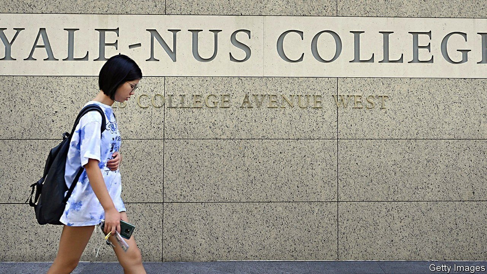

###### Lessons learnt

# Yale-NUS, Singapore’s first liberal-arts college, closes its doors 

##### Students are up in arms 

 

> Sep 2nd 2021 

CLASSES THE next day were cancelled, the email said, and everyone was encouraged to attend a town hall instead. A wave of speculation rippled through the student body at Yale-NUS, a college set up in 2013 as a tie-up between Yale University and the National University of Singapore (NUS). At the meeting on August 27th administrators announced that the college’s programmes will be combined with another at NUS to form a new institution by 2022. When the current crop of first-years graduate, Yale-NUS will cease to exist.

Most undergraduate students in Singapore choose specialised courses of study, such as medicine or law. Some universities had begun experimenting with interdisciplinary curriculums but it was with Yale-NUS, the city-state’s first liberal-arts college, that Singapore signalled its commitment to a new approach. Its launch was billed as a grand experiment testing whether an American-style liberal-arts education could sink roots in Asia.


The decision to close the college was made by NUS, which is consolidating six departments, Yale-NUS among them, into three new colleges. The restructuring, which affects about 18,000 students or half the student body, is in fact a mark of the university’s commitment to the liberal arts, argues Chan Heng Chee, a diplomat who sits on the college’s board. The purpose is to make “liberal-arts education more accessible [to Singaporeans] and more inclusive”, she says. Yale-NUS is “exclusive”, she argues. It admits at most 1,000 students a year, 40% of whom are foreign. The new college will enroll twice as many students and will, if NUS fees are anything to go by, charge them less.

Another reason to close the college was its “financial unsustainability”, says Ms Chan. Yale-NUS had hoped eventually to secure as much private funding as do top-tier American liberal-arts colleges, but by March had raised just a measly $320m. Concern about the financial model “started the conversation” about what to do with the college, says Ms Chan. But Pericles Lewis, the first president of Yale-NUS, who also sits on the board, notes that it had “a few years left” to achieve its fundraising targets, and could have doubled the number of students it admits.

Some professors and students suspect there were other considerations at play. Political activism is frowned upon in Singapore, which has been ruled by the same party since 1959. Yale-NUS students were more likely to express their political views and were better organised than their peers at other universities, says Cherian George, the author of a recent report on academic freedom in Singapore. Ms Chan pooh-poohs the notion that the government was keen to muzzle mouthy students. The government, she says, knew what it was signing up for when it launched the college.

At the opening of the new campus in 2015 Lee Hsien Loong, Singapore’s prime minister, said that the college would have “to adapt the Yale model to Asia”. Four years later the college appeared to do just that when it cancelled a course on dissent taught by a prominent playwright because, it said, it was not sufficiently rigorous. Responding to allegations that the college had caved to political pressure, Mr Lewis conducted an investigation which yielded no evidence of government coercion. Yet Ong Ye Kung, then the education minister, supported cancelling the course, declaring in Parliament that “political conscientisation”—when people become aware of how they are oppressed—“is not the taxpayer’s idea of what education means”.

News of the closure came as a shock to students and teachers, who were not consulted. Neither was the college president, Tan Tai Yong, who was reportedly “gobsmacked and flabbergasted” when informed in July. During the virtual town hall, microphones were muted; students had to send questions via a mediator. At the end of the meeting, students could be heard shouting with frustration, according to the college newspaper. All they are likely to get in return for their “conscientisation” on this issue is silence. ■

