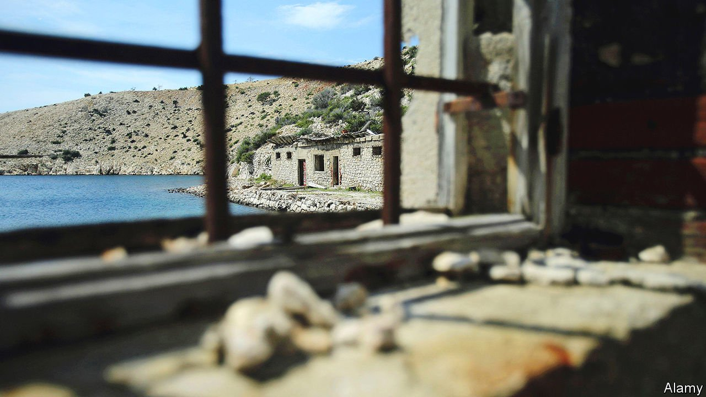

###### Israeli fiction

# A family grapples with its past in David Grossman’s new novel 

##### The characters in “More Than I Love My Life” are plunged into the traumas of history 

 

> Sep 4th 2021 

More Than I Love My Life. By David Grossman. Translated by Jessica Cohen. Knopf; 288 pages; $27. Jonathan Cape; £18.99

NEAR THE beginning of David Grossman’s new novel, Gili, a young Israeli film-maker, is celebrating the 90th birthday of Vera, the grandmother who helped bring her up after her mother vanished. It is 2008. Vera is a survivor of the barbarity inflicted on Yugoslavia during the second world war. Her parents were sent to Auschwitz; Milosz, her first husband and great love, committed suicide after being arrested and tortured in Belgrade.


Vera—“my generous, warm, endlessly devoted, fanatical, tough, cruel grandmother”, Gili calls her—eventually emigrated to Israel, married a widower and looked after her daughter, Nina, and a new stepson, Rafi, mostly trying to put the past behind her. Her care for her second husband, even as she maintained her devotion to Milosz, and the warm relationships she forged with her extended Israeli stepfamily, have made her the matriarch of a sprawling and tight-knit clan.

The party is interrupted by the return of flinty Nina, the prodigal daughter who had conceived Gili with Rafi, only to abandon the baby. Nina’s entrance unleashes a family crisis. And it precipitates an epic journey from Israel to the desolate island of Goli Otok, off the coast of what is now Croatia. In the 1950s Vera had been held there as a political prisoner. How she faced up to her torturers—and the terrible moral dilemma they imposed—would haunt the family for ever.

Mr Grossman’s is not the first novel to dramatise the decisions that war and dictatorship can demand; William Styron’s “Sophie’s Choice” is probably the most famous. What differentiates his story is the way he tells it. A devoted, if inconspicuous, experimentalist, Mr Grossman chose a long walk across Israel as a template in “To the End of the Land”; in “A Horse Walked into a Bar”, which won the International Booker prize, stand-up comedy provided an unexpected way of exploring the past.

In “More Than I Love My Life”, Gili and her father use the journey to Goli Otok to film documentary footage about Vera and Nina. Partly narrated by Gili and brilliantly translated from Hebrew by Jessica Cohen, the novel leaps back and forth in time—and sometimes from the first person to the third—giving vivid voice to each of the characters as they navigate their pain, both present and past. Pages of expository dialogue, which might have become clumsy and obstructive, are seamlessly included as interviews conducted for the film, enhancing the overall subtlety.

Mr Grossman’s 12 previous novels and five volumes of non-fiction have brought him renown on both sides of the Atlantic. This book will earn him more. ■

