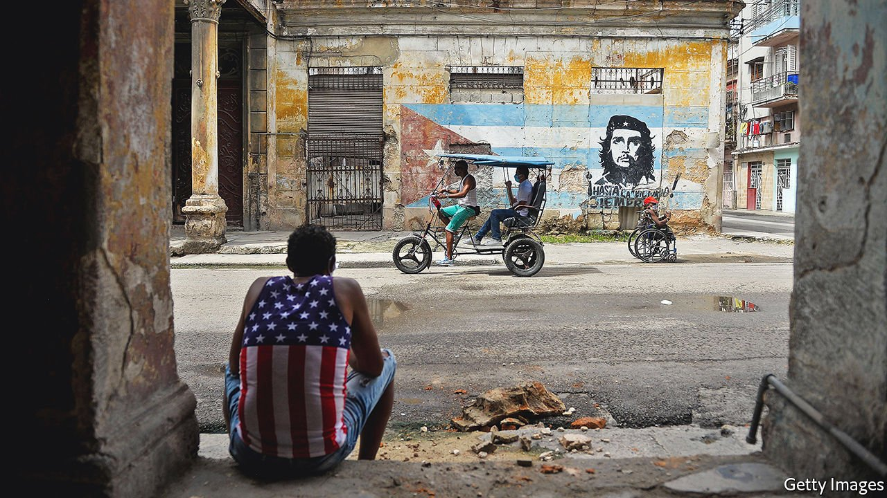

###### Cuban history

# America looms large in a new history of Cuba 

##### The heroes of Ada Ferrer’s narrative are the island’s nationalists and reformers 

 

> Sep 4th 2021 

Cuba: An American History. By Ada Ferrer. Scribner; 576 pages; $32

IN 1853 WILLIAM KING was sworn in as vice-president of the United States on a sugar plantation in Matanzas, near Cuba’s northern coast. King, who had hoped that spending his afternoons amid the fumes of boiling sugar would cure the tuberculosis from which he was dying, asked Congress for permission to take office as deputy to President Franklin Pierce on foreign soil. He lasted only 45 days in the job, returning to his own plantation in Alabama just before he died.


His is one of many stories told by Ada Ferrer in “Cuba: An American History” to show how intertwined the two countries have been. King’s presence on the island was telling. The slave-owning deputy of a northern president who sought to placate the restive American South, he took the oath in a place where slaves harvested the crop that made Cuba one of Spain’s most profitable colonies. King and Pierce had campaigned to make Cuba an American possession; their supporters carried banners reading “Pierce and Cuba”. The off-site inauguration “exemplified the power of a system that linked planters, slave-traders and investors from New York to Charleston to the African coast to Havana, Matanzas and the green cane fields of the island’s interior”, Ms Ferrer writes.

The idea of putting the United States at the centre of Cuba’s history is not surprising. But Ms Ferrer reveals a relationship that is deeper and more troubled than it may appear to readers who remember the Maine, an American battleship that blew up in Havana harbour in 1898, triggering the Spanish-American war. Her book is timely, too. This summer the biggest protests in decades confronted Cuba’s repressive (and anti-American) regime. Ms Ferrer invites readers to consider the context in which the country’s next change of regime could happen.

America was domineering from the start, and more often a foe than a friend of Cuban nationalists. Thomas Jefferson thought Cuba should be his country’s “southernmost limit”. Ships owned by Americans from northern states trafficked slaves from Africa to Cuba in the middle of the 19th century, even after the United States had made the trade illegal. American-made machines, maintained by American engineers, refined Cuban sugar. After America helped Cuban rebels boot out the Spanish it eventually conceded Cuban independence, but not without imposing the Platt amendment, which limited the new state’s ability to sign treaties and gave America the right to send in its army. In the 1920s Cuba had around 80 American settlements and nearly two-thirds of its sugar was produced by American-owned mills.

The heroes in Ms Ferrer’s saga of collaboration between rich white Americans and Cuba’s upper classes, some of whom during slavery favoured annexation by the United States, are the nationalists and reformers who repeatedly rebelled against Cuba’s rulers, whether Spanish, American or Cuban. Many were black, and much of her book is about these lesser-known fighters for independence and equality. Her tales are revealing and moving. José Martí, the intellectual father of Cuban independence, was against racism, insisting that people “have no special rights simply because they belong to one race or another”. General Quintín Bandera, a black man, helped lead three wars against Spain. After independence, failing to find employment commensurate with his stature, he collected rubbish, defiantly wearing his uniform.

Heroes and villains

Cuba’s submissiveness to the United States ended abruptly with the victory of Fidel Castro’s revolution in 1959. America still tried to get its way, through invasion, attempted assassination and an economic embargo. As well as fomenting the Bay of Pigs fiasco, the CIA contemplated spraying a derivative of LSD on Castro before a speech to make him look crazy. But he and his revolution survived everything the Americans threw at them. Even now Castro’s defiance of the superpower, along with such social successes as a low infant-mortality rate, excuse his repression and economic malpractice in the eyes of many leftists. Ms Ferrer, whose family fled Cuba in the early 1960s, is not so indulgent.

Castro did not need psychedelics to govern irrationally. During the 1960s his regime nationalised almost every productive activity. Starting in 1969 it dragooned city folk, including children as young as 14, to cut sugar cane in a bid to raise cash for industrialisation, postponing Christmas and new-year celebrations until the summer in pursuit of a doomed target. In its quest to mould Cubans into dutiful socialists the regime sent 85% of high-school students to rural boarding schools. Within a few years of the revolution, in the first of several waves of emigration, some 250,000 Cubans left, mostly for Miami. They included half of Cuba’s doctors and two-thirds of the faculty of the University of Havana.

Could relations with America over the past 62 years have been less barbed, and Cubans’ lives better as a result? Castro’s personality, America’s preconceptions and the cold war all made that unlikely. It is unclear just when Castro decided he was a communist but he was never going to be a democrat; even before the revolution he proclaimed that Cuba “needs more Robespierres”. The Eisenhower administration saw Castro’s relatively moderate early land reform, which did not fully compensate American firms, and a visit by a Soviet official as signs that Cuba was going communist. With America in a global power struggle against the nuclear-armed Soviet Union, that was intolerable.

Cubans are still suffering. Food is scarce—the result of socialist policies that have been only partly reformed, the tourism-crushing pandemic, the woes of Venezuela (which replaced the Soviets as Cuba’s economic backer) and the American embargo. In July Cubans protested in dozens of cities and towns. The regime, led today by Miguel Díaz-Canel, an apparatchik with none of Castro’s charisma, responded with tear gas and arrests.

Yet readers will close Ms Ferrer’s fascinating book with a sense of hope. The cold war is over. The yearning of many Cubans for political and economic freedom is one that any American government can endorse. If they finally achieve it, Cuba’s overbearing neighbour might at last prove a friend to the island’s progress. ■

