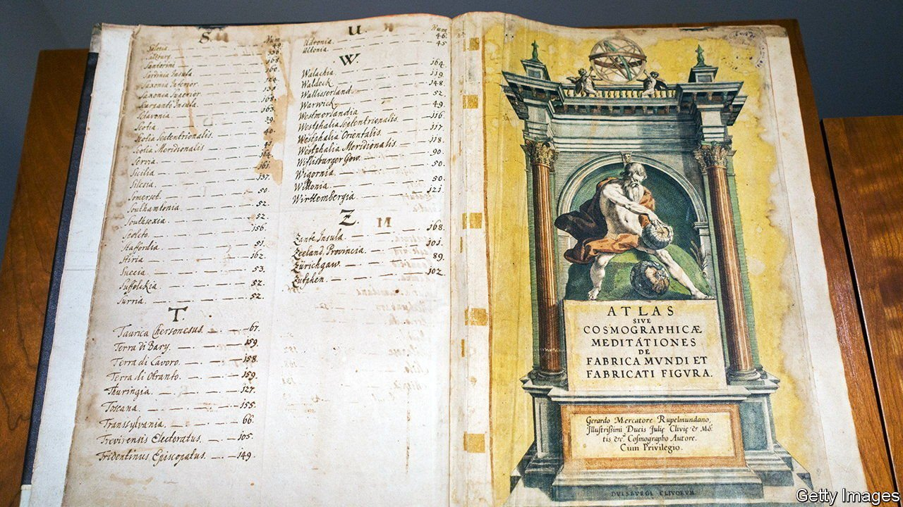

###### Keys to all knowledge

# How the index changed reading, for better and worse 

##### What is Google, asks a new book, but a giant electronic index? 

 

> Sep 4th 2021 

Index, A History of the. By Dennis Duncan. Allen Lane; 352 pages; £20. To be published in America by W.W. Norton in February; $30

PRODUCING AN INDEX is like squeezing “a grape in a winepress”, wrote a 19th-century French scholar, “so that not even the tiniest drop of precious juice has been allowed to escape”. Reading an index is more like wine-tasting. Take the smallest sip and you can guess the vintage.


Try this one: “gluttony/God/grief/heaven/hell/humanity/Seneca/sex/sin”. It’s a heady combination: ambrosial and intellectual; sensual with a bitter aftertaste. It is from St Augustine’s “Confessions”. Or try a slug of this: “shame/shameless/shamrock/shit/shite/shithouse”. That earthy flavour is from James Joyce. How about “pie/poverty/power/prison/pudding (see ‘Christmas Dinner’)/ pugilist”? Full-bodied, with a hint of festive spice: Dickens, naturally.

Indexes are to books as menus are to meals: often the best bit. The index should be prosaic—it is, after all, a mere tool—but it can read like poetry. Even John Betjeman, a bard of Englishness, might struggle to match “Abingdon/al-Qaeda/Angola/Ascot/Asda”. Indexes are a solution, but they are also a puzzle. Take that last one. It is from a biography of John le Carré—and who wouldn’t wonder, Smiley-like, how those entries all join up?

As Dennis Duncan’s charming book shows, though today they suggest fusty libraries, indexes were once a novelty. A book seems such a simple structure that it feels less invented than self-evident, the innovations behind it hard to see. Yet every chapter in its progress was slow, bound on either side by centuries of sluggishness. Turnable pages didn’t really arrive until the first century BC; the book form didn’t take off properly until the fourth century AD. The separating of words with spaces didn’t get going until the seventh—verylateforsomethingsouseful. Finally things accelerated: first came the index, in the 13th century, then Gutenberg, then, in 1470, the first printed page number. You can still see it in a book in the Bodleian Library.

People have struggled with the speed of literary production ever since. “Is there anywhere on Earth exempt from these swarms of new books?” grumbled Erasmus. The index was both an aid and a problem of its own. “Many people read only them,” tutted the hard-to-please Erasmus. An anxiety has always hung about them—that, while they enhance convenience, they threaten serendipity. To claim to have read a book when you have only read the index is, said Jonathan Swift, like a traveller claiming to describe a palace when “he had seen nothing but the Privy”.

But indexes could and can be fun. Brevity is the soul of wit, and what is briefer than an index? Consider this takedown of a British politician: “Aitken, Jonathan: admires risk-takers, 59; goes to jail, 60”. At times they were astonishingly ambitious: the Victorians strove to produce a “key to all knowledge”. Like railways, an author rhapsodised, indexes have “cleared the way; they have levelled mountains and straightened the most tortuous paths…What a timesaver!…this is electricity!”

They are still saving time. Where Victorian keys to everything failed, Google has succeeded, says Mr Duncan. For what is the search engine but a giant, electronic index? Type in the word, and everything appears instantly—gluttony/God/shame/shite/Angola/Ascot/Aitken and all the rest. What a timesaver! What electricity! And yet it is hard not to feel, like Erasmus, that something has been lost. The mountains have been levelled, the paths straightened. The serendipity has gone. ■

Back Story, our new culture column, is online at economist.com/books-and-arts

