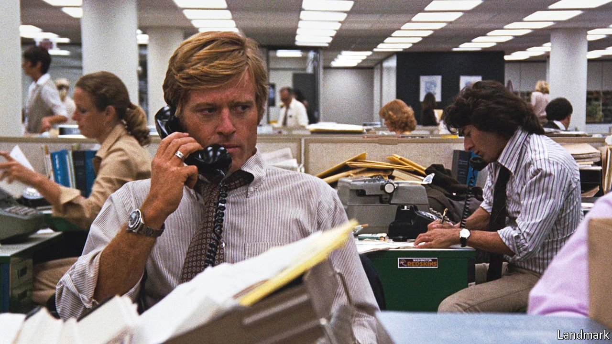

###### Liberalism and the truth

# Jonathan Rauch defends “the constitution of knowledge” 

##### The architecture of knowledge-making has proved enduring. But now it looks fragile 

 

> Sep 4th 2021 

The Constitution of Knowledge. By Jonathan Rauch. Brookings Institution Press; 280 pages; $27.99 and £22.50

IF THIS REVIEW contains errors, they will probably be spotted by the first editor who reads it. If a mistake sneaks past him then other editors, who pride themselves on being able to find bloopers, will probably intervene. If they are all asleep at the keyboard, The Economist’s fact-checking team will embarrass them by flagging the mistake. And if all these safety features fail, then a reader will write to point out the error, which will then be corrected with a slightly sheepish apology.


This system, which has corollaries in science, law, academia, finance and everywhere that facts still matter, forms one node in an enormous decentralised, depersonalised network. Jonathan Rauch, a former journalist at The Economist and now at the Brookings Institution, a think-tank, calls the rules that govern it the “constitution of knowledge”.

Unlike America’s constitution, this one has no identifiable authors. Instead, the rules were discovered by trial and error over the course of centuries. In Mr Rauch’s telling, the constitution of knowledge draws on the same inspiration as the Founding Fathers: a mash-up of 17th-century ideas about liberty with the French and Scottish enlightenments. But it took more than a hundred years to perfect. In the mid-19th century American journalists still invented stories to boost their readership. In 1844, for example, the New York Sun published a fake story about a transatlantic hot-air balloon journey, written by Edgar Allan Poe.

The 20th century brought codes of ethics, professional bodies and unwritten rules that were passed on through institutions. In journalism, a field Mr Rauch knows well—and to which he pays particular attention because of its role in politics—these rules include seeking multiple sources, preferring information that is on the record, questioning received wisdom, affording subjects a right of reply and correcting mistakes. Karl Popper’s philosophy of science gave the constitution of knowledge an epistemological basis. The truth might be unattainable, but by excluding enough falsehoods it was possible to get close to it.

Like science, what Mr Rauch describes is a social activity. He sets out the house rules. Nobody has the final say on anything. Authority on a subject is not personal: “if an experiment works for Yale’s Sterling Professor of Social and Natural Science, it should also work for the lowly undergraduate who replicates it.” Knowledge advances through disconfirmation, which means that when one person advances an idea, everybody else can try to knock it down. People must be accountable for mistakes, though if the punishment for being wrong is too severe it becomes counterproductive. Civility matters, as do earned credentials and reputation. Institutions are vital. Last, no bullshitting is allowed.

It will not come as news to Economist readers that the system Mr Rauch evokes so fondly is under threat, from three sources. News as entertainment, in the form of talk radio and cable-news outrage, was around decades before the birth of Twitter and Facebook. Yet social media have given the phenomenon extra oomph—and so far the big social platforms have proved better at undermining the authority of institutions that make knowledge than at strengthening them, or at creating new ones. Wikipedia is a lonely exception that illustrates what might be possible with a different set of incentives.

Then there is the threat from the populist right, which seemed to reach its apogee in 2016. The knowledge-making that Mr Rauch describes is complex and questioning. One reason populism is popular is that it makes everything seem simple and certain. The sabotage from the right has also been deliberate. When Donald Trump was president-elect, Lesley Stahl of CBS asked why he spent so much time attacking the press. “You know why I do it?” Ms Stahl later recalled him saying. “I do it to discredit you all and demean you all, so when you write negative stories about me no one will believe you.”

Third comes the threat from the left, in the form of cancelling and self-censorship. Liberal knowledge-makers are more worried about this now, because to some the peril of Trumpism seems to be receding. The Yale students who were upset by a professor’s reluctance to police Halloween costumes, or those at Smith College who protested against Christine Lagarde giving a speech, are suspicious of the liberty on which knowledge-making depends. There is evidence that this preference for conformity is gaining ground. Two-thirds of college students who answered a poll run by the Knight Foundation in 2019 admitted that the climate on campus stopped them expressing their views because classmates might find them offensive.

“That so few now dare to be eccentric marks the chief danger of the time,” wrote J.S. Mill of Victorian England. Mr Rauch’s book is a manifesto for liberals and eccentrics, which explains how carefully the great, distributed knowledge-making network has been assembled, how enduring it has proved—yet how fragile it seems. ■

