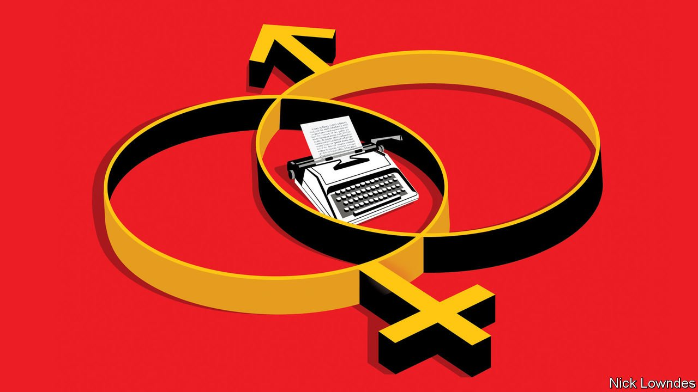

###### Johnson

# The best and worst ways to tackle linguistic sexism 

##### Some languages have more luck than others 

 

> Sep 4th 2021 

ENGLISH HAS a long tradition of wrangling over its lack of a gender-neutral pronoun. For centuries the orthodox view was simply that “he” includes “she”. But in the 19th century, when suffragettes in Britain and America argued that they were entitled to vote, they were told that the “he” used to describe voters in laws referred only to men. More recently some (including this columnist) have argued for a generic singular “they”, which has been employed in this way for centuries. But conservatives insist that it is illogical.

As the dispute rumbles on, people have invented pronouns to fit the bill: hesh, hizzer, herm and others. Many aim to combine he, she, him and her in some way. But English is unfortunate in that these words simply don’t blend into one that feels entirely natural.


Activists trying to take default maleness out of other languages have banged their heads against the same wall. In German, the current solution is the “Gendersternchen” (gender asterisk). The feminine ending (often -innen) is added after the masculine base plus an asterisk, as in Student*innen, a genderless plural of “students”.A few bodies, such as the Green Party, have adopted the practice. But it is tricky to pronounce (to keep it from sounding identical to Studentinnen, “female students”, speakers use a brief pause). And, not surprisingly, it is unpopular with traditionalists.

French feminists have sought a similar fix, setting off feminine endings (like -e) with full stops, as in étudiant.e. Naturally the (almost always conservative) Académie Française has rejected the innovation. But so have public figures who otherwise trumpet their feminist credentials; Édouard Philippe, the prime minister until last year, called for feminising official job titles—so a female chef de cabinet could be a cheffe—but rejected the interposed dots.

Linguistic engineering need not be so awkward. In this regard, some languages are luckier than others. Swedish is one. It does not distinguish masculine from feminine in adjectives and articles; they merged into a “common” gender long ago. So Swedes had mainly just the pronoun problem to solve: how to refer to a generic person without using han (he) or hon (she). Activists have embraced hen, which is neatly close to both, and easy to pronounce. In contrast to the German and French equivalents, it has enjoyed some formal approval. Sweden’s biggest teachers’ union issues guidance for educators on using it in the classroom.

More intriguing perhaps are the solutions found by Spanish-speakers. A few people in America have adopted the term “Latinx” to avoid the masculine “Latino” (it is pronounced “la-teen-eks”). This has crept into English but is used rarely by Latinos themselves. It does not really solve the problem in Spanish, where -x cannot replace the masculine -o and feminine -a in a way that feels native.

Another solution fits neatly into Spain’s spelling and sound system: -e, as is in one latine or multiple latines. It also dovetails with the detail that many Spanish nouns and adjectives (those that end in a consonant) already take the plural form -es. This makes new words like alumnes (students) look less alien: they resemble traditional Spanish words like españoles. The -e ending also yields a pronoun, elle, sitting between él (he) and ella (she), with none of the weirdness that nobbles hizzer or hesh in English

Whether such innovations will be taken up by the broad community of speakers remains to be seen. Many people mocked the creation of Ms as an alternative to Mrs and Miss. Perhaps against the odds, it is now ubiquitous. But the fact that sex-neutral pronouns can also be used by those who claim neither of the traditional genders will embroil them in yet another culture war.

In the end, languages do allow for pronoun engineering in the name of social goals, if not always the planned, top-down kind of reform. You was once the object form of ye, English’s old second-person plural pronoun. Later it became the subject form, but still plural only. Then it became a polite way to refer to a single person (in contrast to thou, for intimates and inferiors). Over centuries, speakers gradually decided that everyone deserved the polite “you”, and the days of “thou” were numbered. In the midst of the change, many decried singular “you” (the Quakers were longtime holdouts). They lost the debate.

It is often said that the personal is political, and the same goes for personal pronouns. When politics change, they eventually do, too.

