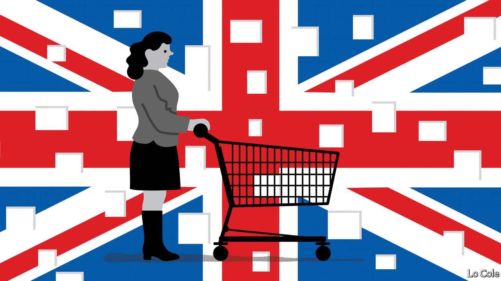
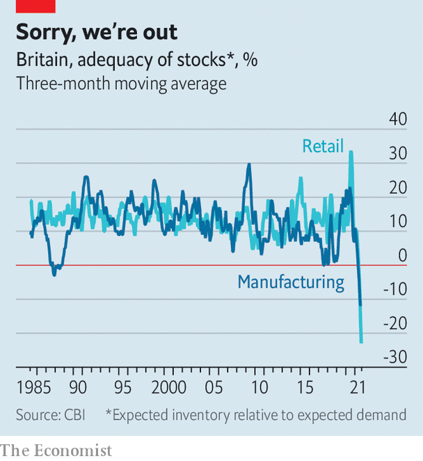

###### Out of stock

# Britain’s economic recovery from the pandemic is far from smooth 

##### Demand has recovered much faster than supply. That is causing shortages and bottlenecks 

 

> Sep 4th 2021 

THE END of the summer feels too early to be thinking about Christmas, but retailers have little choice. The typical British household spends around a third more than usual in December, and stocking up for the most important trading weeks of the year usually begins around now. This year, however, rather than preparing for the coming rush, retailers are struggling to keep shelves full.

 


According to survey data from the Confederation of British Industry, a lobby group, retailers’ and manufacturers’ inventories have plunged in recent months (see chart). It has been asking members about stock levels for decades and has never recorded answers so low. In spring and early summer, shortages of construction materials and computer chips hampered builders and carmakers. In recent weeks the impact has become more visible on high streets. McDonald’s, a burger chain, stopped serving milkshakes. Wetherspoons, a chain of pubs, is short of some brands of beer. Nando’s, a chicken restaurant, temporarily closed around 50 branches because it cannot get the birds.

The main reason is straightforward. With pandemic restrictions almost entirely lifted and the economy reopened, demand has recovered faster than supply, leading to shortages and higher prices. Consumer-price inflation, which was running at under 1% annually at the start of the year, hit 2.1% in July. The Bank of England expects annual inflation to rise to around 4% over the coming months.

But that is not the whole story. Some of the squeeze is caused by problems outside Britain’s borders, for example the computer-chip shortage. And the pandemic is far from over: government estimates suggest that new infections are running at over 200,000 a week. Employers are having to do without both the infected and many of those who came near them. According to the most recent data available, in the week ending August 18th over 300,000 close contacts of people who tested positive were told to stay home.


The main additional factor, however, is Brexit. Britain’s transitional membership of the European Single Market and Customs Union ended on December 31st 2020. The end of the frictionless border with Britain’s main trading partner means further problems for supply-chain managers. Although the government has chosen to suspend most border checks until October, new rules on collecting value-added tax have convinced many smaller European businesses to sell less to Britain. Sanitary and phytosanitary rules, due to be imposed on imports this autumn, will make food supply chains more fragile. Employers in sectors such as food processing and hospitality, which relied heavily on European workers, say that many left the country last year. Some may not return.

Disentangling the effects of Brexit and the pandemic is tricky. Take, for example, the shortage of heavy-goods vehicle (HGV) drivers. It has become severe enough that the government has extended the maximum time allowed behind the wheel. Drivers may stretch the daily maximum of nine hours to 11 hours twice a week between now and October. Around 40% of Britain’s shortfall of drivers, estimated at around 100,000, can be blamed on the suspension of driving tests at the height of the pandemic, and HGV drivers are in short supply across the continent. But Britain is suffering particularly acutely.

As well as suppressing demand and disrupting supply, the pandemic has also twisted Britain’s economy into a new shape. Over the past 18 months, consumer habits have undergone a dramatic shift. Between the end of 2019 and March 2021, their spending on services fell by around a fifth, while spending on goods mostly held up. The typical Briton went to the pub hardly at all and used Amazon a lot more. Such shifts have reshaped high streets. The Centre for Retail Research, a think-tank, calculates that almost 18,000 shops have closed since the end of 2019, and over 215,000 retail jobs have been lost. According to the Office for National Statistics, the share of retail sales made online has jumped from under 20% before the pandemic to approaching 30%, even as shops have reopened. Retailers think that shopping habits formed during the pandemic may well outlive it.

Many workers have responded to changing consumption patterns by following the money. Bosses in the hospitality sector have found themselves short of staff, probably because some former waiters and the like are now driving delivery vans or stacking supermarket shelves. Data from Indeed, an online recruitment firm, show a marked drop in interest from potential applicants in working in certain sectors. Clicks per online job advert for vacancies in food preparation and service roles have fallen by over 50% since February. In an effort to lure workers back to such jobs, employers are starting to raise pay. The median wage rate for hospitality jobs posted on Indeed rose by 3.7% between February and July, compared with an increase of 0.8% across all roles.

Some of these bottlenecks should ease over the coming 12 months. Global supply chains will be adjusted and strengthened, and the labour market will adapt to new spending patterns. The rules on when to isolate after coming in contact with a case of covid-19 were eased in mid-August. And higher wages will eventually draw workers back into hospitality, and encourage them to train as HGV drivers. But all this will take time, and as Brexit bites, trade with the EU will continue to become more difficult. The recovery from the pandemic will be far from smooth. ■

Dig deeper

All our stories relating to the pandemic and the vaccines can be found on our . You can also find trackers showing ,  and the virus’s spread across  and . For more coverage of matters relating to Brexit, visit our 

