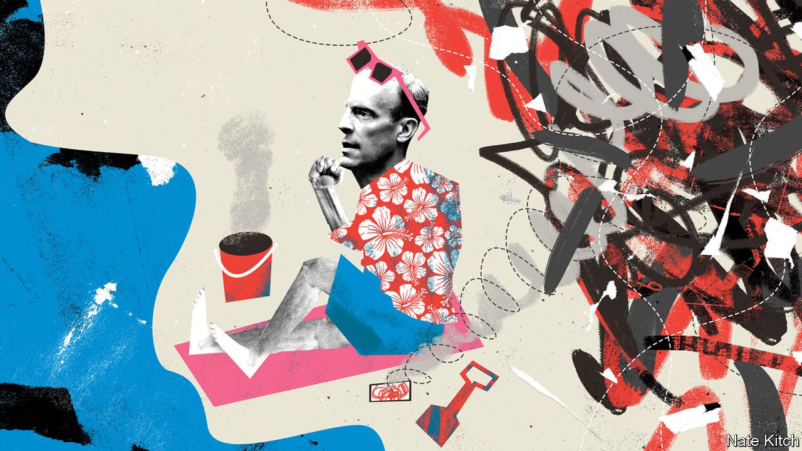

###### Bagehot

# Britain’s foreign secretary isn’t up to the job 

##### Dominic Raab fails to rise to the challenge of Britain’s biggest foreign-policy crisis in decades 

 

> Sep 2nd 2021 

IDEALISTS SEE leadership as steering the ship of state in the right direction (Plato), or embracing the “ethic of responsibility” (Weber). Realists see it as the ability to seize the horse of history by the tail and lever yourself onto its back (Machiavelli), or to sell a coherent vision to a fickle public (Schumpeter). But whatever its nature, everyone can agree when it is absent.

As it has been from the Foreign Office during the past fortnight. Even as Afghanistan was falling to the Taliban, Dominic Raab, the foreign secretary, dawdled in Crete before cutting his holiday short. He delegated to a junior minister the job of calling his opposite number in Kabul to discuss the fate of Afghan interpreters working for British forces. His response to criticism in a television interview was risible: he had been focused on his job in Crete, he bristled, not paddle-boarding, because the “sea was closed”.


The permanent secretaries of the Foreign Office, Home Office and Ministry of Defence, as well as the prime minister, Boris Johnson, also initially refused to let a little thing like the fall of Kabul interrupt their holidays. And Mr Raab made some reasonable points during a combative appearance before the foreign-affairs select committee on September 1st. There was a limit to how much Britain could have done to improve the situation in Afghanistan, given America’s precipitous departure. Britain was not alone in underestimating the speed of the Taliban’s advance. As foreign secretary he had to keep his eye on lots of pots that threaten to boil over, not on Afghanistan alone.

Moreover, Mr Raab inherited a Foreign Office that had been broken by decades of cuts and marginalisation. “Embassies have been sold off; a diplomat’s career path has become arbitrary; the last Permanent Secretary prioritised diversity over diplomacy; and too much experienced advice has been ignored and subordinated to the whims and instructions of Downing Street,” lamented Sir Alan Duncan, who served a spell as a foreign-office minister, in a recent article. Brexit has left Britain’s diplomatic strategy in disarray, tearing up nearly five decades of patient work with the European Union and doubling down on the transatlantic relationship, at precisely the moment when America has decided to turn inward and towards the Pacific.

But leadership is about rising to challenges. A lesser man than Ernest Bevin, foreign secretary from 1945 to 1951, might have surrendered to pressure from within the Labour Party to side with the Soviet Union rather than America, or to shift opportunistically between the two. Moreover, Mr Raab helped create the difficulties that now beset his department. He was among the hardest of the Brexiteers, helping to bring down Theresa May, the previous prime minister, when she tried to compromise with the EU, and running for party leadership in 2019 as the champion of the ultras.

That Mr Raab’s Foreign Office is not a happy place is hardly surprising, given his ideological leanings. But the atmosphere has been worsened by his personality, variously described as “tightly wound”, “controlling” and “cold”. Some officials have taken to calling him “five i’s”, a double reference to the “five eyes” arrangement that sees Britain share intelligence with America, Australia, Canada and New Zealand, and what they see as his attributes: insular, imperious, idle, irascible and ignorant. He has handled this hostile environment by sidelining ambassadors and surrounding himself with special advisers. But the cost has been high. He has built no close relationships with his counterparts around the world, failing to talk to foreign ministers in Afghanistan, Pakistan and several of the surrounding states in the six months leading up to the fall of Kabul. Important decisions have been shaped by callow youths who have seldom strayed outside the Westminster village, rather than by seasoned diplomats.

Nor does Mr Raab supply much in the way of intellectual leadership. The son of a Jewish Czech refugee, he has a fine record on standing up to Russia and China. He pressed for residents of Hong Kong to be welcomed in Britain as China tightened its grip on the territory. But on many difficult choices facing Britain, he has been reticent—so much so that some other Brexiteers are losing patience. Instead of buccaneering about the place, as they fondly imagined Britain doing once freed from the EU, he has got lost in pettifogging process, they complain. He is a strange combination of ideologue and technocrat, a hard-line Brexiteer by conviction but a human-rights lawyer by training and experience. Somehow, this mixture has left space for neither vision nor panache.

His dismal performance over Afghanistan has provoked another round of Westminster snakes and ladders. Will the prime minister sack him in the next reshuffle, or at least move him sideways? Who would take his place? (Michael Gove, the cabinet-office minister, and Liz Truss, the trade secretary, are early front-runners.) And might the manifest failings of one member of his cabinet inspire the prime minister to take a hard look at the others? Why does it contain so many people who mess up everything they do, like Gavin Williamson, the education secretary? Why have so many of the most impressive Tory politicians languished on the backbenches, like Tom Tugendhat, the chairman of the foreign-affairs select committee, or jumped ship, like Rory Stewart, a former soldier, diplomat and Conservative leadership candidate?

Holding on tight

When Mr Johnson took office, surrounding himself with Brexiteers was understandable, given the need to end his party’s 30-year civil war. But sensible Remainers have reconciled themselves to a future outside the EU, and the cost of packing the cabinet with mediocrities is rising by the day. The prime minister would strike no one as a follower of Plato or Weber. The realist school of leadership seems a better fit. But having seized the horse of history by the tail when he backed Brexit, he is in danger of failing because he has assembled incompetent horsemen, rather than crack cavalry. ■

An early version of this article was published online on September 1st 2021

