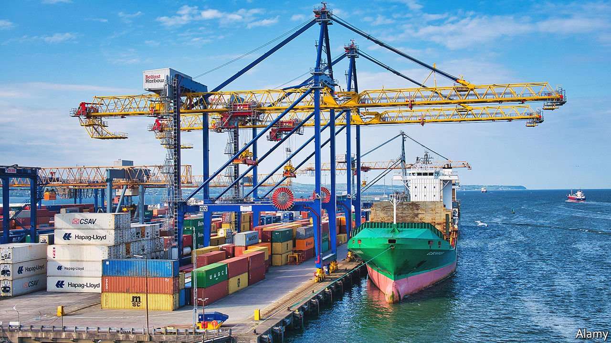

###### Tied up in knots

# For Northern Ireland, Brexit means red tape and subsidies 

##### The province’s businesses and consumers must either pay higher prices, or receive government handouts in perpetuity 

 

> Sep 4th 2021 

AMONG THE many claims made for Brexit was that leaving the European Union would allow Britain to slash red tape and free private industry to flourish. Nowhere does that promise ring more hollow than in Northern Ireland. When the United Kingdom left the EU, it promised that the province would remain to all intents and purposes within the trade bloc, in order to keep the border with the Republic of Ireland near-invisible. The aim was to avoid disrupting Northern Ireland’s fragile peace process by re-inscribing the island’s partition, thus inflaming nationalist sentiment. But the result has been to create a fresh blizzard of red tape and large new costs for traders.

Under the Northern Ireland protocol, goods must continue to flow freely on the island of Ireland. Exports from Northern Ireland to mainland Britain are also uncomplicated, since Westminster is free to set the rules. But trade in the other direction crosses from Great Britain, which is fully outside the EU, to territory from which it can pass freely into the trade bloc, potentially circumventing its standards for everything from animal health to product labelling. So the price of an invisible border on the island of Ireland is one in the Irish Sea, with new and onerous customs and regulatory barriers. Late last month the British government released a dedicated form to cover the eventuality that a hippopotamus might one day cross the Irish Sea.


One predictable result is that an increasing number of mainland firms are stopping selling to Northern Ireland. Another is large and rising government spending on mitigating the protocol’s consequences. Boris Johnson, the prime minister, has authorised a plethora of costly schemes aimed, in effect, at maintaining historical trade patterns. More than £500m ($690m) has already been budgeted until the end of 2022. Many border measures, for example those governing the import of medicines and chilled meats, have been delayed to allow time to adjust. When they come into force they are likely to cause disruption, public anger—and clamour for further intervention.

Esmond Birnie, an economist at Ulster University, has sought to quantify the costs in more expensive imports, new customs checks and extra red tape. The protocol benefits some businesses by allowing them to stay within the EU’s free-trade area, he says, but not enough to offset such costs. Using early trade data from this year, he reckons the “protocol penalty” will be around 2% of Northern Ireland’s GDP.

The British government is now seeking to renegotiate the protocol in order to lessen its impact. But the EU has said maintaining the integrity of the single market leaves room for at most minor changes, creating a dilemma for policymakers in Westminster. Should they withdraw support and allow trade to adjust, with considerable economic pain for Northern Irish businesses and consumers? Or should taxpayers bear the cost of expensive and inefficient schemes in which the government acts as trade facilitator in perpetuity?

There is little guiding precedent. Governments often subsidise regional economies, points out Alan Winters of the UK Trade Policy Observatory at Sussex University, for example by building infrastructure or beefing up transport links. They also commonly subsidise international trade—as in previous decades, when Northern Ireland and other parts of the UK saw lavish handouts to unprofitable shipyards and carmakers. But “paying to undo your own policies is unusual,” he says, “and the politics are more difficult.”

At some point, the choice may be taken out of the British government’s hands. Under the protocol, the UK can offer subsidies to Northern Irish companies, but only if they satisfy EU law. The trading bloc is generally quite sympathetic to governments seeking to support isolated or disadvantaged regions, says George Peretz, a barrister and expert in state-aid law. But no one knows what is permissible when it comes to counteracting newly imposed trade barriers, he adds. The whole point of the EU is that within it, trade is able to flow freely. ■

 This piece previously said that under the Northern Ireland protocol, goods and services must continue to flow freely across the Irish border. In fact, only goods need to. Sorry.

