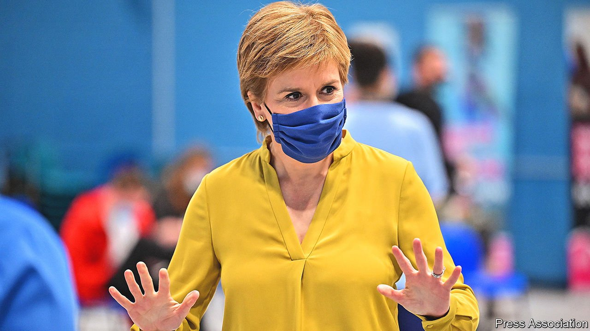

###### Going nowhere

# Neither Nicola Sturgeon nor the SNP will be easy to dislodge 

##### But the prospect of another referendum on independence is remote 

 

> Sep 4th 2021 

AFTER 14 YEARS in government, seven as Scotland’s first minister, Nicola Sturgeon seems unstoppable. In May she led the Scottish National Party (SNP) to its fourth consecutive victory in elections to the devolved administration. A poll in June showed that 47% of Scots support the party under her leadership, despite a series of scandals and crises that most governments would struggle to survive. As she prepares for her party’s annual conference, a virtual event between September 10th and 13th, she is gearing up for another shot at Scottish independence. She has promised Scottish voters “IndyRef2”, a re-run of the referendum in 2014 that saw them decide to stay in the United Kingdom by 55% to 45%.

Seen in one light, both Ms Sturgeon and the SNP look impregnable. Both present themselves to the rest of Britain, and indeed to the world, as a progressive, outward-looking contrast to the Brexiteers in Westminster. So dominant are both leader and party in Scotland that after the vote to leave the European Union in 2016, which most Scots opposed, another referendum on independence seemed almost inevitable. Seen in another light, however, their reign looks less like stability than stasis. A referendum is not in their power to call, and in any case, would probably be lost. And far from progressive, their record in office is one of measures that help the rich and hurt the poor. But until Scottish politics can move past the question of independence, the SNP and Scottish voters seem locked in a loop, repeating the same policies and promises over and over.


A co-operation agreement with the Scottish Greens, which brought them into power as junior partner to the SNP and granted them two ministerial posts in return for support in crucial budget votes, has been presented as a route to a new referendum. But authority to call such a vote lies in London, not Edinburgh. The vote in 2014 was held only because David Cameron, then the prime minister, was confident that the Scottish nationalists would lose. Similar confidence led to disaster two years later, when he lost a referendum on remaining in the European Union.

The current prime minister, Boris Johnson, has made it clear many times that he has no intention of taking a similar gamble. That position seemed to soften slightly when the Scottish secretary, Alister Jack, said in an interview late last month that if opinion polls showed 60% in favour of another referendum “for a reasonably long period”, one might be held. In fact, it sets Ms Sturgeon what looks like an impossible challenge: only a minority of Scots say they favour another poll any time soon.

Not that any of this is reflected in Ms Sturgeon’s rhetoric. “She’s been telling supporters a second referendum’s on the horizon during every conference speech since 2014 and there’s no sign of one,” says one of her allies. “There comes a point, surely, when we have to come clean and say, look, if you want this, it’s not going to be easy.” In the run-up to May’s elections, the SNP pledged to force the issue, even though doing so might mean turning to the courts. One veteran independence campaigner who knows Ms Sturgeon well believes she will have to make good on that threat, though it has little chance of succeeding. The very idea that a court might tell the government in Westminster that it had to devolve constitutional powers to the Scottish Parliament in Holyrood is risible, he scoffs. “All it is is another delaying tactic. We can show supporters we’re doing something and then when we fail, we can tell them how unfair it all is.”

Ever since voters rejected independence in 2014, Ms Sturgeon has placed her faith in events to turn the political tide. The Conservative victory of 2015 (with just 15% of the Scottish vote, compared with 37% nationally), the Brexit referendum (Scots voted by 62% to stay in the EU) and the election of Mr Johnson (recent polling found that he is “loathed” by Scots) all showed how Scottish sensibilities differ from those south of the border. But despite it all, a majority of Scots continue to support the Union.

Polling in August by Redfield and Wilton Strategies, a consulting firm, found 47% in favour of staying and 44% against, with 9% undecided. “Some of our more excitable new members talk about how support for independence went up 15 points during the campaign to get us to 45% on the day,” says an SNP strategist. “They think you can repeat that sort of thing. But you can’t. The country’s properly divided now. People have taken up their positions.”

And a perennial problem for independence campaigners—that Scotland benefits financially from the Union—has only worsened during the pandemic. Official figures published on August 18th showed that falling tax revenues in 2020-21 increased Scotland’s public-sector deficit to over £36bn ($50bn), or 22% of GDP. The deficit for the UK as a whole was much lower, at about 14% of GDP. Public-sector spending in Scotland increased by 21% in the most recent tax year, to around £18,000 per person. That is about £1,800 above the UK average.

Central to the SNP’s case for independence is that Scotland would be fairer and more compassionate outside the UK than within it. But that is belied by its record in power. Its flagship policies have included free prescriptions and higher education, as well as year after year of council-tax freezes. Each of these has benefited the wealthiest Scots most. Prescriptions had long been free to those of limited means, both in Scotland and elsewhere. Extending this perk to the affluent costs the Scottish health service upwards of £50m each year. And even as university students, most of them from middle-class families, benefit from free tuition, state support has been cut for further-education colleges, which train an outsize share of young people from modest backgrounds.

When the SNP first formed a government in 2007, it ordered Scottish councils not to raise council taxes. The freeze remained in place for nine years. And between 2013 and 2019, as transfers from Westminster to Scotland fell by 2.8% in real terms, it was even harsher with councils, reducing their funding from Holyrood by 7.5%. When figures published in July showed that Scotland had recorded its seventh consecutive annual record for drug deaths, campaigners pointed out that cuts to council budgets had made it harder to support addicts or help them to quit.

Northern Neverland

Ms Sturgeon’s conference speech will no doubt be yet another crowd-pleaser, repeating once more the SNP’s unrealistic pledge to fight IndyRef2, and to win it. The truth is that Scottish politics are stuck in an unproductive fantasy, with a referendum always around the corner, and public opinion always in need of just one more push. That offers the SNP an eternal excuse to ignore Scotland’s real problems—and rescues it from a reckoning with voters. “If it wasn’t for the constitution, we’d have lost the last election,” says an old friend of the first minister. “We deserved to. It’s all feeling tired. Maybe we need to lose one but I don’t see how.” ■

