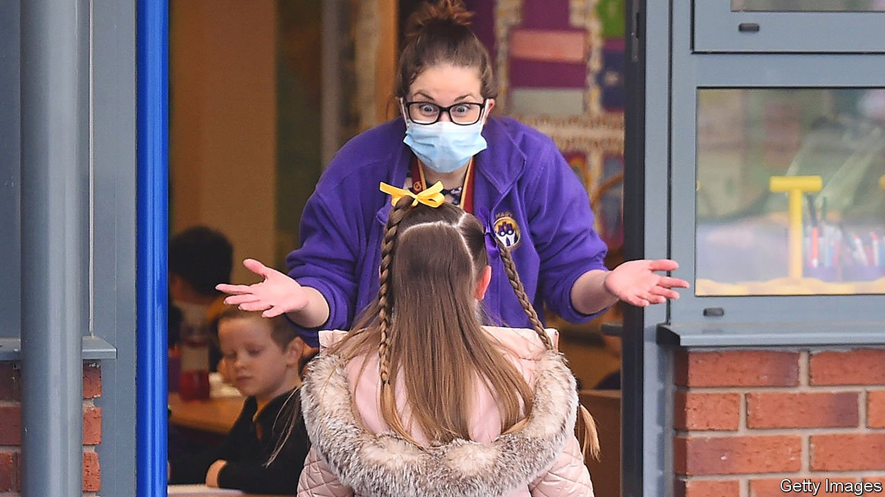

###### Back to basics

# School closures have caused damage that extra lessons cannot fix 

##### Helping children catch up will take years 

 

> Sep 4th 2021 

A DECADE AGO Bowling Park Primary was one of England’s least successful schools. Its neighbourhood in south Bradford is one of England’s poorest. A fifth of pupils are Roma, who tend to do worse at school than any other group. But a turnaround that began in 2008 dragged test scores up to the national average. The progress pupils make from seven to 11 is greater than almost anywhere else.

Covid-19 has hit hard, says Matthew Langley, the head teacher. Large families and small homes helped the virus spread. Some pupils spent a quarter of the past academic year isolating, on top of two months of remote learning early in the pandemic, when all classrooms in England were shut. “It’s like we’ve hit a brick wall,” says Mr Langley, “and now we have to reverse.”


As children return to school after the summer break, the effects of the past two years of closures are worrying head teachers—and the government. A recent study suggests that in March primary-school pupils were about two months behind expected attainment in reading, and more than three months behind in maths. It also offered some grounds for optimism: during the relatively uninterrupted period last autumn pupils started to make up some of their earlier losses. But the averages disguise wide variations. Pretty much every school, says Sammy Wright, a member of a government advisory panel on social mobility, will have 5-10% of children who have been “devastated” by the disruption.

Missing out on sport, school trips and other character-building activities has hit disadvantaged pupils’ confidence, says Mr Langley. And the pandemic has amplified the sorts of everyday difficulties that distract them from their studies. Across the country, the number poor enough to qualify for free lunches rose by 20.6% in the year to January. Even during normal times disadvantaged children lose more time than others to common problems such as toothache, says Mark Mon-Williams of the Bradford Institute for Health Research. These will have been worsened as services were cut or suspended during lockdowns.

The government has promised schools extra funding equal to about £310 ($427) per pupil. That is only a little more than a single month’s spending in 2020 on a scheme that subsidised people to eat out in restaurants. In June Sir Kevan Collins, a former teacher and council boss hired to advise the government on its catch-up strategy, resigned when he heard that only a tenth of the £15bn in extra funding he had asked for would be made available.

Sir Kevan had wanted to increase school spending by about 10% over the next three years, with more than half to be used to add half an hour to the standard school day. The idea was to make time for confidence-building activities, such as sport, music and drama, which risk being squeezed out as schools scramble to catch up on the basics. The extra time would have been mandatory, since voluntary activities are most likely to be skipped by those who need them most. In July the prime minister, Boris Johnson, said that more money might be announced later this year. But the Treasury, faced with a post-pandemic black hole in the budget, is reportedly less keen.

One reason is that many education researchers are dubious that longer school days do much to improve results—in normal times, at least. They tend to recommend using existing time better, not least because that is cheaper. Many teachers and school leaders, meanwhile, fear that a heavier workload might not be fully reflected in extra pay. They argue instead for schemes aimed at pupils with the biggest learning deficits, along with freedom for each school to craft its own plans. In the Netherlands, where catch-up money is a more munificent £2,500 per pupil, the government has given guidance regarding what to spend it on, but not set firm rules.

In Bradford Mr Langley worries that much talk of catch-up has focused on “short-term solutions” aimed at propping up test scores. Covid-19 has disrupted schooling for much longer than people expected; its after-effects will linger, too. He has no doubt that Bowling Park will outgrow the damage done by the pandemic. “But it won’t be in two or three years.” ■

