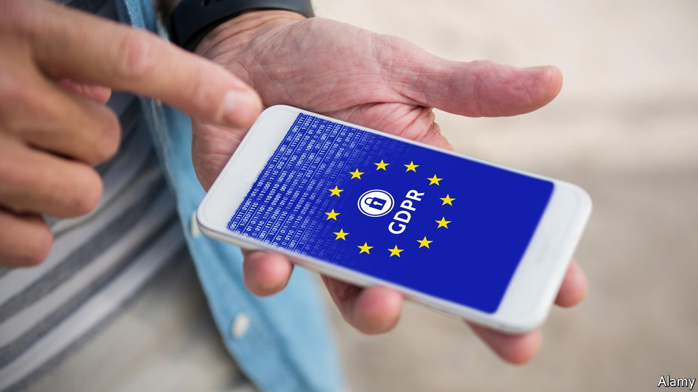

###### GBPR

# The coming Brexit row over data 

##### Britain plans to trim European online-privacy laws 

 

> Sep 2nd 2021 

THE ARMS of the European Union can sometimes stretch half-way around the world. That, at least, was New Zealand’s experience. In 2017 John Edwards, the country’s privacy regulator, urged its government to overhaul a dated privacy law. There were several good reasons, but one of the strongest originated 11,000 miles from Wellington. The European Union’s sweeping new data law, the General Data Protection Regulation (GDPR), was coming into force. Without reform, Mr Edwards warned, the EU could strip New Zealand of its “adequacy” status, which allows businesses to zip data freely back and forth between the trade bloc and other countries. That would have cost New Zealand an important competitive edge. The law was duly upgraded. Without a whisper of a threat of sanctions, the gravitational pull of EU regulation had reshaped the laws of a distant sovereign state.

Mr Edwards will soon have the opportunity to recount that experience to British ministers. On August 26th he was named the government’s preferred candidate for the role of information commissioner, the national privacy regulator. Oliver Dowden, the culture secretary, intends to review Britain’s privacy law, with the aim of shifting it further from Europe. That risks a confrontation that could cost Britain’s own “adequacy” status, and will test whether the EU’s remit also runs closer to home.


Even as the Brexit drama was unfolding, Britain diligently implemented the GDPR in domestic law. Its loyalty to the “European privacy family” was rewarded by the European Commission with an adequacy decision, which recognised that Britain’s rule book was “essentially equivalent”. That was a relief for the many businesses that rely on cross-border transfers of personal data, such as London’s fintech companies, lawyers and insurers. Without it they might have had to rely on fiddly contractual clauses or even to shift operations to the continent.

Mr Dowden intends to reduce the volume of cookie pop-ups that greet users when they visit a new website (which are a product not of the GDPR but of an earlier EU data-protection directive). Guidance for academic research will be streamlined. More radically, the government wants to cut the compliance burden on small companies, and to allow data collected for one purpose to be used for another. Ministers want the office of the information commissioner to pay less attention to tackling low-level breaches.

At the same time, they hope to extend Britain’s own “adequacy” agreements to America, Singapore, South Korea and other places the EU’s regime does not cover. According to Neil Ross of techUK, a lobby group, an updated data-protection rule book together with access to larger pools of data from around the world could make Britain marginally more attractive for research. But many companies have adopted GDPR as their global default, so it will be hard for them to take advantage of any British divergence.

The European Commission knew this was coming. The adequacy decision it granted to Britain was intentionally rickety, collapsible at a moment’s notice if Britain weakens its data-protection law too much, strikes data-sharing deals with less strict countries or fails to co-operate with the commission’s inquiries. Unlike the EU’s other adequacy agreements, it lapses in 2025 if not specifically renewed.

The British government stresses that its rules do not have to remain identical to the EU’s in order to be “essentially equivalent”. But its scope for divergence “is more a porthole than a floor-to-ceiling window”, says Mark Young, a partner in the London office of Covington &amp; Burling, an American law firm. Defining precisely what would be acceptable is not straightforward, he notes, since it is hard to draw clear precedents from the EU’s previous adequacy decisions. Loosening the regulatory burden on small companies, for example, is riskier than it sounds, since cutting-edge tech firms are often small.

And the decision depends as much on politics, both European and British, as on legal precedent. The credibility of the EU’s global privacy regime is at stake if a large, recently departed member can shred it without suffering consequences. Privacy hawks in the European Parliament distrust Britain’s security and immigration services and will demand a firm line. But the economic disruption that would follow ending the adequacy agreement would be a headache for both sides, and a high price for British businesses to pay for the relatively modest prize of looser rules. On striking his Brexit deal, Boris Johnson declared Britain had escaped the EU’s “lunar pull”. That seems unlikely. ■

