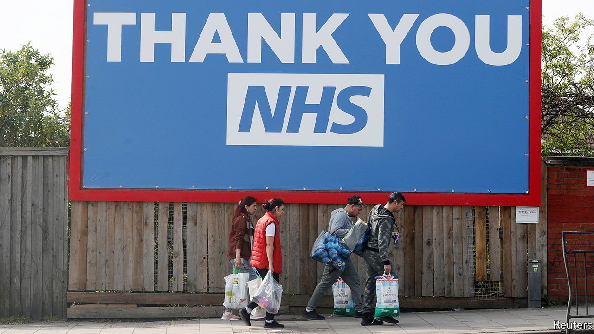

###### Spin doctors

# The extraordinary power of the NHS brand 

##### When the government wants something done, it invokes the health service 

 

> Sep 4th 2021 

AN OVERWEIGHT WOMAN reaches for a takeaway. An older man struggles out of his seat. “Let’s face it, after the year we’ve had, many of us are carrying a few lockdown pounds,” says the voiceover. “Now’s the time to turn things around.” On the screen is a familiar logo to prompt people to action: three white letters, “NHS”, against a deep-blue background.

When the government wants something done, it invokes the health service. In the early days of covid-19 ministers urged people to “stay at home, protect the NHS, save lives”. In an attempt to get those contacted to follow instructions, the test-and-trace system was labelled “NHS test and trace” despite being a standalone outfit. The “Better Health” campaign, of which the TV ad is a part, is in fact run by a separate government body, Public Health England.


According to the database of WPP, a giant advertising agency, the health service is Britain’s strongest brand, beating the BBC and Amazon. Just like them, it has tight rules governing the use of its intellectual property. The logo, three decades old, must be Pantone 300 (or “NHS blue”). The font must be Frutiger. Imagery must “reflect the diversity of NHS patients, the public and staff”.

A study published by the health service in 2016 found that patients get “confused and unsettled by non-standard NHS branding”. They do not like other organisations employing the logo, worrying that this would “imply privatisation”. There was consternation when Islamic State set up the Islamic State Health Service, using similar imagery. So, too, when Brexiteers put the logo on the side of a bus, without permission, and promised the health service more cash.

During the pandemic, firms from Premier League football clubs to John Hurd’s Organic Watercress (“donate 1p to the NHS from every pack purchased”) have rushed to show solidarity by plastering their products with the logo. Their enthusiasm may soon fade. The NHS is starting to grind through the longest queues since records began—a task that lacks the heroism of fighting a new virus, no matter how beloved the brand.

