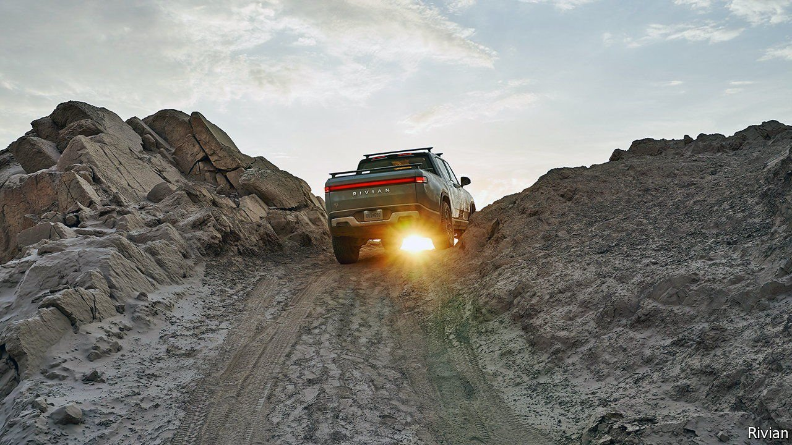

###### Can Rivian deliver?

# An electric-vehicle startup aims for a stellar valuation 

##### Rivian motors towards an IPO 

 

> Sep 4th 2021 

CARMAKING IS sharply divided between the old and new. Recent electric-vehicle (EV) entrants, with Tesla at the forefront, command effervescent valuations largely based on being new and different. The share prices of established carmakers suggest that they will soon go out of business. Yet many of the former will probably fail and most of the latter survive. Rivian, one of the newcomers, filed paperwork for an initial public offering on August 27th and is reportedly seeking a valuation of at least $70bn, roughly the same as General Motors. Do its plans match the fizz?

At first glance its billing as one of the most promising EV startups might seem justified. Rivian has raised over $8bn from an impressive list of backers, including Amazon and Ford. The e-commerce giant has ordered 100,000 electric vans, the first 10,000 of which should be on the road in 2022. Rivian is looking for a location for another plant which together with its factory in Illinois could turn out 300,000 vehicles a year.


Commercial EVs are in huge demand as e-commerce flourishes, lifted further by the pandemic, and cities worldwide impose increasingly strict emissions rules. Rivian’s skateboard chassis, on which a “top hat” of any body style can be plonked, allows it easily to customise delivery vehicles to customers’ specific needs. It will also underpin the firm’s forthcoming pickup and SUV and could also be sold to other carmakers.

But established firms, which make fat profit margins on vans, will not give up their market lightly. Moreover, Rivian is not the only newcomer: America’s Canoo and Britain’s Arrival are also entering the EV van game. Canoo and REE, an Israeli startup, are among many making EV skateboards. A battery-powered version of Ford’s popular F-150 pickup—the F-series is the source of most of its profits—goes on sale next year and GM has similar plans for the Chevrolet Silverado in 2023. Rivian has joined a business in which the fight to survive has never been more brutal. ■

For more expert analysis of the biggest stories in economics, business and markets, , our weekly newsletter.

