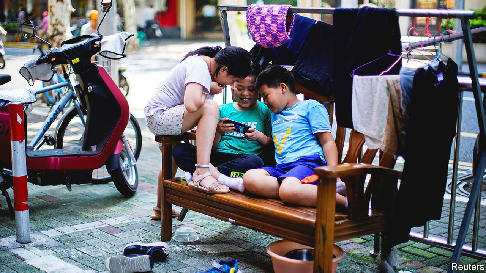

###### China’s gaming crackdown

# China imposes the world’s strictest limits on video games 

##### Foreign firms will be hit as well as Chinese ones 

 

> Sep 2nd 2021 

IT IS HARD work being a capitalist in a communist dictatorship. In the past few months China’s authorities have gone after big technology firms for alleged abuse of monopolistic power and the misuse of data. In the name of social cohesion they have banned for-profit tutoring and hectored companies and billionaires about their wider social responsibilities. The crackdown is reckoned to have wiped more than $1trn off the value of China’s biggest tech firms.

On August 30th the country’s video-gaming industry—the world’s largest with annual sales of $44bn—became the latest target. New rules proclaimed that, in order to “effectively protect the physical and mental health of minors”, children under 18 would be allowed to play online games only between 8pm and 9pm on Fridays, Saturdays, Sundays and public holidays.


The rules are the most restrictive in the world, and will affect tens of millions of people. Around two-thirds of Chinese children are thought to play online games regularly. But the idea is not new. China has worried about what it sees as the addictive and corrupting qualities of video games for more than a decade, says Daniel Ahmad, a senior analyst at Niko Partners, which follows Asian video-gaming markets. Censors frown on things like politics and gore, requiring changes to foreign games seeking a licence for sale in China. The new regulations are an update to ones passed in 2019 that limited children to 90 minutes per day of gaming, and imposed a curfew between 10pm and 8am. (On August 25th South Korea, which implemented a similar curfew in 2011, announced it would scrap its rules.)

 


Those previous rules had loopholes. China’s “anti-addiction system” requires gamers to use their real names, and a government-issued identity number, to play online, and boots them from the game when their allotted time has expired. But children could use adult credentials to log in, or play in internet cafés that turned a blind eye to long gaming sessions. This time, the authorities seem keen to block such workarounds. Alongside the new rules were promises of tougher policing and punishments for companies found to be dragging their feet. Tencent, China’s biggest video-gaming company, has been experimenting with facial-recognition software to ensure that crafty players cannot use other people’s credentials.

Despite their draconian nature, the immediate impact of the new rules was muted. Shares in Tencent and NetEase, a rival firm, dipped slightly after the announcement. That is probably because the rules are unlikely to make much instant difference to the firms’ bottom lines. Although there are thought to be around 110m gamer kids in China, they have little money to splash on new characters or virtual items. In its most recent set of quarterly results, Tencent said that only 2.6% of gaming revenue came from players under 16.

The long-term consequences could be more painful. The impecunious teenage gamers of today are the young adult gamers, complete with disposable income, of tomorrow. If the crackdown is effective, says one observer, Chinese gaming giants could see their flow of new customers dry up. Western firms could suffer, too. Jefferies, a bank, flags Roblox, an American gaming platform that allows users to create their own mini-games and share them with friends, as particularly at risk. The game, which has over 40m daily users around the world, is aimed at younger players. It launched in China in July.

Another question is how far the crackdown will spread. For now, a thriving grey market links Chinese gamers to foreign firms that are unable, or unwilling, to seek an official licence to sell their products in the country’s vast market. “PlayerUnknown’s Battlegrounds”, an online shooter, is reckoned to have sold around 20m copies in China despite lacking official approval. Around 50m Chinese gamers are thought to use Steam, an online shop for PC games run by Valve, an American firm, that remains curiously unblocked by China’s Great Firewall. That gives them access to tens of thousands of unlicensed games, free from official nannying.

The signs are ominous. In February Apple removed tens of thousands of unlicensed games from the Chinese version of its app store and a stripped-down, censorship-compliant Chinese version of Steam was launched. It offers few games and has hardly any users. But if the crackdown continues, Chinese gamers may soon find the local version is all that is available. ■

For more expert analysis of the biggest stories in economics, business and markets, , our weekly newsletter.

An early version of this article was published online on August 31st 2021

