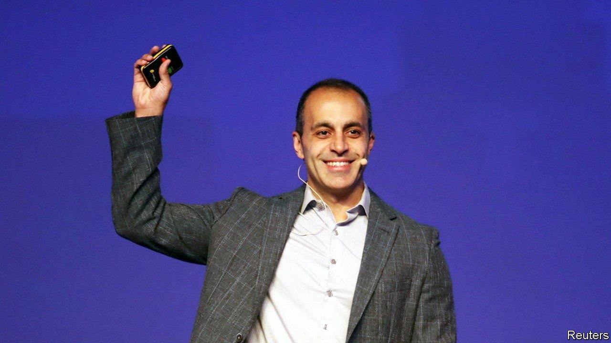
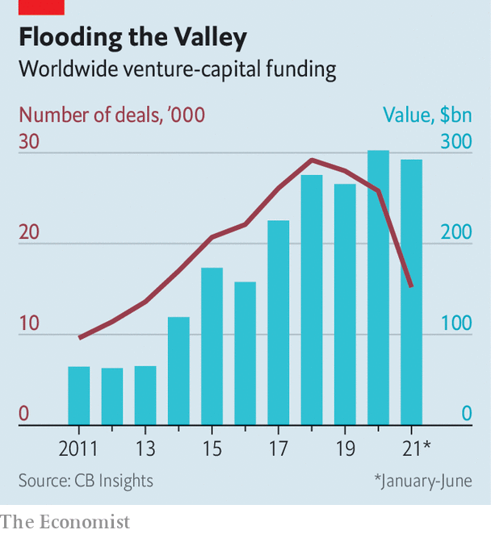

###### The Oracle of AI

# Flush with billions, Databricks has momentum and big plans 

##### Silicon’s Valley’s latest darling is on the move 

 

> Sep 4th 2021 

“HI, JUST CHECKING in. Can I put in some more?” The bosses of promising startups are bombarded by such texts these days. Big funds in particular are falling over themselves to grab a piece of the tech pie (see chart). Yet one founder seems to have received more than his fair share of pitches: Ali Ghodsi, the chief executive of Databricks. And he has said yes to many. On August 31st the company confirmed that, only six months after a $1bn financing deal, it had raised another $1.6bn, valuing it at $38bn—$10bn more than after the previous round. Among the Silicon Valley cognoscenti, these numbers cement Databricks’ status as the most hyped company of the hour.

 


The software-maker is soon likely to be known farther afield. Later this year it is expected to stage the largest-ever initial public offering (IPO) of a software firm—larger than that in late 2020 of Snowflake, its most serious rival. Alternatively, some predict, it could be snapped up by Microsoft in the largest ever software takeover. Whatever the outcome, there is substance to the hype. Databricks could become, in the age of artificial intelligence (AI), what Oracle and its databases once were in the world of conventional corporate software: the dominant platform on top of which applications are built and run.


Databricks was founded in 2013 to commercialise Spark, a piece of open-source software that processes reams of data from different sources to train algorithms which then become the engines of AI applications. The firm added features, including code that makes it easier for developers to program the system as well as manage their workflow, and offered the package as a cloud-based subscription service.

Yet Databricks only really took off when it added another component called “lakehouse”. It is a combination of two sorts of databases, a “data warehouse” and a “data lake” (hence the portmanteau). Both have historically been separate because of technical constraints and because they serve different purposes. Data warehouses are filled with well-defined corporate data that allow a firm to look into its past, for instance at how its sales have evolved, something called “business intelligence” (BI). Data lakes are essentially a dumping ground for all sorts of data that can reveal a firm’s future, including whether sales are likely to go up or down. Yet this separation is increasingly inefficient and unnecessary, explains Max Schireson of Battery Ventures, an investor in Databricks. “Doing BI and AI in different systems today is kind of stupid,” he notes.

Firms have jumped on what Databricks offers, in particular incumbents worried about being disrupted by an AI-driven startup. Comcast, an American broadband provider, uses it to allow its customers to use their voice to select movies; ABN Amro, a Dutch bank, to recommend services; and H&amp;M, a fashion retailer, to optimise its supply chain. Databricks now claims more than 5,000 customers and annualised subscription revenue of $600m—75% growth year-on-year.

Throwing Databricks at Snowflake

Mr Ghodsi has set his sights even higher. “Ultimately, everything data should be on Databricks,” he says. He is planning on investing the newly raised capital to keep growing and become the leader in lakehouse systems. Nobody should fault Mr Ghodsi, who once taught computer science at the University of California, Berkeley, for his ambitions. Yet realising them will not be easy. Other firms are already pushing into the territory. He will probably be able to fend off the three big cloud-computing providers: Amazon Web Services, Google Cloud Platform and Microsoft Azure. Although they have more than enough resources to compete and provide integrated AI packages, they share one big problem. Firms increasingly prefer not to store all their data in a single cloud, fearing they will get stuck with one vendor. Instead, they opt for products, such as Databricks’, that run across several clouds.

Snowflake is a different story. It, too, is building lakehouses. It is also taking a different approach. Whereas Databricks is adding BI to its AI platform, Snowflake, which has grown up in the data-warehouse world, is adding AI to its cloud-based BI package, meaning that their respective products will increasingly overlap. Whereas most of Databricks’ code is open-source, Snowflake’s is proprietary. And whereas Databricks has mostly stuck to a “land-and-expand” strategy, whereby small software deals grow into bigger ones, Snowflake practises a more conventional top-down sales model that focuses on big deals from the start.

All this will make for a battle over the next few years. But it could be rudely interrupted if Microsoft snaps up Databricks. The software firm is already one of Databricks’ investors and co-operates closely with it. Among other things, Azure offers a version of Databricks’ platform and Microsoft uses its name in presentations about its strategy, something it rarely does with other firms. It would be a good fit. At its core, Microsoft is still a company selling tools for developers to write applications and platforms to run them on. And Databricks represents both a complement and a strategic threat: it lets data, rather than people, write the code.

Databricks’ IPO is not meant to take the firm public, according to some analysts, but to put a price on it, so that negotiations can start somewhere. But the hype surrounding the company could thwart such plans. Snowflake is now worth about $90bn. If Databricks’ IPO outdoes Snowflake’s, its asking price may well be north of $100bn. And like Pinterest, a social-media firm which Microsoft considered buying earlier this year, it may become too pricey even for a company as loaded as world’s biggest software firm. ■

For more expert analysis of the biggest stories in economics, business and markets, , our weekly newsletter.

