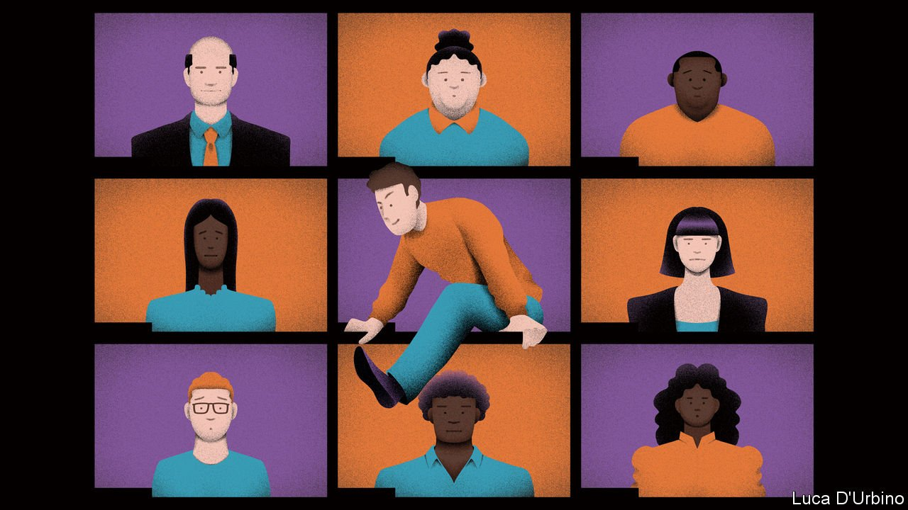
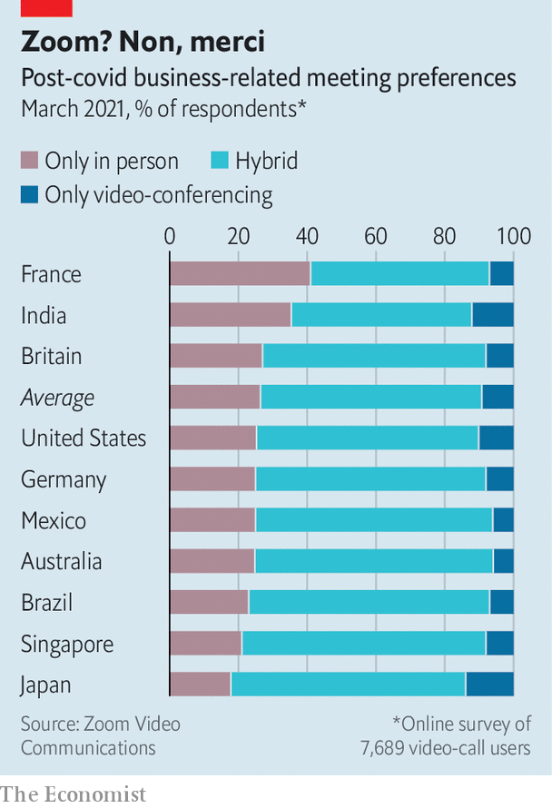

###### Update your calendar

# The future of meetings 

##### How to get employees, clients and investors into a room 

 

> Sep 2nd 2021 

A LOBBY CAN shape the first impressions of a business. Guests at the building housing the New York headquarters of Jefferies, an investment bank, were once greeted by a section of the Berlin Wall purchased from the East German government. In the London office of Slaughter and May, a law firm, water trickles down an atrium wall into a shallow pool made of natural stone. The San Francisco home of Salesforce, a software giant, welcomes visitors with a 106-foot (32-metre) video wall displaying anything from soothing waterfalls to Pac-Man clips.

As covid-19 shut offices around the world, those crucial first impressions were mediated by video calls. With workers stuck at home, corporate meetings—with underlings, fellow workers, clients and investors—turned almost entirely virtual. Anything that used to involve people crowding into spaces, from performance reviews to shareholder jamborees, roadshows and initial public offerings, moved to cyberspace.


Since March 2020 the Nasdaq exchange in New York has held more than 150 virtual bell ceremonies. The Hong Kong Stock Exchange has conducted at least 140. The aggregate amount of time people spent on Microsoft’s Teams video-conferencing platform tripled to 45m hours a day. Zoom went from being a moderately successful startup to a verb (and, for some people, a four-letter word).

Now that many companies are reopening their offices and reconfiguring their work arrangements into something hybrid, they are also rethinking their approach to meetings. Love them or (more often) loathe them, powwows are an integral part of modern commerce. Managers must therefore decide which parts of remote experience, if any, they want to keep. A poll of more than 7,000 people in ten countries by Zoom found that two-thirds would prefer a mix of virtual and in-person meetings in future. As with all work that is part remote and part not, in other words, the future of meetings looks messy.

 are not going anywhere. Zoom’s shares fell sharply on August 30th but only in response to an announcement that its growth had slowed in the latest quarter. Lumi, a service which helps organise shareholder meetings, says that 90% of this year’s gatherings will be fully remote, compared with 11% in 2019. OpenExchange, a firm that provides virtual and hybrid events for companies and investors, expects to run 200,000 of them in 2021, up from 4,000 in 2019.

The rampant  of covid-19, which is forcing firms to postpone their fuller return to the conference room, is one reason. But not the only one: virtual meetings allow more people to attend than if participants had to travel to distant locations. Online gatherings can also be more flexible. During the pandemic British workers scheduled meetings at times they would normally be commuting to and from work, according to research by Doodle, a scheduling service.

Video conferences also seem to work just fine for many purposes. Deloitte, a consultancy, surveyed 1,000 executives in America involved in private-equity transactions and mergers and acquisitions. It found that 87% of respondents said their firms were able to close deals in a purely virtual environment. More than half would prefer to maintain this after the pandemic.

But virtual get-togethers have drawbacks, too. More can be packed into a day, leading to  (another phrase that has entered common parlance). They are also less likely to end on time. A study by Microsoft showed that the average meeting in Microsoft Teams lengthened from 35 to 45 minutes, compared with a year earlier (probably because they lack physical prompts such as people getting up to leave or the next group barging into the conference room for their own conclave).

Hybrid meetings where some people are present in person and others dial in present a particular challenge. Most organisations have underinvested in the audiovisual technology that ensures that those dialling in are seen, heard, and do not feel like second-class citizens. In most pre-pandemic meeting rooms such considerations were an afterthought. Poor lighting and ill-placed microphones are common.

Such technical niggles can be fixed with better technology and cleverer design of office space. Companies are experimenting with larger, higher-quality screens, voice-tracking cameras that follow the speaker and tools that limit background noise. Software that transcribes or records meetings is becoming standard, easing pressure on employees to attend every session. Silicon Valley giants such as Microsoft and Facebook want to take things a step further, developing an augmented-reality “”, where users anywhere can interact with one another in real time.

Not everyone is convinced. Some companies are pushing back against the virtual culture. Many Wall Street bosses have taken a hardline position against remote work, including meetings. JPMorgan Chase called employees back to offices earlier than most. It is now urging its bankers to get back on planes to meet clients in person. JPMorgan’s boss, Jamie Dimon, has made the firm’s fleet of private jets available to managing directors. This summer an informal contest kicked off at the bank, with employees awarded points for face-to-face client meetings. The reward was reportedly a meal with JPMorgan’s top brass. Mr Dimon may be on to something: seven in ten respondents in Zoom’s study thought that it was important to meet clients physically.

Fearful of forsaking good ideas that emerge from spur-of-the-moment meetings, many companies are reshaping their spaces to facilitate such serendipity whenever workers do deign to show up at the office. A poll of 400 international firms by Knight Frank, a property consultancy, found that more than half expect the share of collaborative spaces in their portfolios to increase over the next three years. Nokia, a Finnish maker of telecoms equipment, says that from next year around 70% of its office space will be dedicated to collaboration and teamwork. Dropbox, a cloud-storage firm, has sold its headquarters in San Francisco. Its new sites, known internally as studios, will feature larger conference rooms with versatile layouts.

 


And whereas big majorities of people tell surveys they favour hybrid work, they clash over what this means for meetings specifically. With respect to large gatherings the clear preference seems to be for virtual settings, which 61% of Zoom’s respondents favoured, compared with 39% opting for the physical conference room. But the preferences differed by gender, with around 44% of men preferring to attend large group meetings in person, compared with just 33% of women (whom studies show to be less likely to speak up in meetings and likelier to be interrupted by men). With respect to smaller team meetings, remote workers were split evenly between wanting to join in person and preferring to do so virtually. And some countries’ work cultures look particularly averse to virtualisation: 41% of French workers insisted they would only meet in person (see chart).

Some decisions will be straightforward enough. Meetings where crucial calls are made or new clients introduced will almost certainly take place in-person. When it comes to less consequential yet still important confabs, the calculation will be more complicated. One thing is certain. A great many meetings will remain a pain for managers to schedule and, for many of their subordinates, a pain to attend. ■

For more expert analysis of the biggest stories in economics, business and markets, , our weekly newsletter.

All our stories relating to the pandemic and the vaccines can be found on our . You can also find trackers showing ,  and the virus’s spread across  and .

An early version of this article was published online on August 29th 2021

