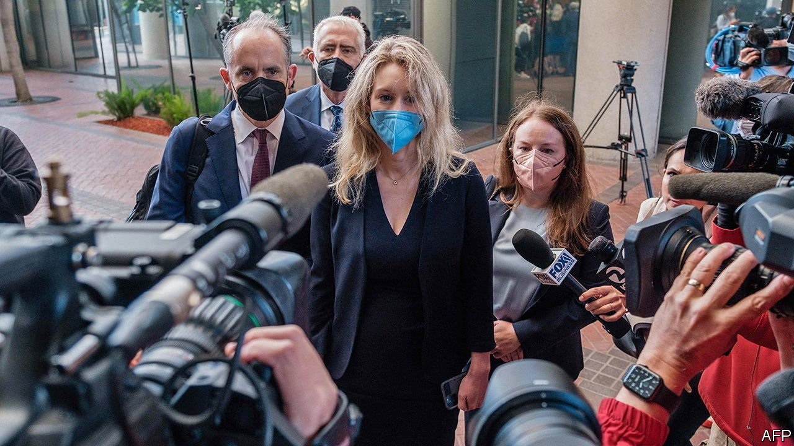

###### Theatre of blood

# The trial of Elizabeth Holmes gets under way 

##### The former boss of a notorious failed health-care startup could face jail 

 

> Sep 2nd 2021 

A CROWD OF reporters, drawn by the drama and glamour of the event, jostled outside a courtroom in San Jose on August 31st to witness the opening of what may be the next, perilous, act for a woman once touted as the next Steve Jobs and the world’s youngest self-made female billionaire. Jury selection was beginning for the fraud trial of Elizabeth Holmes, the former boss of Theranos, a startup which attempted to revolutionise the process of blood testing but failed spectacularly in 2016 after the press and regulators probed the company’s inflated claims.

These sorts of cases usually hinge on subtle distinctions between exaggeration and outright deceit and whether such deceit was intentional. But legal intricacies may take second place to theatrics. Will Ms Holmes take the stand in her own defence and risk the spotlight of cross-examination? Will she claim “coercive control” by her second-in-command at Theranos, Ramesh “Sunny” Balwani? Mr Balwani will be tried separately in January; he has denied Ms Holmes’s claims.


The story of Ms Holmes is an epic of Silicon Valley hubris. She brought charisma to the corporate world, adorning many magazine covers. She relentlessly promoted her firm to a valuation of $9bn in 2015 before its demise. The attention lavished on Theranos seemed justified for a time. In 2015 Joe Biden, then America’s vice-president, called it “the laboratory of the future”. Its board included political, medical and legal bigwigs. Two huge firms, Safeway and Walgreens, agreed to distribute its products. Investors ignored flawed financial performance and the dubious quality of the device it was developing, drawn instead by the firm’s idealistic goal of making testing cheap, easy and ubiquitous.

The awareness grew with the company’s abrupt failure in 2016. Multiple books and television documentaries shone more light on Ms Holmes. A TV mini-series and a film are now reportedly in the works. Such coverage is not justified by the facts of the case. Ms Holmes and Mr Balwani are accused of lying to investors, patients and doctors about the effectiveness of Theranos’s tests. But Silicon Valley’s venture capitalists are well used to over-hyped plans. Failure rates among tech startups are high, though most do not lose as much as the $700m or so that had been invested in Theranos.

The buzz over Theranos stems from more than money. Because it was involved in health care rather than, say, enterprise software or co-working facilities, any mistake could have had catastrophic consequences for a patient. The inability of Theranos to deliver on its promises was a disappointment to those who had seen it as a way for science to improve lives. The case also resonates because Ms Holmes looked like a woman succeeding in a male-dominated world. The issue will become more prominent if Ms Holmes is convicted and sentenced to jail as in July she gave birth to her first child. That could make for a mini-series with a heart-rending finale.■

For more expert analysis of the biggest stories in economics, business and markets, , our weekly newsletter.

