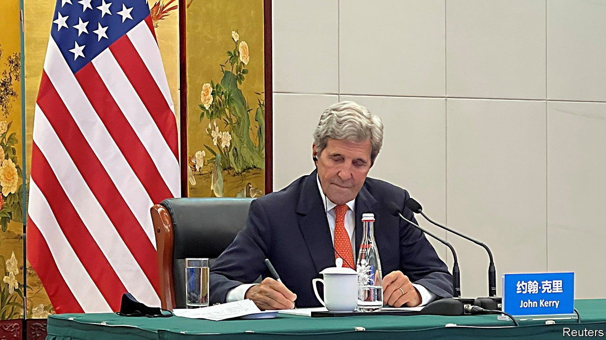

###### Squeezing out the carbon

# America wants China to end support for coal projects abroad 

##### Why worry when China’s financing of them has already waned? 

 

> Sep 4th 2021 

SINCE JOE BIDEN became America’s president in January, few senior American officials have visited China. But as The Economist went to press, Mr Biden’s special envoy for climate change, John Kerry, was in the middle of his second trip this year. With relations so rancorous in almost every other domain, the two countries appear to welcome the chance to talk about a problem they hope can be tackled together. There may be political dividends for both.

Mr Kerry has set his sights on coal, a big contributor to global warming. China is not only the world’s biggest producer and consumer of it, but has also been a leading financer of coal-fired power plants in developing countries. During his talks with Chinese officials in the northern city of Tianjin, which began on September 1st and were due to end on September 3rd, Mr Kerry was expected to urge China to cease its involvement in such projects abroad.


At first glance, Mr Kerry’s request may seem odd. Until 2019 China’s support for coal-fired energy was a big part of its Belt and Road Initiative (BRI), a global infrastructure-building scheme. But the picture has been changing fast. In 2019 and 2020 Chinese-backed coal projects abroad worth about $47bn were suspended or terminated. In the first half of 2021 China financed no new coal plants in countries involved in the BRI. This had little to do with global warming. Shuang Liu of the World Resources Institute, a think-tank in Washington, reckons that coal is no longer competitive in BRI countries due to a plunge in the price of renewable energy.

The elephant in the room is China’s burning of coal at home. The country’s power plants last year produced over half of the world’s coal-generated electricity. Despite China’s professed concern about the climate, the share is about to get bigger. In 2020 China built more than three times as much new coal-fired power capacity as the rest of the world combined, at a pace of roughly a new coal plant a week. Taking account of the decommissioning of plants, the country’s capacity rose by a net 30 gigawatts in 2020, whereas the rest of the world’s saw a net decline of 17GW.

 


Look closer, though, and Mr Kerry’s focus on China’s global involvement in coal becomes easier to explain. Consider American politics. To people at home, the gentlemanly American envoy wants to appear tough on China—there is seething bipartisan animosity towards the country. A headline in the Wall Street Journal on the eve of Mr Kerry’s trip, “Kerry to press China to stop financing coal-fired energy projects,” captured the desired pose.

Bashing China’s domestic addiction to coal would also smack of hypocrisy: America still gets over a fifth of its power from the stuff. Joe Manchin, a Democratic senator from West Virginia whose backing is vitally important to Mr Biden, is an unabashed supporter of coal. China has sent mixed signals about its own use of it. But despite its prodigious building of new carbon-spewing plants, it has pledged that its CO emissions from coal will stop rising after 2025 and that China’s overall emissions of the gas will peak by 2030.

Mr Kerry is right to worry about China’s activities abroad. In recent months, America, Japan and South Korea have followed an example set by the European Union and Britain by ending official financing of overseas coal projects. But China has not yet issued such a ban to its own banks and development institutions. As a result, observes Leo Roberts of E3G, a British environmental think-tank, “China is the public lender of last resort to an increasingly stigmatised industry.”

The British organisers of a UN climate summit in Glasgow later this year hope it will help “consign coal power to history”. Given that new coal plants in most countries have bleak commercial prospects anyway, China may make a show of ending support for them abroad. That would be welcomed. But the real test of China’s dedication to fighting climate change will be what it does about the ones at home.■

