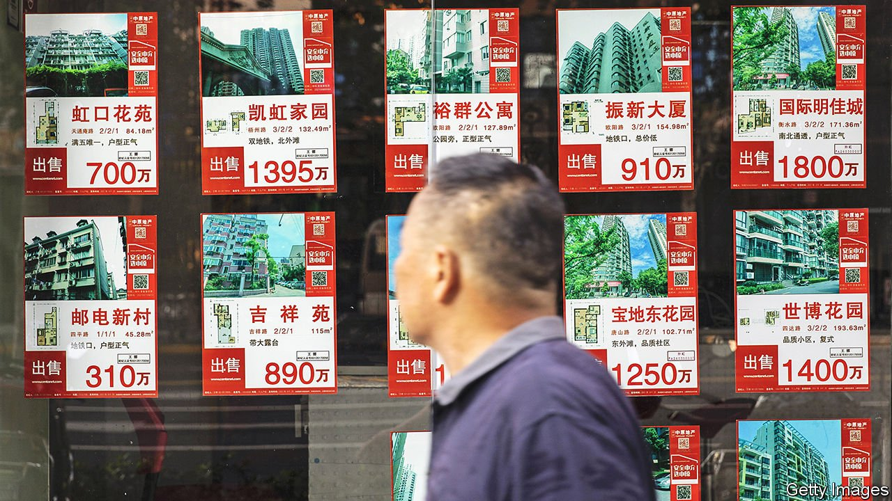
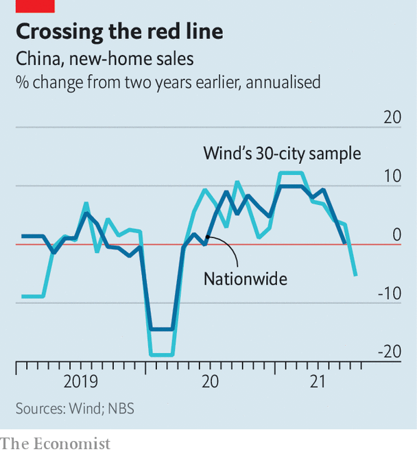

###### Red lines, grey rhinos and big mountains

# China’s bid to stabilise its property market is causing jitters 

##### Can it be done without harming the wider economy? 

 

> Sep 4th 2021 

OCTOBER 6TH 1979 was a beautiful Saturday in Washington. It was not the kind of day that augured wrenching change in economic policy. But on that date Paul Volcker, then chairman of America’s central bank, announced a radical plan to quash persistent inflation. Before the battle was won, America’s interest rates reached 20% and unemployment surpassed 10%. Car dealers sent him the keys to vehicles they could not sell, in coffins.

China is now facing its own “Volcker moment”, according to Ting Lu of Nomura, a bank. The government’s aim is not to curb an inflationary spiral (China’s consumer prices are rising only modestly) but to break a vicious circle of property speculation and credit expansion. Regulators are making it harder for developers to raise money and for households to buy homes. The new rules have already pushed several property firms, including the country’s biggest homebuilder, Evergrande, to the brink and contributed to a decline in home sales. But are China’s rulers willing to endure anything like the economic discomfort that Volcker inflicted to achieve their goals? The world may be about to find out.


An Englishman’s home is his castle. In China, a home is much more besides. As well as providing shelter and security, housing often serves as collateral, nest-egg, speculative investment, bride-price and ticket to a good school. Housing makes up three-quarters of household wealth, according to the China Household Financial Survey, a data set compiled by academics in China. It accounts for the biggest chunk of household debt, which by one estimate exceeded 70% of GDP at the end of last year. Local governments raise 30% of their revenue by selling land to developers. And policymakers often rely on homebuilding to revive the economy in downturns.

Property dons other guises, too. The high price of housing is often likened to a “big mountain” (alongside costly health care and education) and a “grey rhino” (an obvious but neglected risk). In March Guo Shuqing, the head of China’s banking and insurance regulator, warned that if house prices were to drop, people holding multiple properties would not only suffer “huge losses”, they might also fall delinquent on their mortgages, endangering the banks and leading to “economic chaos”.

The government wants property to play a more modest role. In December 2016 President Xi Jinping said homes were for “living in, not for speculating”, a phrase that officials now often repeat. In 2019 the Communist Party declared that property was not a tool for short-term economic stimulus, a commitment reiterated at a meeting of the ruling Politburo in July.

The authorities are facing the grey rhino more squarely by trying to tackle the industry’s financial fragilities. Last year regulators capped the share of mortgages and property-related loans that banks may hold. They also imposed “three red lines” on prominent property developers, limiting the size of their debts relative to their assets, equity and cash. Now when the president of Country Garden, a high-end developer, talks of his aim to “turn green” he is not referring to the environment, but to keeping clear of those lines.

 


The impact of the curbs on the property market is becoming more stark. Sales of new homes in 30 cities tracked by Wind, a financial-data firm, fell by 23% in August compared with a year earlier, having fallen less sharply in July and June. Sales were also lower than in the same period of 2019, before the pandemic (see chart). Nomura’s Mr Lu says investors should prepare for a “much worse-than-expected growth slowdown, more loan and bond defaults, and potential stockmarket turmoil.”

Will the regulators blink? In the past, policymakers have been quick to ease property curbs in downturns. A big drop in house sales or prices over several months would probably “jolt the government into a more dovish stance”, argues Rosealea Yao of Gavekal Dragonomics, a consultancy. But Mr Lu believes it will be hard for leaders to reverse course. They have publicly committed themselves to a tighter policy and created bureaucratic momentum behind it. Earlier this year the central government sacked officials in the southern city of Shenzhen for failing to tame prices.

The curbs can be seen as part of the government’s new preoccupation with creating “common prosperity”. Unaffordable housing conflicts with this aim. Research by three Chinese academics—Guanghua Wan, Chen Wang and Yu Wu—has found that the cost of housing causes about 75% of China’s wealth inequality. It may also be one reason why China’s families now have so few children, a trend that increasingly worries the government.

To shore up growth, China may try building more subsidised homes. It has ordered 40 cities to construct almost 1m low-rent housing units this year. But it will take time to ramp up such work on a sufficient scale. Meanwhile, China’s growth will face other threats. Service industries may suffer from pandemic-related lockdowns. Exports may grow more slowly as manufacturing recovers abroad. And infrastructure spending will weaken if local governments cannot sell as much land to developers.

It is hard to imagine China pushing things nearly as far as Volcker did. But then Volcker himself did not foresee the full economic pain that would follow that beautiful Saturday. China’s hard-pressed developers may find themselves with many unsold properties in the months ahead. Where will they send the keys? ■

