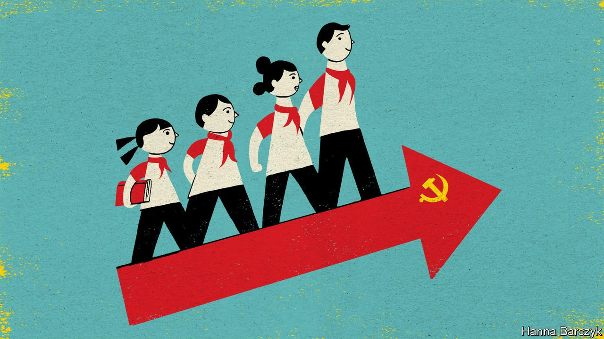

###### Chaguan

# Xi Jinping Thought, for children 

##### China rolls out new textbooks on the supreme leader’s political philosophy 

 

> Sep 4th 2021 

ASK MEMBERS of China’s elite—from senior officials to academics at leading universities, well-known commentators or bosses at big companies—to explain the beliefs of the country’s leader, Xi Jinping, and their replies are surprisingly unhelpful. Even simple questions elicit waffly answers. Take an ongoing campaign to clip the wings of some of China’s largest firms, notably technology giants. The authorities have variously accused such businesses of seeking excessive profits, harming national security with a cavalier approach to data, abusing workers, bullying smaller firms or exploiting young consumers with addictive video games and online fan clubs. Is Mr Xi revealing himself as an ideologue, bent on re-imposing Communist Party control over the economy at the expense of growth? Or is he more pragmatic than that: a nationalist strongman who is helping to make China stable at home and mighty abroad? There is chatter among the country’s grandees, but no consensus.

Given such confusion among grown-ups, this is a bold moment to issue a new series of textbooks to all students in Chinese schools, colleges and universities, with the aim of explaining Xi Jinping Thought on Socialism with Chinese Characteristics for the New Era, as Mr Xi’s political philosophy is formally known.


As the academic year began on September 1st, teachers and lecturers began distributing these books, tailored for each age-group, down to children as young as six. The use of stand-alone schoolbooks devoted to a serving leader marks a break with decades of caution. The last time that hundreds of millions of youngsters clutched books devoted to the wisdom of one man was under Mao Zedong, the object (and instigator) of a disastrous personality cult.

Books for the young are especially revealing, for they have to keep their messages simple. Primary schools have long taught the general rudiments of ideology. Via courses with names like “ethics and law”, children have studied good deeds by the party’s founders and modern-day leaders. They have contemplated the magnificence of the motherland (helped by copious images of wind farms and border-marker stones). Textbooks have devoted many pages to wholesome lessons about honesty, friendship, the importance of hand-washing and respect for elders.

The latest books for primary schools are still wholesome. But they are more focused on defining citizenship as a relationship with the party and its leader. Official guides for teachers concede that it is challenging for very young students to grasp abstract concepts. As a result, the new textbooks will use “golden” maxims from Mr Xi, as well as vivid stories and emotional experiences to “plant the seeds of love for the party, love for the nation and love for socialism in their little hearts”. A notice issued in late August by the education ministry’s National Textbook Committee sets out further aims. Youngsters should be guided to understand that Mr Xi is the leader of the whole party and country, it says. They must also resolve to obey and follow the party from their earliest years.

In addition to praising conformity, the new books offer homely warnings about those who fail to fit in. The last chapter of the new textbook for six- to eight-year-olds opens with an injunction to “Button the First Button of Life Correctly”. Mr Xi often uses this phrase in speeches to the young. It refers to what he calls the duty of schools and families “to teach the first lessons of life well”, so that children do not end up out of line with their peers, like a misbuttoned coat that will have to be adjusted later.

Another lesson in the book tells children about “Grandpa Xi’s expectations of us”. Alongside images of Mr Xi with members of the Young Pioneers, a party organisation for children aged between six and 14, it informs pupils: “As paramount leader of the party and state, Grandpa Xi Jinping has always cared for us, and wishes for us to strive to grow into worthy builders and inheritors of socialism.” In practice, teachers of politics and ideology—who form a highly trained elite, and a pool for future school heads—are encouraged to leaven this stodge with singing contests or lessons in patriotism based on news stories. Teachers say that instructive recent events include last year’s border clash between Chinese and Indian troops, and the American export bans on components needed by Huawei, a Chinese electronics giant.

Power is the point

At first glance these textbooks for small children, filled with Mr Xi’s quotes about caring for the environment, and with songs such as “I Love You, China”, (sample lyrics: “I love your boundless forest, I love your towering mountains”) may not seem to settle hard questions about the country’s ruling philosophy. Arguably, though, Chinese youngsters are getting something close to the true essence of Xi Jinping Thought. The overall aim of this reform, the textbook committee explains, is for the school and university curriculum to “comprehensively introduce” Mr Xi’s views on economics, politics, the rule of law, science and technology, culture, education, ethnic policies, religion, national defence, ecological civilisation, party-building and diplomacy, among other subjects. Put more concisely, Mr Xi is to be seen as the undisputed authority on everything.

This is not the same as a Maoist personality cult. Mao encouraged the young to attack their teachers. He egged on fanatical Red Guards as they destroyed ancient temples. He wanted followers to attack a party establishment whose revolutionary fervour and loyalty he had come to doubt. In contrast, Mr Xi wants the young to study diligently, to take regular exercise and to listen to teachers talk about 5,000 years of glorious Chinese culture. Mr Xi is the establishment: the supreme incarnation of party authority. The party’s legitimacy, in turn, rests on its claims to unrivalled competence and success. It is not for ordinary citizens to second-guess or debate what Mr Xi personally believes. Like children heeding a teacher or an elder, it is their role to obey. ■

