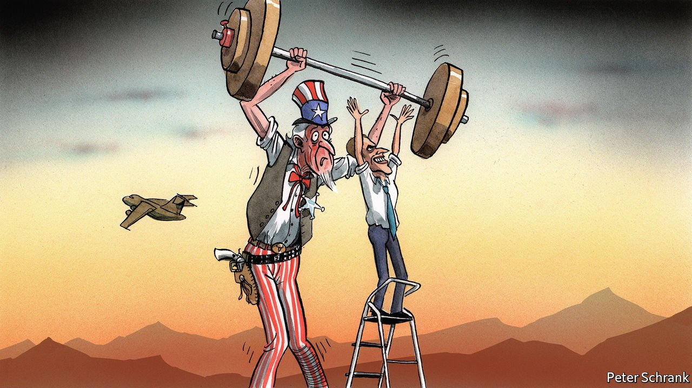

###### Charlemagne

# After Afghanistan, Europe wonders if France was right about America 

##### Emmanuel Macron argued the US could not be relied upon. He may have had a point 

 

> Sep 4th 2021 

THE ANNUAL ritual of Bastille Day is a moment for the French to put up bunting, down champagne and celebrate the republic’s founding myths. On July 14th this year, however, when the French ambassador to Kabul, David Martinon, recorded a message to fellow citizens, gravity crushed festivity. “Mes chers compatriotes”, he began, “the situation in Afghanistan is extremely concerning.” The French embassy, he said, had completed its evacuation of Afghan employees. French nationals were told to leave on a special flight three days later. After that, given the “predictable evolution” of events in Afghanistan, he declared—a full month before the fall of Kabul—France could no longer guarantee them a safe exit.

When the French began to pull out Afghan staff and their families in May, even friends accused them of defeatism, and of hastening the regime’s collapse. Their evacuation effort in August (of 2,834 people, on 42 flights) was imperfect, and left some vulnerable Afghans behind. As allies scrambled to get their Afghan employees out of Kabul, the French found themselves as dependent as anybody on American security. Yet there has been quiet satisfaction in Paris. Their plans showed “impressive foresight”, says Lord Ricketts, a former British ambassador to France.


If the French acted early, making their own assessment of shared intelligence, this was due in part to a smaller footprint on the ground. France fought in Afghanistan alongside NATO allies from 2001. “We are all Americans,” ran Le Monde’s front page after 9/11. It then pulled out all troops by 2014, partly to concentrate on its own counter-insurgency effort in the Sahel. Yet the decision in Kabul was also easier to take because the French have fewer qualms about doing their own thing, even when this irks America. As Europeans think through the unsettling implications of the Afghan fiasco, and what it says about dependence on a unilateral America, the mood in Britain and Germany is one of shock and hurt. For the French, who drew from the Suez crisis in 1956 the lesson that they could never fully rely on America, a conclusion reinforced under the Obama and Trump presidencies, Afghanistan has served to confirm what they long suspected.

It is no secret that not all Europeans share France’s view. When Emmanuel Macron took to the stage in the wood-panelled Sorbonne amphitheatre shortly after his election in 2017 and pleaded for “European sovereignty” and a “capacity to act autonomously” in security matters should Europe need to, his was a lone voice. In Germany and points east, Mr Macron’s plea was regarded with irritation: yet another pesky Gaullist attempt to undermine NATO and supplant America as the guarantor of European security.

Minds have moved a bit since, as Mr Macron has sought to reassure friends that his idea is not to replace but to complement the transatlantic alliance. Even so, as recently as last year Annegret Kramp-Karrenbauer, Germany’s defence minister, wrote bluntly that “illusions of European strategic autonomy must come to an end.” In Britain, meanwhile, Mr Macron’s calls were disregarded as irrelevant to an island nation freshly free to forge its own global role. The pooling of European sovereignty over defence was something Brexit was designed to avoid.

The debacle in Afghanistan has shifted the rhetoric. Tom Tugendhat, a Conservative MP who served in Afghanistan, urged Britain “to make sure that we are not dependent on a single ally”, naming France and Germany as potential partners. Ben Wallace, Britain’s defence secretary, suggested that his armed forces should be ready to “join different coalitions and not be dependent on one nation”. He did not need to spell out which one. “We’ve all been equally humiliated by the Americans,” says a British diplomat, who points to a common interest in making sure this does not happen again. For conflict-shy Germany, Afghanistan was a formative experience. The disappointment has been wounding. Armin Laschet, the conservative candidate for Germany’s chancellorship, described the withdrawal as “the greatest debacle that NATO has experienced since its foundation”.

In short, Europe seems to realise that it will have to do more by itself. Whether the sceptics understand it or not, this is exactly what Mr Macron has been saying, and will say again in a speech ahead of France’s rotating presidency of the EU Council in 2022. Nobody, but nobody, will say so aloud. But the implicit recognition is that, zut alors, Mr Macron was right.

Aux armes, Européens

Two big questions for Europeans flow from this disconcerting thought, however, and easy answers exist to neither. First, what does Europe really mean by “European sovereignty” or “strategic autonomy”? Most countries vow to spend more on defence, even though Germany (unlike Britain and France) still fails to meet the NATO benchmark of 2% of GDP. Beyond that, there is little clarity, and even less agreement, not least because Brexit has put Britain in no mood to work institutionally with the EU.

Should Europeans aspire merely to limited management of a regional conflict, such as the Sahel or Iraq? Or do they hope to take on collective defence of their continent? Realists argue for the former, and only up to a point. Enthusiasts hint at the latter. Yet even in the Sahel, France still needs the Americans for intelligence and logistics. Second, is Europe really prepared to do what it would take to get by on its own? The evidence is unconvincing. Europe is better at devising acronyms than building capabilities. “If we can’t even look after the airport in Kabul, there is a big gap between our analysis and our capacity to act,” says Claudia Major of the German Institute for International and Security Affairs.

The implied effort would be huge. “I am not sure the Europeans are psychologically ready to face the challenge,” wrote Gérard Araud, a French former ambassador to America, for the Atlantic Council. Mr Macron, like his ambassador in Kabul, may have made the right call. But are Europeans ready to heed it? ■

