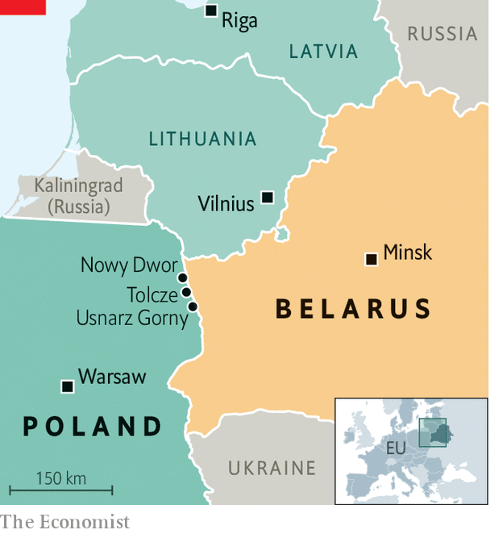

###### Stranded in no-man’s-land

# Europe’s latest migrant crisis leaves refugees stuck between two borders 

##### New barriers have been erected on the frontier with Belarus 

 

> Sep 2nd 2021 

IT IS THE first sight of men with guns in the village since Poland’s communist rulers declared martial law 40 years ago. But the villagers of Nowy Dwor, 5km (three miles) from the border with Belarus, say they feel protected by the makeshift barracks that have been set up on the school sports field. Soldiers are here to patrol a frontier that seldom required close supervision before the events of this summer. “When the migrants first started coming,” says a retired health worker, “I was afraid to fetch potatoes from my field for dinner.”

Fright at the thought of a new influx of migrants affects most of Europe’s governments, too. But what is happening in Poland, Lithuania and Latvia is no ordinary migrant crisis. The people trying to cross into those countries are not victims of Alexander Lukashenko’s dictatorship next door in Belarus, but its guests. Mr Lukashenko engineered their arrival, most of them on direct flights from Iraq. Then, to embarrass his neighbours, he sought to pass them on. His guards have been filmed directing them across the border and into the EU. In recent weeks Lithuania and Poland have each nabbed around 3,000 migrants entering from Belarus.


Mr Lukashenko’s neighbours have responded by dispatching their armies, tightening asylum rules and walling off their borders. It is the latest big step towards militarising the EU’s outer rim, a trend that was barely thinkable a decade ago. Poland’s fence now comprises three large rings of razor wire. Alongside it is a row of newly drilled holes, ready for the installation of a sturdy fence 2.5 metres high. This reinforcement of the Polish border was announced on August 23rd.

 


In Tolcze, another nearby Polish village, a farmer retraces his country’s history by charting the changes on the border. After 1945, when the boundary of the Soviet Union jumped 200km to the west, a series of sticks in the ground turned up, twenty paces from his house, cutting his family off from its orchard. After the Soviet Union collapsed in 1991 a big fence was taken down. But in 2004, when Poland joined the EU, up went a smaller one, which kept the cows from running off. The arrival of razor wire suggests yet another chapter for Tolcze—and perhaps for Europe too.

Until now, surprise crossings of people were rare. The thought of trespassing into Soviet territory once made Poles tremble. That old fear still lingers. But animals do not care. One woman in Tolcze lifts up the wounded hind paw of her dog, Puszek (“Fluffy” in Polish), who strayed onto the razor wire. A woman in a nearby village says that every spring a herd of Belarusian bison wander into Poland in search of food, delighting the locals. She frets that she will never see them again.

Locals often seem more concerned for the plight of animals than they are about the migrants. Two women chatting in Nowy Dwor’s main shop concur that the migrants do not look like real refugees because they are clean and well dressed. One describes a friend’s photo of an Afghan migrant with a “lovely shaved beard and a little moustache” who looked “straight out of a zhurnal (a fashion magazine)”. Others say the problem is not migrants in general but the risk of malefactors in their midst.

Few elsewhere in Europe begrudge Poland and its Baltic neighbours their hawkish response. The loudest opposition to the rougher treatment of migrants comes from local activists, many of whom have set up camp in Usnarz Gorny, a hamlet of ten houses. Nearby some 30 Afghans are stranded in no-man’s-land on the border with Belarus, blocked by Polish guards and unable to move either way. Translators from Ocalenie (Rescue), a Polish NGO, shout inquiries in Dari to the migrants through a megaphone. Polish police rev their vans’ engines to drown them out.

Such divisions will delight Mr Lukashenko, who seeks revenge on Europe for its sanctions against Belarus. War games scheduled this month with Russia in western Belarus will ratchet up the tension. But he would be deluded if he were to expect the EU to accept his invitation to negotiate a resolution to this migrant crisis. One other feeling that Europe’s politicians and Polish villagers on the border with Belarus share is contempt for Mr Lukashenko, a thuggish, election-stealing despot. “He is very bad,” says the retired health worker in Nowy Dwor. “Everyone here says thank God we were born on the Polish side.” ■

